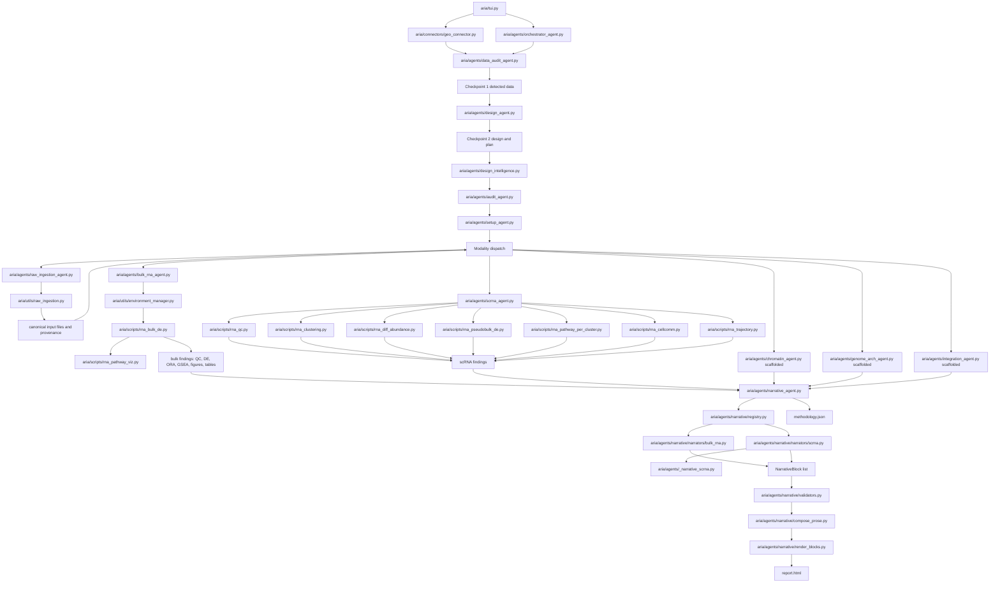

# Code Dependency Graph

This document is the working impact map for ARIA code changes. It is not a
complete Python import graph. It tracks the runtime data flow, ownership
boundaries, and production-impact edges that matter when adding features or
polishing existing behavior.

Use it before changing shared agents, script result schemas, report rendering,
or checkpoint/design logic.

## RNA And Reporting Flow

## High-Impact Edges

| If you change | Check these dependents | Why it is risky |
|---|---|---|
| `geo_connector.py` inferred design schema | `data_audit_agent.py`, `design_agent.py`, `bulk_rna_agent.py`, TUI GEO flow | GEO groups, organism, aliases, and sample IDs seed the entire design path. |
| `data_audit_agent.py` h5ad or GEO design inference | `design_agent.py`, `scrna_agent.py`, `design_intelligence.py`, CP1 text | A wrong condition/replicate/groupby guess can run valid code on the wrong biological design. |
| `design_agent.py` design dict | `bulk_rna_agent.py`, `scrna_agent.py`, `design_intelligence.py`, methods/provenance | `groups`, `main_factor`, covariates, aliases, and pseudobulk settings are consumed downstream. |
| `bulk_rna_agent.py` | `rna_bulk_de.py`, narrative bulk narrator, methods, release validation | It maps confirmed design onto count matrix columns and owns bulk result shape. |
| `rna_bulk_de.py` result schema | `BulkRnaNarrator`, `NarrativeAgent`, bulk workflow docs, tests | Report claims, figures, tables, ORA, GSEA, and methodology depend on specific keys. |
| `rna_pathway_viz.py` | `rna_bulk_de.py`, bulk narrative, report artifacts | It creates GSEA/ORA figures and tables that reports reference. |
| `scrna_agent.py` result schema | `_narrative_scrna.py`, `ScrnaNarrator`, scRNA workflow docs | scRNA reports assume stable keys for QC, composition, pseudobulk, pathways, LIANA, and trajectory. |
| `rna_pseudobulk_de.py` or `rna_diff_abundance.py` | `scrna_agent.py`, `ScrnaNarrator`, FDR-strategy and power report text | These scripts drive publication-facing inferential claims. |
| `NarrativeBlock` schema | every modality narrator, validators, renderer, `methodology.json` | This is the report evidence contract. |
| `validators.py` | all report generation | Validators are the last integrity gate before claims reach HTML. |
| `compose_prose.py` or `render_blocks.py` | HTML findings for all block-backed modalities | Rendering changes can turn valid results into cryptic or misleading reports. |
| `environment_manager.py` | all script-running agents | It controls conda stack execution and JSON IPC boundaries. |
| `memory.py` decisions schema | checkpoints, provenance, reports, resume | DB shape changes can break old sessions and audit trails. |

## Ownership Boundaries

Agents own orchestration and user-visible decisions. Scripts own deterministic
analysis. Narrators own translation from structured results to
`NarrativeBlock`. Renderers own presentation.

Do not cross these boundaries casually:

- Scripts should not publish bus messages or write report prose.
- Agents should not parse generated HTML to recover results.
- Narrators should not invent analyses that are absent from structured output.
- Renderers should not create scientific claims that are not present in a
  block.
- Validators should downgrade or block unsafe claims, not silently rewrite
  biological meaning.

## Impact Checklist

Before changing a production path, answer these questions:

1. What result keys does this module produce or consume?
2. Which checkpoint text or confirmed design fields will change?
3. Which report sections, figures, tables, or `methodology.json` fields depend
   on it?
4. Does the change affect replay/resume or old workspaces?
5. Does it touch publication claims: DE, global/local FDR, power, ORA/GSEA,
   LIANA, PAGA/DPT, provenance, or dependency locks?
6. Which focused tests prove the contract, and which smoke test covers the
   integration path?

## Current Narrative Rule

For modalities backed by `NarrativeBlock`, prose is the primary report
presentation. Structured evidence tables, figures, and file links are audit
support. A report that only exposes claim rows and evidence tables is not
considered sufficiently narrative.

## Test Anchors

Use these tests as impact anchors when editing the graph's major nodes:

- Narrative kernel: `tests/test_narrative_types.py`,
  `tests/test_narrative_validators.py`, `tests/test_narrative_render_blocks.py`
- Bulk narrator and GSEA surfacing: `tests/test_narrator_bulk.py`,
  `tests/test_pathway_viz.py`
- scRNA narrator: `tests/test_narrator_scrna.py`
- GEO/design mapping: `tests/test_geo_design.py`
- Main integration smoke: `tests/test_pytest_smoke.py`
