# Code Dependency Graph

This document is the working impact map for ARIA code changes. It is not a
complete Python import graph. It tracks the runtime data flow, ownership
boundaries, and production-impact edges that matter when adding features or
polishing existing behavior.

Use it before changing shared agents, script result schemas, report rendering,
or checkpoint/design logic.

For repository-wide exploration, use the generated Graphify map in
[`docs/architecture/graphify/`](graphify/README.md). That artifact is built from
a clean tracked snapshot and provides `graph.json`, `graph.html`,
`GRAPH_TREE.html`, and `GRAPH_REPORT.md`. It is **structure-only**: only real
code nodes and EXTRACTED structural edges (imports/calls/contains/method/
inherits/references/…), with the inferred (`confidence=INFERRED`) and
rationale/concept layers filtered out by `scripts/graphify_structure_filter.py`
(deterministic, no LLM). This document remains the curated impact map; Graphify
is the broader navigational index.

The structure filter also has one explicit deterministic AST completeness guard:
`aria/memory/memory.py:ARIAMemory`. Graphify sometimes emits only the aggregate
class node for that shared infrastructure module, so the filter restores its real
Python methods and `method` edges from the tracked AST. This is structural
extraction, not a semantic/inferred layer; `export_experiment_snapshot()` must be
present in every regenerated map (`tests/test_graphify_structure_filter.py`).

**F11 audit fix (2026-06-20):** `scripts/generate_graphify_graph.sh` no longer leaks a
machine-absolute path into the committed Graphify artifacts. Its post-step previously
rewrote the temp corpus/run_out roots to the ABSOLUTE repo root, so manifest/report/html
shipped `/home/<user>/Samael/ARIA/...` on every regen; that step also never ran because a
hard `cp graph.html` aborted the script under `set -e` whenever `cluster-only` skipped
HTML (>5000 nodes). The copies are now tolerant (skip a missing artifact), the post-step
maps every absolute root to repo-relative (`aria/x.py`) / the label `ARIA`, and the README
snapshot pointer is auto-stamped to the build HEAD + date. Guard
`tests/test_graphify_no_absolute_paths.py`: fails on any absolute path under
`docs/architecture/graphify/` and if the README commit pointer is not a real commit
reachable from HEAD. Do not reintroduce a `replace(corpus, root)` that injects the
absolute root, or a hard `cp` that can abort before the scrub.

## RNA And Reporting Flow

```mermaid
flowchart TD
    TUI[aria/tui.py entry: cockpit when TTY+tui extra, else classic Rich] --> GEO[aria/connectors/geo_connector.py]
    TUI --> BRAND[aria/ui/brand.py shared terminal branding]
    TUI --> RCC[aria/ui/cockpit.run_control_center single-app front door]
    RCC --> COCKPIT
    RCC --> INTAKE[aria/ui/intake.py AriaIntakeScreen pushed as first screen]
    INTAKE --> BRAND
    INTAKE --> HISTORY[U7 render_history: resume/history panel]
    HISTORY --> BUILDHIST[experiment_view.build_history reads ARIAMemory wings/decisions/halls]
    BUILDHIST --> MEM[aria/memory/memory.py ARIAMemory ~/.aria/memory.db]
    BUILDHIST --> REPORTDIR2[(~/.aria/reports resume-point resolution by experiment-id suffix)]
    RCC --> GEO
    TUI --> ORCH[aria/agents/orchestrator_agent.py]
    COCKPIT[aria/ui/cockpit.py Textual cockpit U1 header+tabs layout]
    COCKPIT --> RENDER[aria/ui/render.py pure Rich renderers incl. overview, sci-fi per-agent progress, U5 ledger + U8 mode-bar/findings-disclosure]
    COCKPIT --> VIEW
    HEADLESS[aria/headless.py canonical reproducible path] --> VIEW
    TUI --> VIEW[aria/runtime/experiment_view.py U0 read-model build_snapshot + long-run heartbeat]
    VIEW --> BUS
    GEO --> AUDIT[aria/agents/data_audit_agent.py]
    ORCH --> AUDIT
    ORCH --> SESSION[aria/runtime/experiment_session.py execution-owned state]
    SESSION --> RUNBUS[MessageBus instance + bus_log.jsonl per execution]
    BUS[aria/bus/message_bus.py compatibility router by experiment_id] --> RUNBUS
    SESSION --> RUNLLM[LLMProvider.for_execution isolated mutable state]
    SESSION --> EGRESS[EgressPolicy + ContextVar per execution]
    VIEW --> SESSION
    VIEW --> BUS

    AUDIT --> ASSAY[aria/utils/assay_detector.py content-based assay detection incl. 10X-barcode MEX guard]
    AUDIT --> MULTIOME_CONTRACT[aria/utils/multiome_contracts.py RNA+ATAC object contract]
    AUDIT --> SENS[aria/utils/sensitivity.py classify input sensitivity]
    SENS --> CP1[Checkpoint 1 detected data + sensitivity + air-gap option]
    CP1 --> DESIGN[aria/agents/design_agent.py]
    DESIGN --> CP2[Checkpoint 2 design and plan]
    CP2 --> DI[aria/agents/design_intelligence.py]
    DI --> AUDIT2[aria/agents/audit_agent.py]
    AUDIT2 --> READINESS[aria/agents/modality_audit.py readiness cards + capability matrix]
    READINESS --> CONTRACT[aria/utils/assay_contracts.py pre-dispatch assay contract validator]
    READINESS --> MULTIOME_CONTRACT
    READINESS --> DESIGN_POWER[aria/utils/design_power.py pre-flight design/power advisor]
    READINESS --> REFINT[aria/utils/reference_integrity.py checksum gate for staged references]
    READINESS --> CP35[Checkpoint 3.5 explicit ack for yellow / red filtered]
    CP35 --> SETUP
    AUDIT2 --> SETUP[aria/agents/setup_agent.py]
    SETUP --> DISPATCH[Modality dispatch]

    DISPATCH --> ICP[Internal parameter checkpoints]
    ICP --> BASE[aria/agents/base_agent.py publish_blocking_escalation]
    BASE --> BUS[aria/bus/message_bus.py wait_for_checkpoint_resolution]
    BUS --> TUI_CP[aria/tui.py or aria/headless.py resolves checkpoint]
    TUI_CP --> ORCH_CP[orchestrator_agent.on_checkpoint_resolved]
    ORCH_CP --> BUS
    BUS --> ICP

    DISPATCH --> RAW[aria/agents/raw_ingestion_agent.py]
    RAW --> RAW_UTILS[aria/utils/raw_ingestion.py context-scoped scRNA raw scan + progress callbacks]
    RAW --> ENV
    ENV --> RNA_KB[aria/scripts/rna_kb_count.py beta FASTQ kb dispatch]
    RNA_KB --> RAW_UTILS
    RAW_UTILS --> CANONICAL[canonical input files and provenance]
    CANONICAL --> DISPATCH

    DISPATCH --> BULK_AGENT[aria/agents/bulk_rna_agent.py]
    BULK_AGENT --> ENV[aria/utils/environment_manager.py injects active run policy]
    ENV --> BULK_SCRIPT[aria/scripts/rna_bulk_de.py]
    BULK_SCRIPT --> CLASSIFIER[aria/utils/count_classifier.py raw-count guard]
    BULK_SCRIPT --> PATHWAY_VIZ[aria/scripts/rna_pathway_viz.py]
    BULK_SCRIPT --> ORA[aria/utils/ora.py local hypergeometric ORA + versioned GMTs]
    ORA --> GMT[(ARIA_GMT_DIR versioned .gmt + manifest)]
    ORA --> REFINT
    VIEW --> RESOURCES[U4 resource snapshot: envs/GMTs/motifs/genomes/CellTypist/air-gap]
    RESOURCES --> GMT
    RESOURCES --> MOTIFDIR
    RESOURCES --> GENOMES[aria/utils/genomes.py local FASTA resolver]
    GENOMES --> REFINT
    RESOURCES --> PRIV
    VIEW --> ARTIFACTS[U6 artifact browser: report/methodology/figures/tables/claims]
    ARTIFACTS --> REPORTDIR[(report_dir on disk: report.html + methodology.json + figures/ + tables/)]
    ARTIFACTS --> CLAIMLINK[run_ledger.link_claims_to_ledger claim_linkage in methodology.json]
    BULK_SCRIPT --> BULK_OUT[bulk findings: QC, DE, ORA, GSEA, figures, tables]

    DISPATCH --> SCRNA_AGENT[aria/agents/scrna_agent.py]
    SCRNA_AGENT --> BASE
    SCRNA_AGENT --> SCRNA_QC[aria/scripts/rna_qc.py]
    SCRNA_AGENT --> SCRNA_CLUSTER[aria/scripts/rna_clustering.py]
    SCRNA_AGENT --> SCRNA_DA[aria/scripts/rna_diff_abundance.py donor-level CLR compositional DA + Fisher diagnostics]
    SCRNA_AGENT --> SCRNA_PB[aria/scripts/rna_pseudobulk_de.py]
    STATS[aria/utils/stats.py shared statistical helpers] --> SCRNA_DA
    STATS --> SCRNA_PB
    SCRNA_PB --> CLASSIFIER
    SCRNA_AGENT --> SCRNA_PW[aria/scripts/rna_pathway_per_cluster.py]
    SCRNA_PB -->|per-cluster ORA universe| SCRNA_PW
    SCRNA_PW --> ORA
    SCRNA_AGENT --> SCRNA_CCC[aria/scripts/rna_cellcomm.py]
    SCRNA_AGENT --> SCRNA_TRAJ[aria/scripts/rna_trajectory.py]
    SCRNA_AGENT --> BATCH_QC[aria/utils/batch_qc.py hidden-batch detector WARN-only]
    SCRNA_AGENT --> AMBIENT_QC[aria/utils/ambient_qc.py ambient detector WARN-only]
    BATCH_QC --> DQ[scrna.data_quality narrative block]
    AMBIENT_QC --> DQ
    SCRNA_QC -->|ambient_correction opt-in honest| SCRNA_OUT
    SCRNA_QC --> SCRNA_OUT[scRNA findings]
    SCRNA_CLUSTER --> SCRNA_OUT
    SCRNA_DA --> SCRNA_OUT
    SCRNA_PB --> SCRNA_OUT
    SCRNA_PW --> SCRNA_OUT
    SCRNA_CCC --> SCRNA_OUT
    SCRNA_TRAJ --> SCRNA_OUT

    AUDIT --> MUDATA[aria/utils/mudata_io.py .h5mu real reader]
    DISPATCH --> CHROM[aria/agents/chromatin_agent.py beta scATAC + beta bulk ATAC QC/peaks/counts/DA + TF motif interpretation]
    CHROM --> CHROM_HELPERS[aria/agents/chromatin_helpers.py pure FASTQ + bulk DA motif-region helpers]
    CHROM --> CHROM_QC[aria/scripts/chromatin_qc.py measured-only QC]
    CHROM_QC --> MUDATA
    CHROM --> CHROM_PEAKS[aria/scripts/chromatin_peaks.py MACS3 peak calling]
    CHROM --> CHROM_PEAK_COUNTS[aria/scripts/chromatin_peak_counts.py bulk ATAC peak x sample counts]
    CHROM_PEAK_COUNTS --> CHROM_PEAKS
    CHROM --> CHROM_BULK_DA[aria/scripts/chromatin_bulk_diffacc.py bulk ATAC DESeq2 DA]
    CHROM_BULK_DA --> CHROM_PEAK_COUNTS
    CHROM_BULK_DA --> DESEQ_CORE
    CHROM --> CHROM_LSI[aria/scripts/chromatin_lsi_clustering.py TF-IDF/LSI/depth-drop/Leiden]
    CHROM_LSI --> MUDATA
    CHROM_LSI --> CHROM_ROBUST[aria/utils/chromatin_robustness.py scATAC doublets/batch/provenance WARN gates]
    CHROM --> CHROM_DA[aria/scripts/chromatin_diffacc.py per-cluster + pseudobulk DA]
    CHROM_DA --> DESEQ_CORE[aria/scripts/rna_bulk_de.py _run_deseq2 shared DE core]
    CHROM --> CHROM_MOTIF[aria/scripts/chromatin_motifs.py snapatac2 motif enrichment]
    CHROM_MOTIF --> MOTIFDIR[aria/utils/motifs.py ARIA_MOTIF_DIR versioned MEME + manifest]
    MOTIFDIR --> REFINT
    CHROM --> CHROM_REG[aria/scripts/chromatin_regulatory.py P2 regulatory layers input-gated]
    DISPATCH --> HIC[aria/agents/genome_arch_agent.py scaffolded]
    DISPATCH --> INT_GATE[Integration validation gate]
    INT_GATE --> INT[aria/agents/integration_agent.py scaffolded]
    INT --> BASE

    BULK_OUT --> NARR[aria/agents/narrative_agent.py]
    SCRNA_OUT --> NARR
    CHROM --> NARR
    HIC --> NARR
    INT --> NARR

    NARR --> REPORT_SECTIONS[aria/agents/narrative/report_sections.py pure HTML/provenance builders]
    NARR --> REPORT_BUILDER[aria/agents/narrative/report_builder.py ReportBuilderMixin: HTML render/build/staging]
    NARR --> LEDGER[aria/agents/narrative/run_ledger.py planned-vs-run]
    NARR --> DEVIL[aria/agents/narrative/devils_advocate.py]
    NARR --> ROBUST[aria/agents/narrative/robustness.py multiverse manifest]
    DEVIL --> BLOCKS
    LEDGER --> METHODOLOGY
    DEVIL --> METHODOLOGY
    ROBUST --> METHODOLOGY
    NARR --> REGISTRY[aria/agents/narrative/registry.py]
    REGISTRY --> BULK_NARR[aria/agents/narrative/narrators/bulk_rna.py]
    REGISTRY --> SCRNA_NARR[aria/agents/narrative/narrators/scrna.py]
    REGISTRY --> CHROM_NARR[aria/agents/narrative/narrators/chromatin.py ChromatinNarrator: QC/LSI/DA/motifs v4.6 + bulk ATAC methods _bulk_atac_methods/_is_bulk_atac caller/counting/model params]
    SCRNA_NARR --> SCRNA_HELPERS[aria/agents/_narrative_scrna.py]
    BULK_NARR --> BLOCKS[NarrativeBlock list]
    SCRNA_NARR --> BLOCKS
    CHROM_NARR --> BLOCKS
    BLOCKS --> VALIDATORS[aria/agents/narrative/validators.py]
    VALIDATORS --> PROSE[aria/agents/narrative/compose_prose.py]
    PROSE --> RENDER[aria/agents/narrative/render_blocks.py]
    RENDER --> REPORT[report.html]
    NARR --> LLM[aria/llm/provider.py]
    RUNLLM --> LLM
    RUNLLM --> LLM_USAGE[workspace/experiment_id/llm_usage.jsonl]
    LLM_USAGE --> METHODOLOGY
    ENV --> PRIV[aria/utils/privacy.py redacted failed-run archives]
    EGRESS --> PRIV
    EGRESS --> ENV
    LLM --> PRIV
    NARR --> METHODOLOGY[methodology.json]

    %% A2 transactional per-experiment publication path (2026-07-10).
    REPORT_BUILDER -->|reproducible run, before RO-Crate| MEM_EXPORT[aria/memory/memory.py ARIAMemory.export_experiment_snapshot]
    MEM_EXPORT -->|shared lock + WAL-consistent scoped rows + SQLite integrity_check + atomic replace| MEM_SNAPSHOT[(memory_snapshot.sqlite: exactly one experiment)]
    REPORT_BUILDER --> ROCRATE[ledger_export.write_ro_crate: atomic, portable input refs]
    MEM_SNAPSHOT --> ROCRATE
    METHODOLOGY --> ROCRATE
    ROCRATE --> CAPSULE[ledger_export.write_reproducible_capsule: immutable staging + source snapshot + atomic ZIP publish]
    MEM_SNAPSHOT --> CAPSULE
    CAPSULE --> CAPSULE_VERIFY[verify_reproducible_capsule: hashes + SQLite scope/integrity + input relocation]

    %% SPECULATIVE hypothesis layer (ADR-057): opt-in, runs LAST over audited
    %% evidence only, mechanically walled non-promotable.
    REPORT_BUILDER -->|exp_ctx.enable_hypotheses opt-in + REAL W-CLAIM/W-LEDGER state| HYPO_SECTION[aria/agents/narrative/hypothesis/report_section.py gather_evidence + build_speculative_section + persist_speculative_manifest]
    HYPO_SECTION --> HYPO_ADAPTERS[hypothesis/adapters/* bulk_rna/scrna/bulk_atac/scatac: audited findings to EvidenceSignal context+signal_id, no destructive dedup]
    HYPO_ADAPTERS --> HYPO_AGENT[aria/agents/hypothesis_agent.py HypothesisAgent: causal gate, per-candidate gates, ranking, quarantine]
    HYPO_SECTION --> HYPO_PROPOSER[hypothesis/proposer_llm.py LLMProposer: adaptive-budget retry + real model provenance]
    HYPO_AGENT --> HYPO_PROPOSER
    HYPO_PROPOSER --> LLM
    HYPO_AGENT --> HYPO_GROUND[hypothesis/grounding.py entity + generated-prose + non-vacuity wall]
    HYPO_AGENT --> HYPO_GATES[hypothesis/gates.py falsifiability + word-boundary language lint]
    HYPO_AGENT --> HYPO_DEVIL[hypothesis/devils_advocate.py confound-ownership gate]
    HYPO_AGENT --> HYPO_RANK[hypothesis/ranking.py normalized effect + code-derived independence + competing_with]
    HYPO_AGENT --> HYPO_QUAR[hypothesis/quarantine.py hypothesis:// unique non-promotable nodes]
    HYPO_QUAR --> HYPO_WALL[assert_no_speculative_promotion: an audited claim may not carry a hypothesis node / SPECULATIVE tier]
    HYPO_SECTION --> REPORT
    HYPO_SECTION --> HYPO_MANIFEST[(speculative_hypotheses.json: auditable, promotable:false)]
    HYPO_WALL --> METHODOLOGY
```

## High-Impact Edges

| If you change | Check these dependents | Why it is risky |
|---|---|---|
| `geo_connector.py` inferred design schema | `data_audit_agent.py`, `design_agent.py`, `bulk_rna_agent.py`, TUI GEO flow | GEO groups, organism, aliases, and sample IDs seed the entire design path. **B2 preprint-readiness (2026-07-12):** `_infer_design` no longer collapses a multifactorial study to a single "best" characteristic. It emits an explicit `sample_sheet` (every sample keeps all characteristics), a `covariates` list of secondary multi-level factors (donor/subject/replicate ids preserved even when unique per sample), a best-effort `donor_col`, and `confounded_covariates`/`unresolved_confounding` computed via `design_matrix.factors_confounded_with_condition`. Donor/batch/covariates are never silently discarded. Guard: `tests/test_preprint_audit_b2_confounding.py`. |
| `data_audit_agent.py` h5ad/GEO design inference or raw MEX classification | `design_agent.py`, `raw_ingestion_agent.py`, `scrna_agent.py`, `design_intelligence.py`, CP1 text | A wrong condition/replicate/groupby guess can run valid code on the wrong biological design. Raw MatrixMarket triplets are another high-risk front door: generic `matrix.mtx` + `barcodes.tsv` + `features.tsv` must not be promoted to scRNA unless barcodes look like 10X cell barcodes (or the directory is an explicit Cell Ranger matrix directory). Ambiguous MEX sidecars are demoted from scRNA so bulk raw exports do not trigger `RawIngestionAgent`. Guards: `tests/test_assay_detector.py::test_data_audit_does_not_promote_bulk_like_mtx_triplet_to_scrna`, `::test_data_audit_classifies_10x_like_mtx_triplet_as_scrna`. |
| `raw_ingestion_agent.py` / `raw_ingestion.py` raw scan policy | `orchestrator_agent.py`, CP1-confirmed modalities, scRNA FASTQ/kb checkpoint, bulk raw dispatch | Raw ingestion is a deterministic scRNA pre-pipeline layer, not a second global modality detector. It must respect `exp_context["modalities"]`: confirmed `bulk_RNA_raw` inputs do not get rescanned as scRNA MEX/FASTQ; scRNA MEX/FASTQ scans run only when the context is legacy-empty or contains scRNA raw paths. Long scans publish progress counters (`files`, `candidate_dirs`, `FASTQ`) through `publish_status`. Guards: `tests/test_raw_ingestion_kb_dispatch.py::test_raw_ingestion_does_not_rescan_confirmed_bulk_raw_as_scrna`, `::test_raw_ingestion_passes_progress_callback_to_scanners`. |
| `ExperimentSession` / compatibility `bus` router / `LLMProvider.for_execution` / `EgressPolicy` / per-run usage log | orchestrator agent creation and dispatch, BaseAgent publish/wait, TUI/headless polling, EnvironmentManager child env, Narrative methodology provenance | **A3 preprint-readiness (2026-07-10):** every experiment owns a distinct MessageBus (including its persistence path), provider mutable state/context managers, LLM usage JSONL, and mutable egress policy. The legacy imported `bus` is only a router keyed by `experiment_id`; scoped reads/publishes/checkpoint resolution must reach the owning broker, and agents created by the orchestrator must be registered there. The provider may share immutable model/cache configuration but never `_last_completion`, context managers, usage destination, or egress state. `use_egress_policy` binds non-LLM egress checks for the active agent call, while `EnvironmentManager` injects that policy only into the matching subprocess environment; never restore process-global mutation for an ordinary run. Legacy direct calls without a session still honor `ARIA_AIR_GAPPED`. Guards: `tests/test_preprint_audit_a3_runtime_isolation.py`, live A3 probe in `tests/test_preprint_audit_probes.py`. |
| `ReportBuilderMixin._build_report_dir` / `LLMProvider._call` / `collect_llm_usage` backend determinism schema | report bundle identity, headless/history fallback lookup, staged figures/tables, A2 RO-Crate/capsule inputs, HTML + `methodology.json` LLM provenance | **A6 preprint-readiness (2026-07-10):** each report directory is owned by one execution. Its name retains reproducible input identity plus a sanitized/hash-protected `experiment_id` and the legacy final-id suffix; creation uses `exist_ok=False`, so a repeated identity fails closed and no later run deletes, inherits, or overwrites an earlier bundle. Keep the suffix last or headless/history recovery will stop finding reports. LLM determinism is declared from the actual answering backend: every call gets `temperature=0`; only the explicit seed-capable provider allowlist receives `seed=0`; usage events and per-model/report summaries expose `temperature_controlled`, `seed_applied`, and `seed_deterministic`. Temperature-only Anthropic/Gemini calls (including cache hits) must never be reported as seed-deterministic; cache replay is recorded separately. Guards: `tests/test_preprint_audit_a6_reproducibility.py`, updated Q3 + provider/provenance smoke guards. |
| `DesignAgent` CP2.5 replicate contract (`groups` / `analysis_groups` / `replicate_handling`) | `DesignIntelligence`, `ScRNAAuditAgent`, `design_power`, assay preflight, `BulkRNAAgent` metadata, `rna_bulk_de._aggregate_technical_replicates`, scRNA condition injection/pseudobulk, Methods/provenance | **B1 preprint-readiness (2026-07-10):** raw `groups` retain every input library for mapping/audit, while `analysis_groups` contains the condition-scoped biological units used for replicate counts, power, readiness, and dispatch. CP2.5 independent vs technical choices must produce different executable contracts: technical members are grouped only by explicit `_repN`/`_rN`/`_N` suffixes (plain `donor1` is never truncated), `sample_to_unit` is persisted, and uncertainty cancels. If aggregation leaves any condition with fewer than two biological units or a library maps ambiguously, final confirmation fails closed. Bulk writes `biological_unit` metadata and sums raw-count columns before QC/DE; scRNA injects the same unit as `replicate_col` before pseudobulk. `design_formula` remains the valid fitted-model formula; `analysis_design_formula`, nominal/exact residual df, library→unit members, and bulk Methods disclose the preceding aggregation. Complete/partial paired blocking remains B3; never infer it from names here. Guard: `tests/test_preprint_audit_b1_technical_replicates.py`. **B2 preprint-readiness (2026-07-12):** `_build_design` now also fails closed on `condition_covariate_confounding` — a factor from the inferred `sample_sheet`/`covariates` perfectly aliased with `main_factor` (bijective level mapping) blocks the assembled design. This is a metadata property, so the headless `default_answer_policy` "ignore batch" default (CP2.4) cannot bypass it; declining to model a confounded term does not make biology identifiable. `_handle_confirm_response` reports `condition_covariate_confounding`, and CP2.6 discloses the confounded factors and offers only a cancel/sample-sheet option. Guard: `tests/test_preprint_audit_b2_confounding.py`. |
| `runtime/experiment_view.py` U0/U4/U6 read-model resource + artifact snapshot + per-agent progress | `aria/ui/cockpit.py`, `aria/ui/render.py`, `aria/tui.py`, setup/resource visibility, privacy/resource policy | U4 is a presentation-only resource center for envs, local GMTs, motif collections, genome FASTAs, CellTypist cache, and air-gap state. It must inspect local files/env vars and already-published `SetupAgent` state only: no `conda env list` polling, no downloads, no environment creation, no dispatch decisions. Missing resources must be shown honestly with actions; local staged resources/caches may be marked ready. **U6** adds a read-only artifact snapshot (`ArtifactView`, `_artifact_views`) over the on-disk `report_dir` (report.html, methodology.json, figures/, tables/) and the compiled claims in `methodology.json`; claim status reuses the report-builder's `link_claims_to_ledger` `claim_linkage` (no separate artifact graph) and the snapshot is empty until the report path is known. The snapshot also carries `agent_progress` (latest STATUS per sender) so the cockpit can show which agents are working instead of only a single global percent. If the current active agent has been silent for >=30 min, U0 derives a presentation-only heartbeat that refreshes on 5-min buckets; it does not publish synthetic bus messages or change analysis state. The legacy Rich TUI uses the same 30-min / 5-min constants for its console heartbeat. The Textual shell presents these as a single main surface with header + tab views (Overview default; Decisions/Artifacts auto-focus), not simultaneous left/right sidebars. Guards: `tests/test_experiment_view.py`, `tests/test_cockpit_render.py`, `tests/test_cockpit_app.py`. |
| `aria/tui.py` top-level prompt / `_prompt_action` / `_use_cockpit` / `_run_cockpit_front_door` + `aria/ui/intake.py` + `aria/ui/brand.py` + `aria/ui/cockpit.py` completion/layout behavior | CLI entrypoint `aria`, Textual front door, classic Rich TUI fallback, Textual cockpit selection, `conda run aria` from non-interactive runners | When stdin+stdout are real TTYs, Textual is installed, and no opt-out is set, `aria` should enter the Textual front door immediately: `ui/intake.py` collects data directory or GEO/SRA accession + biological question, then `tui.py` resolves the same local/GEO inputs and launches `ui/cockpit.py` as the run view. `ui/brand.py` owns the shared ASCII ARIA banner/tagline used by both Rich and Textual startup surfaces. The cockpit is a header + tabs monitor: compact Run header, Pipeline strip, mode bar, and one active main view. Overview is default for non-console users; new checkpoints auto-focus Decisions once; completion auto-focuses Artifacts when available. The cockpit must remain visible after completion by default (`exit_on_done=False`) and let the user leave with `q`; callers that explicitly request `exit_on_done=True` still get the final snapshot. Two paste paths are supported. (1) Bracketed paste from the terminal: Textual forwards a `Paste` event to `self.focused`, so the path `Input` keeps the first line and the question `TextArea` keeps the full multi-line text via their native `_on_paste`. There is intentionally NO app-level `on_paste` — an earlier one double-pasted into the `TextArea` (whose native handler does not stop the event before it bubbles to the app). (2) Ctrl+V when the terminal passes it through on a local session (Windows Terminal / local WSL2): Textual's default `action_paste` reads the EMPTY in-app `App.clipboard`, so `_ClipboardInput`/`_ClipboardTextArea` override `action_paste` to read the OS clipboard via `aria/ui/clipboard.py::read_clipboard` (local-only; first line for the path, full text for the question; honest notify when no backend exists). Backend order is SESSION-AWARE for local sessions: with `WAYLAND_DISPLAY` set, `wl-paste` first; with `DISPLAY` set, the X11 CLIPBOARD/PRIMARY selections (`xclip`/`xsel`) first, since a Linux copy lands in X11 not the Windows clipboard; otherwise `powershell.exe Get-Clipboard` first (headless WSL). In remote SSH sessions (e.g. MobaXterm connected to Medusa), Ctrl+V does NOT read OS clipboard backends by default because those commands run on the remote host and paste the remote clipboard, not the user's local MobaXterm clipboard; users should use the terminal paste operation (right-click / Shift+Insert / MobaXterm Paste), or explicitly set `ARIA_CLIPBOARD_SOURCE=windows|x11|wayland|mac` to read a remote OS clipboard. `ARIA_CLIPBOARD_SOURCE=off|none|terminal` disables OS clipboard reads explicitly. `powershell.exe`/`pwsh.exe` still resolve via absolute `/mnt/c/...` fallbacks when WSL interop is on but the Windows paths are off a login-stripped PATH. The two paths do not double — a terminal that emits a `Paste` event does not also deliver a Ctrl+V key. The intake validates the data value via an injected `data_validator` (`tui._validate_textual_intake_data`): a non-existent path or a file (not a directory) keeps the user IN the intake with a clear status message, mirroring the classic re-prompt loop instead of exiting the TUI and failing resolution after it closes. The SPECULATIVE hypotheses opt-in is a compact state button (`Hypotheses: off/on`) above the long question field, because the previous checkbox could sit partly below an 80x24 terminal viewport and mouse clicks then submitted `enable_hypotheses=False`; guards assert mouse click, submitted flag, and small-terminal visibility. After the intake, `_run_cockpit_front_door` is non-silent: a GEO accession that fails to resolve, or a cockpit that fails to start (`launch_cockpit` returns `None`), prints an explicit message (and the `~/.aria/logs/exp_<id>.log` pointer) rather than dropping to the terminal. The legacy Rich intake remains the fallback for non-TTY, missing Textual, `ARIA_NO_TUI`, `--classic-tui`, or `--reproducible`. The interactive CLI may be launched with stdin already at EOF; the classic top-level action prompt must catch `EOFError` and exit cleanly before data selection starts, never treating EOF as "new". In non-interactive `conda run` contexts, print the `conda activate aria-env && aria` launch hint instead of tracebacking. Guards: `tests/test_cockpit_app.py::test_intake_submits_data_and_question`, `::test_intake_requires_question`, `::test_intake_pastes_path_into_data_input_once`, `::test_intake_pastes_multiline_question_once`, `::test_intake_ctrl_v_pastes_os_clipboard_into_path`, `::test_intake_ctrl_v_pastes_os_clipboard_into_question`, `tests/test_clipboard.py::test_remote_ssh_does_not_read_remote_clipboard_by_default`, `::test_remote_ssh_can_force_remote_windows_clipboard`, `::test_clipboard_source_off_disables_backends`, `::test_checkpoint_auto_focuses_decision_view_once`, `::test_cockpit_stays_open_on_done_by_default_and_shows_artifacts`, `::test_cockpit_exit_on_done_remains_available_for_callers_that_request_it`, `tests/test_clipboard.py`, `tests/test_pytest_smoke.py::test_cockpit_front_door_builds_context_before_legacy_prompt`, `::test_validate_textual_intake_data`, `tests/test_cockpit_app.py::test_intake_invalid_data_keeps_app_open`, `::test_intake_valid_data_submits_with_validator`, `::test_tui_action_prompt_exits_cleanly_on_eof`, `::test_tui_action_prompt_eof_names_interactive_launch`, `::test_cockpit_requires_stdin_and_stdout_tty`, `::test_cockpit_is_selected_on_interactive_tty`. |
| `bulk_rna_agent.py` | `rna_bulk_de.py`, narrative bulk narrator, methods, release validation | It maps confirmed design onto count matrix columns, writes `confirmed_design_metadata.tsv`, passes it as `metadata_file`, and owns bulk result shape. Without that metadata handoff, production `rna_bulk_de.py` now stops with `MetadataRequired`/`MetadataFailed`; column-name metadata inference is legacy/dev opt-in only. |
| `bulk_rna_agent.py` design resolution / `_filename_fallback_allowed` / `_discover_groups` | production stop behavior, `ARIA_ALLOW_FILENAME_FALLBACK`, bulk findings | P0-6: file/column-name group inference is a GUESS, OFF in production. A confirmed design that fails to apply (or no design at all) STOPS with `status=failed`, `reason=design_application_failed`/`no_confirmed_design` + an INSUFFICIENT finding; name-based inference runs only under `ARIA_ALLOW_FILENAME_FALLBACK=1` with a loud LOW-confidence not-publication-grade warning. Do not restore the silent `design=None` degrade-to-`_discover_groups` path. |
| `BulkRNAAgent.run` / `_interpret` / `_interpret_single` / `NarrativeAgent._summarize_bulk_rna` | bulk RNA Results prose, legacy report fallback, claim/evidence governance | **F3 preprint audit (2026-06-20):** bulk RNA no longer generates or renders free-text LLM interpretation. `run()` stamps `interpretation_status` (`ran=False`, `governance="F3_preprint_audit"`) instead of `findings["interpretation"]`; `_interpret*` are deterministic disabled stubs; legacy `_summarize_bulk_rna` intentionally omits any inherited `interpretation` field. Result-level biological claims must come from structured DE/pathway outputs and `NarrativeBlock` evidence cards with evidence IDs, not regex-soft-guarded LLM prose. Guards: `tests/test_bulk_rna.py::test_bulk_rna_agent_does_not_generate_free_text_interpretation`, `tests/test_bulk_report_text.py::test_legacy_bulk_summary_omits_free_text_interpretation`. |
| `bulk_rna_agent._default_lfc_threshold` / `suggest_lfc_profile` / `DEFAULT_LFC_THRESHOLD` / `orchestrator_agent` plan + `_after_checkpoint_3` profiles / `lfc_threshold_provenance` | bulk DE `|log2FC|` cutoff, plan preview, CP3 profile selection, stored threshold decision, report Methods | **F1 / ADR-055 (audit 2026-06-19):** the `|log2FC|` significance cutoff is prompt-/data-independent by default (`DEFAULT_LFC_THRESHOLD = 1.0`). The removed `_infer_lfc_threshold` used to drop it to 0.58 from question text + a hardcoded `KNOWN_TFS` list — NOT reproducible. The cutoff now changes ONLY via an explicit CP3 profile (Strict/Standard/Exploratory-TF/Sensitivity) or a versioned `global_lfc`. `suggest_lfc_profile` keeps the TF/KO heuristic as a NON-BINDING advisory (never applied). Every run stamps `lfc_threshold_provenance` ∈ {`default`,`cp3_profile:<name>`,`explicit_global_lfc`}. Do not reintroduce text-derived thresholds. |
| `rna_bulk_de.py` result schema | `BulkRnaNarrator`, `NarrativeAgent`, bulk workflow docs, tests | Report claims, figures, tables, ORA, GSEA, and methodology depend on specific keys. |
| `rna_bulk_de.py` sample QC / `_run_outlier_sensitivity` | primary bulk contrast results, `sample_qc`, `outlier_sensitivity`, `BulkRnaNarrator`, legacy `NarrativeAgent` QC text | P1-5: QC may flag sample outliers, but primary DE MUST retain all samples. Design-safe outlier removal is a sensitivity rerun only; it records `candidate_outliers`, `outliers_removed_primary=[]`, `sensitivity_outliers_removed`, per-contrast primary-vs-sensitivity significant gene-set overlap, and `conclusion_robust`. Sensitivity hits never replace `n_significant`/ORA/top genes from the primary run. Do not restore pre-DE pruning or report flagged outliers as removed from primary analysis. |
| `narrative_agent.py` ↔ `aria/agents/narrative/report_sections.py` | `NarrativeAgent` HTML render path, methodology.json provenance, callers of `_build_*`/`_collect_tool_versions`/`_plain_text_to_html`/etc. | P2-8 follow-up: the 12 pure `@staticmethod` HTML/report-section + provenance helpers were extracted to `report_sections.py` (module functions) and **aliased** on the class (`_x = staticmethod(report_sections._x)`), so `self._x(...)`/`NarrativeAgent._x(...)` call sites are unchanged. The helpers call each other by MODULE-LEVEL name (not via the class), so to override one in a test, patch it on `report_sections`, not on `NarrativeAgent`. No `self`/LLM in these; do not import `narrative_agent` from `report_sections` (cycle). New narrators still go in `narrative/narrators/`. |
| `narrative_agent.py` ↔ `aria/agents/narrative/report_builder.py` (`ReportBuilderMixin`) | `NarrativeAgent` report rendering: callers of `_render_html_report`/`_build_*_section`/`_build_*_table`/`_build_bulk_rna_plots`/`_build_methodology_json`/`_build_report_dir`/`_stage_artifacts`/`_generate_scrna_figures`/`_write_memory_snapshot` (tests call them as bound instance methods) | P2-8 increment 3: the 13 contiguous report render/build/staging methods (1287–2554, the entire `# HTML rendering` block) moved to `ReportBuilderMixin`. Unlike `report_sections`, these are **instance** methods that use `self` (cross-call `self._summarize_*`/`self._write_*`/the `report_sections` aliases), so they were extracted as a **mixin** — `class NarrativeAgent(ReportBuilderMixin, BaseAgent)` — keeping `self` and every call site byte-for-byte unchanged via the MRO (no rewrite of `self.` qualifiers). `narrative_agent.py` 2599→1329 lines. Dependency one-way: `report_builder` is imported INTO `narrative_agent`; do NOT import `narrative_agent` from `report_builder` (cycle). The mixin only needs its own module imports (`json`/`logging`/`html`/`datetime`/`Path`/`Optional`/`ARIA_VERSION`/`collect_provenance`/`collect_llm_usage`); helpers it calls live on the instance, not the module. |
| `ARIAMemory.export_experiment_snapshot` / `ReportBuilderMixin._write_memory_snapshot` / `ledger_export.{write_ro_crate,build_capsule_manifest,write_reproducible_capsule,verify_reproducible_capsule}` | reproducible report close, RO-Crate, `aria export`, `aria reproduce`, capsule hashes, public path hygiene | **A2 preprint-readiness (2026-07-10):** the lab DB is one SQLite for many experiments and must NEVER be copied into a report. The memory export holds the shared lock while copying only one wing subtree from the live WAL connection, validates SQLite integrity/foreign keys/scope, then atomically replaces the destination. Reproducible report close creates this snapshot before the RO-Crate. Capsule export copies the report and repository evidence into private immutable staging, replaces private absolute paths with opaque portable refs, verifies that `memory_snapshot.sqlite` names exactly one experiment, hashes the staged bytes, verifies the staged ZIP, and only then atomically publishes it. Missing/corrupt/multi-experiment snapshots fail closed without replacing a prior capsule. Guards: `tests/test_preprint_audit_a2_capsule.py`, `tests/test_preprint_audit_q3_capsule.py`, `tests/test_ledger_export.py`. |
| `aria/agents/hypothesis_agent.py` + `aria/agents/narrative/hypothesis/*` (HypothesisAgent, SPECULATIVE tier ADR-057) | `report_builder._build_speculative_section_html` / `_speculative_verification_state`, the per-modality adapters, `grounding`/`gates`/`devils_advocate`/`ranking`/`quarantine`, `speculative_hypotheses.json`, `assert_no_speculative_promotion` | Opt-in (`exp_ctx.enable_hypotheses`) layer that runs LAST, downstream of W-CLAIM+W-LEDGER, over audited evidence only. **Hardening track H1–H8 (2026-06-28):** the wall is mechanical, not decorative. Grounding rejects any entity absent from the audited evidence — in the structured `entities` AND every generated free-text field (mechanism / experiment perturbation+direction+refutation / simpler-explanation; the `readout` is skipped as assay-acronym dense) — plus non-vacuity (≥1 grounded entity AND ≥1 cited observation). Quarantine nodes are slugged + batch-unique. The causal gate is fed the run's REAL W-CLAIM (`claim_verification.status`) / W-LEDGER (`n_violations`) state, not a hardcoded pass; gate-withheld and honest-null are rendered visibly (per-gate `null_summary`). `EvidenceSignal` carries `context`+`signal_id` and adapters do NOT dedup across contexts; ranking independence is CODE-DERIVED from grounded entities' `(node,context)` (never the LLM's `observation_refs`) with per-measure normalized effects, exact-duplicate collapse, and populated `competing_with`. The proposer has adaptive-budget retry on truncation + real model/finish_reason provenance. Lints are word-boundary (`gates.py`) / documented permissive substring (`devils_advocate.py`). The tier is mechanically non-promotable (`hypothesis://` ∉ `claim_compiler.TIER_ORDER`); NEVER add it to TIER_ORDER or let an audited claim cite a `hypothesis://` node. Plan: `memory/audit/ARIA_PLAN_HypothesisAgent_hardening_2026-06-28.md`. Guards: `tests/test_hypothesis_*.py`. |
| `report_builder._render_html_report` layout / `report_sections._build_raw_ingestion_section` / `NarrativeAgent._summarize_conflicts` | report first-screen editorial order, raw-ingestion appendix, conflicts/limitations section | Presentation polish is part of the report contract: Biological Question and Executive Summary should appear before full Provenance; full audit provenance remains present but no longer precedes the human-facing summary. The Raw Ingestion table must clarify that `fastq_kb_plan` blockers refer to optional FASTQ-to-h5ad/kb routes, while bulk STAR/featureCounts execution is reported in Run Ledger/Methods. Single-modality reports must say cross-modal conflict analysis is not applicable, not that no cross-modal conflicts were identified. Guard: `tests/test_bulk_report_text.py::test_bulk_report_layout_and_single_modality_wording`. |
| `NarrativeAgent._write_executive_summary` / `_executive_summary_user_context` / `report_builder._govern_executive_summary` / `_build_executive_summary_block` / `validators.find_causal_language` | Executive Summary prompt, HTML, and `methodology.json["narrative_blocks"|"claims"]` for all modalities, especially modalities without deterministic executive-summary builders (chromatin/scATAC) | C1a/C1b/C3 post-v4.6 audit remediation: user/context fields in the LLM executive-summary prompt are serialized as JSON inside an explicit `UNTRUSTED USER-SUPPLIED CONTEXT` block and marked as data, not instructions (C3). Free-text LLM executive summaries are then guarded immediately before HTML render: the guard redacts collected external named entities, scans for unlicensed causal language, and rejects numeric claims whose normalized values are absent from the concrete agent-results summary (`_summarize_agent_results_for_llm`). C1b wraps the governed summary as a first-class `NarrativeBlock` (`id="executive_summary"`, `analysis="executive_summary"`, `modality="report"`) before devil's advocate, ledger verification, and methodology compilation. The block carries structured evidence (concrete agent-results summary, biological question, findings counts, summarized block count, confidence-label policy), is W-CLAIM verified strictly, compiles into a claim manifest with `evidence_card_id`, and links to `ledger://report/executive_summary`. On violation, the report shows the deterministic fallback plus a visible "Executive summary governance" warning. A summary that is already the fallback is not reflagged for its own counters. Guard: `tests/test_executive_summary_governance.py`. |
| `NarrativeAgent._deterministic_bulk_executive_summary` / `_write_methods_section` bulk ORA prose / `report_sections._tool_versions_from_lockfiles` + `_build_lockfile_section` | bulk report `Executive Summary`, Methods, `methodology.json["tools"]`, H9 real-run report quality | Real-run H9 report (`aria_20260604_155519...`) exposed a narrative-quality bug after the DE/render fixes: bulk results fell through to the LLM executive summary, which falsely claimed replicate counts were absent and truncated the final sentence, while legacy Methods described local ORA as `gseapy (Enrichr endpoint)`. Bulk reports with successful contrasts now use a deterministic structured summary (DE counts, replicates from confirmed design, overlap, pathways, power, validation next step) and ORA Methods branch on per-contrast `pathway_ora.method` (`local_hypergeometric` → local GMT/hypergeometric, gene list not sent to Enrichr). `report_sections._tool_versions_from_lockfiles` and `_build_lockfile_section` must resolve the repository root (`parents[3]`) so report provenance can read/embed `envs/aria-rna-env.*` and avoid falsely reporting pydeseq2/gseapy or lockfiles as absent when only the orchestrator env lacks them. When package names overlap across modality locks, RNA/report provenance must prefer `aria-rna-env.*`/`aria-rna-ci.*` before chromatin/integration locks (`gseapy` resolves to the RNA lock's 1.1.13, not chromatin's 1.1.11). Guards: `tests/test_bulk_report_text.py`, `tests/test_pytest_smoke.py::test_tool_versions_read_repo_env_lockfiles`, and `tests/test_pytest_smoke.py::test_lockfile_embed_reads_repo_env_lockfiles`. |
| `rna_bulk_de.py` ↔ `aria/scripts/rna_bulk/` subpackage (`gtf_io`, `ora`, `plots`) | every importer of `rna_bulk_de` (agents, tests, narrators) | P2-8: GTF/symbol-map IO, ORA/pathway, and plotting helpers were extracted to the `rna_bulk` subpackage and **re-exported** from `rna_bulk_de` (the dispatched script + public surface — `bulk_rna_de`, `_run_pathway_enrichment`, `_infer_groups`, `_sample_qc`, `_run_deseq2`, `_to_symbols`, `_generate_plots`, …) are UNCHANGED. Behavior-preserving (no DE/stat logic moved; `_run_deseq2`/`_run_vst`/`_sample_qc`/contrast plumbing stay in `rna_bulk_de`). Dependency direction is one-way: `rna_bulk_de` → subpackage, `ora` → `gtf_io` (for `_to_symbols`), `plots` owns the `_P` theme; do NOT import `rna_bulk_de` from a submodule (cycle). When adding a bulk helper, place it in the right submodule and re-export. Only `rna_bulk_de.py` is a dispatched script (IPC contract); the submodules are plain imports (no contract). |
| `rna_bulk_de.py` DE math (effect size / direction / recall) | `tests/test_bulk_rna.py::test_golden_bulk_de_recovers_planted_genes` + `tests/fixtures/golden/bulk_mini/{counts.tsv,expected.json}` | P1-11: a versioned golden mini-dataset (20 planted up-DE genes) pins DESeq2 recovery — a change that flips DE direction, tanks recall, or floods false positives turns this test RED (heavy/pydeseq2 lane). The legacy `test_bulk_rna.py`/`test_scrna.py`/`test_environment_manager.py`/`test_pbmc_e2e.py` are now native pytest (real asserts, dep-gated: pydeseq2 for DE e2e, scanpy for marker/DE, litellm for agent import, pydantic for EnvironmentManager), removed from `conftest.collect_ignore`; do not reintroduce the script-style `sys.exit`/subprocess false-green wrappers. **F8 audit fix (2026-06-20):** the pydeseq2 fit no longer runs under a process-global `filterwarnings("ignore")`. `_run_deseq2` wraps `dds.deseq2()`/`DeseqStats.summary()` in `warnings.catch_warnings(record=True)` + `simplefilter("always")` and routes captured warnings through `_serialize_fit_warnings` → non-benign (RuntimeWarning/UserWarning/convergence/numeric) ones land in the returned `warnings` (and thus `result["warnings"]`); benign API churn (`_BENIGN_WARNING_CATEGORIES`: Deprecation/PendingDeprecation/Future/Import/Resource) is dropped. `bulk_rna_de` suppresses only those benign categories instead of all warnings. Estimation is byte-identical — only warning handling changed. Guards: `tests/test_bulk_rna.py::test_serialize_fit_warnings_keeps_numeric_drops_benign` + `::test_fit_warnings_surface_in_result`. Do not reintroduce a bare global `filterwarnings("ignore")`. |
| bulk/scRNA DE contrast plumbing (`plan_contrasts`, `contrasts`, `comparisons`, `_suggest_contrasts`, `_normalise_explicit_contrasts`, `_normalise_pseudobulk_comparisons`) | `BulkRNAAgent`, `rna_bulk_de.py`, `scRNAAgent._run_pseudobulk`, `rna_diff_abundance.py`, `rna_pseudobulk_de.py`, report contrast claims | P0-5 + F5: DE must never choose a denominator/reference from sorted group names, and production bulk RNA must never infer the experimental design from count-matrix column names. `rna_bulk_de.py` IPC contract requires existing `metadata_file` + non-empty `contrasts`; direct script calls without metadata stop with `MetadataRequired` unless an explicit legacy/dev metadata-inference opt-in is set. Bulk script calls with metadata but no explicit numerator+denominator return `ExplicitContrastRequired` and display-only suggestions. BulkRNAAgent runs only confirmed plan/design contrasts; otherwise it publishes `bulk.contrast` and returns insufficient. `_normalise_explicit_contrasts` may resolve punctuation-only aliases to a unique confirmed design level (`REVERBa_KO` -> `REV-ERBa_KO`), but ambiguous/unmatched levels are still discarded and do not authorize DE. scRNA pseudobulk requires `pb_cfg["comparisons"]`; missing comparisons publish `scrna.pseudobulk.contrast` and skip DA/DE. Do not restore `_auto_contrasts`/alphabetical pairs as executable defaults or production column-name metadata inference. |
| `scRNAAgent.run` / `_run_pseudobulk` raw-count handoff (`raw_counts_h5ad` → `counts_data_path`) | `rna_qc.py`, `rna_clustering.py`, `rna_pseudobulk_de.py`, `ScrnaNarrator`, `tests/test_scrna_pseudobulk_count_source.py` | B-PB1: the production QC→cluster→pseudobulk flow must keep labels/design from the annotated/clustered h5ad but counts from the QC-filtered raw-count h5ad. `rna_clustering.py` intentionally keeps `.raw` log-normalized for marker ranking; pseudobulk must not read that `.raw` as counts and fall into `recovered_from_lognorm`/low-confidence ADR-016 disclosure. `rna_pseudobulk_de.py` accepts optional `counts_data_path`, aligns cells by `obs_names`, uses its X matrix as raw counts, and errors if it is not integer-count-like. Do not replace this with `layers["counts"]` before HVG subsetting unless all-gene counts are preserved. |
| `scRNAAgent._annotate_cell_types` / `_trusted_annotation_groupby` / `_run_pseudobulk` annotation boundary | `rna_celltypist.py`, `rna_apply_cluster_labels.py`, `rna_diff_abundance.py`, `rna_pseudobulk_de.py`, scRNA report cell-type findings | **T1 tri-audit (2026-06-14):** LLM-only marker labels are report-only hypotheses and must never define inferential pseudobulk groups. `_annotate_cell_types` now records `annotation_for_report` separately from `trusted_groupby_for_inference`; CellTypist-backed labels and reused input obs labels may be trusted, but marker/LLM-only labels are not materialized as `obs["cell_type_marker"]`. `_run_pseudobulk` resolves automatic grouping only through `_trusted_annotation_groupby`; if the only available labels are report-only, it skips with `reason="llm_only_annotation_not_trusted_for_inference"` before DA/DE dispatch. Do not restore the old fallback from failed `cell_type_celltypist` to `annotation["label_col"]`. Guards: `tests/test_pytest_smoke.py::test_scrna_llm_only_annotation_is_report_only_not_obs_groupby` and `::test_scrna_pseudobulk_refuses_llm_only_annotation_groupby`. |
| `rna_qc.py` adaptive thresholds (`_mad_bounds`, `total_counts`, `n_genes_by_counts`, `pct_counts_mt`) | `scRNAAgent._run_qc`, `rna_clustering.py`, downstream pseudobulk count preservation, `tests/test_rna_qc_thresholds.py` | B-QC1/B-QC2: QC thresholds are dataset-intrinsic and must not change because of `biological_context["user_question"]` prose. MT% uses MAD capped by the standard ceiling unless an explicit `mt_threshold` param is supplied. The MAD bounds for `total_counts` and `n_genes_by_counts` are bilateral: high-count / high-feature cells are filtered as doublet/multiplet proxies, not just the lower gene bound. **N-QC1:** those two count metrics are right-skewed, so their MAD bounds are computed in LOG space via `_mad_bounds(..., log_space=True)` (sc-best-practices) and rounded back to integers — a raw-scale upper MAD clips legitimately large cells; MT% stays linear. **T6 (tri-audit 2026-06-14):** when most cells share an identical value the MAD is 0 and the bounds collapse to the median (zero width), clipping legitimate minimal technical variation. `_mad_bounds` now floors a degenerate MAD to a minimum width relative to the median (`min_mad_rel`·|median|, in the working/log space). The floor only ever WIDENS bounds (keeps MORE cells, never filters more aggressively) and, being a fraction of the median, never pushes the log-space lower bound below 0; a healthy MAD ≫ floor is unaffected (`min_mad_rel=0` disables it). Cache schema bumped v4→v5 (N-QC1 log-space) → v5→v6 (T6 MAD=0 fallback); each policy change invalidates older QC decisions. Guards: `tests/test_rna_qc_thresholds.py::test_mad_bounds_zero_mad_does_not_collapse_to_median`, `::test_mad_bounds_floor_does_not_widen_legitimate_nonzero_mad`, `tests/test_pytest_smoke.py::test_qc_cache_requires_matching_parameters`. |
| `rna_bulk_de.py` covariate/design plumbing (`_build_design_formula`, `_resolve_covariates`, `_run_deseq2(covariates=...)`, `fitted_design_formula`/`covariates_adjusted`/`covariates_dropped`) | `BulkRNAAgent._design_covariates` → `params["covariates"]`, `validate_design_matrix`, `BulkRnaNarrator.methods()` | P0-4: bulk DESeq2 fits the confirmed `~ batch + condition`, not a hardcoded `~ condition`. Covariates flow agent → params → script; only metadata-present, varying, non-factor covariates are used and the validator receives them; a confirmed-but-unusable covariate is DISCLOSED (warning + `covariates_dropped`), never silently dropped. The narrator Methods must state `fitted_design_formula`. Do not revert to `~ {factor}` or pass `covariates=[]` to the validator. |
| `rna_bulk_de.py` apeGLM + Wald LFC threshold (`_shrink_coeff`, `_run_deseq2(lfc_shrink=...)`, `DeseqStats(lfc_null=..., alt_hypothesis="greaterAbs")`, `log2FoldChange_raw`, `lfc_shrinkage`, `lfc_threshold_test`) | bulk contrast result, `BulkRnaNarrator.methods()`, DE table, ORA gene set, volcano coloring | P1-1(a,b)/ADR-023: bulk mirrors pseudobulk for apeGLM but moves the effect-size threshold into the Wald test. Reported `log2FoldChange` is the apeGLM-shrunken estimate, raw MLE is kept as `log2FoldChange_raw`, and significance is now `padj < threshold` because `pvalue/padj` already test the null `|LFC| <= lfc_threshold` (`greaterAbs`). Do not reintroduce a second post-hoc `abs(log2FC) > lfc_thr` gate for primary calls/ORA/volcano; do not drop `lfc_threshold_test` provenance. `ref_level` stays fixed to the contrast denominator when shrinkage is on; the apeGLM coefficient must be `design_factor[T.numerator]`. |
| `rna_pathway_viz.py` | `rna_bulk_de.py`, bulk narrative, report artifacts | It creates GSEA/ORA figures and tables that reports reference. |
| `utils/batch_qc.py` + `utils/ambient_qc.py` detectors / `scrna_agent` wiring / `ScrnaNarrator._data_quality_blocks` / `devils_advocate._run_signals` / `rna_qc.run_ambient` | `findings["batch_qc"]`/`findings["ambient_qc"]`, `scrna.data_quality` caveats, `qc["ambient_correction"]`, devils-advocate `ambient_corrected` signal, scRNA Methods | P1-4: two pure WARN-ONLY assessors (X8/X9 pattern). `assess_hidden_batch` flags undeclared/uncorrected/unmodeled technical batch obs columns by generic name tokens (ADR-011 exception; donor/subject EXCLUDED — that is the modeled replicate). `assess_ambient_contamination` flags cross-cluster top-marker ubiquity (no hardcoded genes). NEITHER corrects. `rna_qc` gains opt-in `run_ambient` (default False) that records `ambient_correction={ran:False,reason:...}` honestly when no backend — never fabricates a corrected matrix (Option A; SoupX/decontX wrapper is deferred modality work). `devils_advocate` reads the STRUCTURED `qc.ambient_correction.ran` flag, not a blob scan, so the ambient *detector* finding (contains "ambient") cannot masquerade as an applied correction. Cache schema bumped to v3. |
| `utils/sensitivity.py` classifier / `data_audit_agent` CP1 / `orchestrator._after_checkpoint_1` / `privacy.enable_air_gapped_runtime` | CP1 question + options, `exp_context["sensitivity"]`, session `EgressPolicy`, all egress consumers (LLM/ORA/connectors/subprocesses) | P1-8a/W-PRIV+A3: DataAudit classifies input sensitivity (human + clinical/PHI-like field/path tokens — generic technical detection, ADR-011) and CP1 surfaces it. ARIA NEVER auto-disables egress: `Confirm and continue` stays the FIRST option (default/headless unchanged); the air-gapped option is always offered and recommended in the text when sensitive. Choosing it enables only that experiment's mutable `EgressPolicy`; the provider reads it live, non-LLM gates read the context-bound policy, and `EnvironmentManager` injects `ARIA_AIR_GAPPED=1` only into that execution's child environment. Keep the option order/contract and do not mutate the process environment for a session-owned decision. Legacy calls outside a session retain the env-var fallback. A1b still tracks moving the initial question parse after sensitivity classification. |
| `utils/ora.py` local ORA engine / `ARIA_GMT_DIR` / `ARIA_ALLOW_ENRICHR` | `rna_bulk_de._run_pathway_enrichment`, `rna_pathway_per_cluster`, `pathway_ora`/`gene_set_versions` in results + `methodology.json`, `scripts/fetch_genesets.py` | P1-7/W-PRIV: pathway ORA is a LOCAL hypergeometric test (offline — gene lists never leave the machine) against versioned GMTs in `ARIA_GMT_DIR` (default `~/.aria/genesets/<library>/<library>.gmt` + `manifest.json`). It is the DEFAULT and runs even air-gapped. Enrichr (network) is used ONLY for databases lacking a local GMT AND only when `ARIA_ALLOW_ENRICHR=1` AND egress is allowed; otherwise those databases are SKIPPED honestly (no fabrication), never auto-fetched. The local path has no `[:500]` submission cap. Output dicts keep the Enrichr schema (`term/padj/overlap/odds_ratio/combined_score/genes`) so `rna_pathway_viz` and the narrators are unaffected; `gene_set_versions` records the exact release per database for reproducibility. Bootstrap GMTs once (online) via `python scripts/fetch_genesets.py`. |
| `utils/reference_integrity.py` checksum gate / manifest `sha256` fields | `utils/ora.load_local_library`, `utils/motifs.load_local_motif_collection`, `utils/genomes.resolve_local_genome_fasta_with_integrity`, `chromatin_motifs.py`, `modality_audit.build_capability_matrix` | **S13 pre-integration audit (2026-06-21):** staged local references with a manifest-declared SHA-256 are verified before use. GMT/MEME/FASTA resources with `checksum_mismatch` or unreadable manifests are not consumed; scripts skip honestly with integrity metadata instead of producing results from corrupted references. Missing manifests or manifests without a SHA remain backwards-compatible but are surfaced as unverified/yellow preflight findings. `capability_matrix["preflight"]["reference_integrity"]` scans staged GMTs and chromatin motif/genome references before dispatch. Fetch/bootstrap scripts remain the source of versioned manifests. Guards: `tests/test_reference_integrity.py`. |
| `agents/modality_audit.py` readiness cards / `utils/assay_contracts.py` assay contracts / `AuditAgent.run_audit` capability matrix / `OrchestratorAgent._apply_capability_dispatch_policy` | CP3.5 audit gate, `exp_context["capability_matrix"]`, modality dispatch filtering, narrative audit findings | P2-6 + ADR-033: every detected modality gets a green/yellow/red readiness card. Green dispatches automatically; yellow (`dispatch_policy="requires_ack"`, e.g. beta raw workflows, n=2 scRNA pseudobulk, or `scATAC` alpha) forces explicit CP3.5 acknowledgement; red (`dispatch_policy="blocked"`, e.g. scaffold/unvalidated, non-scATAC chromatin modalities, under-replicated/confounded scRNA inferential design, or an invalid S10 assay contract) is removed from `exp_context["modalities"]` before dispatch even if the user proceeds with remaining modalities. **S10 assay contract validator (2026-06-21):** `build_capability_matrix` merges `validate_assay_contract` after modality-specific cards. Chromatin modalities require a confirmed `genome`/`assembly`; scATAC FASTQ requires explicit barcode FASTQ + whitelist; BED/narrowPeak/fragments-like files are lightly parsed for chrom/start/end coordinate shape; comparison runs with missing sample metadata or weak replicate structure become yellow warnings so inferential layers can skip honestly. These checks are data-light and pre-dispatch, meant to prevent late bedtools/reference/barcode failures rather than run heavy biology. scATAC is **beta**/yellow with `live_orchestrator_run=done` + `external_concordance=done` (ADR-034 single-sample HC11 live-validated; **de-alpha ADR-048 2026-06-15**: clustering/motif externally concordant + pseudobulk condition-DA validated vs edgeR/limma/DESeq2 on real replicates; the per-cluster wilcoxon marker path stays caveated). Beta keeps `requires_ack` (yellow), not full autonomous. **C1/C2/C3 Codex audit guard (2026-06-20):** chromatin readiness cards expose `checks.production_readiness`; after C2/C3/C4/C5 closure the ATAC production-blocker list is empty, but `MODALITY_VALIDATION` still labels scATAC and bulk_ATAC as beta/yellow until the tier promotion is an explicit ADR/docs/test update. scRNA readiness checks condition/replicate/groupby pseudobulk design, replicate counts, batch-condition confounding, and pre-dispatch doublet/mitochondrial/ambient QC signals. Do not bypass the matrix by dispatching a red modality directly from `MODALITY_VALIDATION` or a plan step. |
| `utils/multiome_contracts.py` / `data_audit_agent._build_context` / `modality_audit.build_capability_matrix` | `exp_context["multiome_contract"]`, `capability_matrix["contracts"]["multiome"]`, future V48 WNN/MOFA+/peak-to-gene gate | **S11 pre-integration contract (2026-06-21):** DataAudit now infers a conservative RNA+ATAC object contract before integration work. A paired `.h5mu` / 10x multiome H5 with RNA+ATAC evidence is recorded as `object_type="paired_mudata"`, `same_cell=True`, `cell_namespace="shared_mudata_obs"`; split scRNA+scATAC inputs without explicit barcode/sample pairing are degraded as `pairing_unconfirmed` and surfaced as a warning, not as a modality dispatch blocker. An explicit same-cell contract must declare a shared barcode namespace or barcode map; mismatched RNA/ATAC sample IDs are blocking findings for integration readiness. The contract lives top-level in the capability matrix, not inside a modality card, so invalid integration assumptions do not remove independently valid RNA or ATAC lanes from dispatch. `IntegrationAgent` remains scaffold-gated by `INTEGRATION_VALIDATION`; S11 only defines the object contract V48 must honor. Guards: `tests/test_multiome_contracts.py`. |
| `utils/design_power.py` / `modality_audit.build_capability_matrix` | `capability_matrix["preflight"]["design_power"]`, CP3.5 audit findings, future DE/DA planning UI | **S12 Design & Power Advisor (2026-06-21):** pre-flight, data-light design advisor over confirmed/inferred `groups`, `comparisons`, and `batch_map`. It estimates approximate two-sample log2-scale power/MDE under declared assumptions (`assumed_log2_sigma=1.0`, target log2FC default 1.0), flags n<2 as blocking, n=2 as low-power warning, severe imbalance as warning, and batch-condition confounding as blocking. It does not alter DE/DA math, thresholds, or dispatch parameters; it only surfaces actionable pre-run findings and an explicit advisory block in the capability matrix. Guards: `tests/test_design_power_advisor.py`. |
| `design_agent.start_design` chromatin-only skip / `orchestrator._after_checkpoint_1` + `_complete_design_and_publish_plan` / `narrators/chromatin.unwrap_chromatin_findings` (used by `ChromatinNarrator.collect` + `run_ledger._chromatin_findings`) / `narrative_agent._summarize_agent_results_for_llm` | live scATAC orchestrator path: CP1→CP2→CP3.5 ack→dispatch, Chromatin report blocks, run-ledger reconciliation, executive summary | ADR-034 (live-validation fixes, 2026-06-09): a chromatin-only run (no RNA modality, no inferred DE groups) needs NO DE design phase — `start_design` returns `status="skipped"` + a minimal `no_de_design`, and `_after_checkpoint_1` routes it through the shared `_complete_design_and_publish_plan` straight to plan/CP2 (keep the RNA DE path byte-identical). `ChromatinAgent.run` nests analysis findings under a per-modality wrapper (`findings.<modality>.findings.{qc,lsi,differential_accessibility,motifs}`); the narrator, the run-ledger, AND the exec-summary CONCRETE block MUST flatten via `unwrap_chromatin_findings` or they emit zero blocks / read "not_run" / falsely claim analyses didn't run. `_publish_qc_finding` must stay None-safe for the FRiP/TSS=None `.h5mu` contract (B9). Peak calling stays honestly not-run for a pre-called peak matrix. Guards: `tests/test_orchestrator_scatac_dispatch.py`. |
| `scrna_agent.py` result schema | `_narrative_scrna.py`, `ScrnaNarrator`, scRNA workflow docs | scRNA reports assume stable keys for QC, composition, pseudobulk, pathways, LIANA, and trajectory. |
| `narrators/scrna._annotation_confidence_by_label` / `ScrnaNarrator._pseudobulk_blocks` | per-cell-type pseudobulk DE block caveat + confidence cap, `methodology.json` metrics `annotation_uncertain`/`annotation_mean_confidence` | **N-ANNO1 (scRNA annotation audit 2026-06-12):** annotation confidence is computed PER CLUSTER but the pseudobulk DE block groups by a cell-type LABEL, so `_annotation_confidence_by_label(per_cluster)` aggregates the N-ANNO2 `mean_confidence` to the label level (cell-count weighted) and marks a label `uncertain` when its weighted mean CellTypist probability < `_ANNOTATION_CONF_LOW` (0.5). `_pseudobulk_blocks` reads `findings["cell_types"]["celltypist"]["per_cluster"]`, and for a group whose label is uncertain it appends a warning caveat ("'X' cell-type annotation is low confidence …") and caps the block confidence to `low`. **P-values are never changed** — only the trust in the cell-type identity that defines the comparison. The caveat number is backed by the `annotation_mean_confidence` metric so strict W-CLAIM render passes. **T7 tri-audit (2026-06-14):** when CellTypist produced a probability matrix but the per-cell confidence extraction degraded (exception / misaligned label columns), `per_cluster` carries `mean_confidence=None` for every cluster, which is indistinguishable from "no probabilities available" and leaves `uncertain=False` — so the N-ANNO1 caveat/cap never fired on a real failure. `rna_celltypist` now reports `confidence_extraction_failed`, and `_pseudobulk_blocks` reads it: for a group this CellTypist run annotated it appends a DISTINCT warning caveat ("model confidence … could not be verified"), caps the block to `low`, and records the `confidence_extraction_failed` metric — WITHOUT setting `annotation_uncertain` (the label is unverified, not known-uncertain). Guards: `tests/test_narrator_scrna.py::test_pseudobulk_block_flags_low_confidence_annotation`, `::test_pseudobulk_block_flags_confidence_extraction_failure`, `::test_data_quality_block_surfaces_confidence_extraction_failure`. |
| `data_audit_agent._collapse_mex_directories` / `_classify_files` / `scrna_agent._run_qc` | `modalities["scRNA"]`, per-sample vs single-sample QC dispatch | **E2E-1 (production verification 2026-06-12):** a raw 10x MEX directory (`matrix.mtx` + `barcodes.tsv` + `genes.tsv`/`features.tsv`) was classified as 3 separate scRNA files, so `_run_qc` took the multi-sample path and tried to QC `barcodes.tsv` as a sample → `PerSampleQCFailed` → whole pipeline aborted. `_classify_files` now collapses any directory containing a `matrix.mtx` into ONE scRNA input = the directory (rna_qc loads it as a MEX sample); `genes.tsv` added to scRNA signatures (10x v2). Multiple MEX subdirs each collapse to their own directory (real multi-sample still works). **T5 (tri-audit 2026-06-14):** collapsing on `matrix.mtx` ALONE promoted an INCOMPLETE MEX (missing `barcodes`/`features`) to a sample that then failed late in `sc.read_10x_mtx` instead of at CP1. `_collapse_mex_directories` now collapses ONLY complete triplets (pure helper `_mex_dir_components` decides completeness over path strings); an incomplete MEX is left untouched and `_incomplete_mex_warnings` emits a CP1 warning naming the missing component(s), wired into `run()`'s `warnings` list (stashed on `self._mex_warnings` in `_classify_files`). Guard: `tests/test_data_audit_mex_grouping.py`. |
| `ScrnaNarrator._qc_blocks` | `scrna.qc` block status/confidence | **E2E-2 (production verification 2026-06-12):** `_qc_blocks` hardcoded `status="success"`/`confidence="high"` regardless of `qc["status"]`, so a FAILED QC rendered as "completed/high" (governance violation — failures must stay visible). It now emits a `block_type="error"`, `confidence="insufficient"` block surfacing the QC error when `qc["status"]` is not success/done. Guard: `tests/test_narrator_scrna.py::test_qc_block_reflects_failure_status`. |
| `utils/integration_qc.assess_integration_quality` / `scRNAAgent._run_pseudobulk` / `ScrnaNarrator._data_quality_blocks` + composition/pseudobulk blocks | `findings["integration_qc"]["issues"]`, `exp_ctx["integration_qc"]`, DA/pseudobulk dispatch, scRNA block confidence | Warn-only detector for under-mixing / residual batch / overcorrection from integration silhouettes (batch silhouette lower=better; cluster silhouette on the integrated embedding higher=better). **N-INT1/T2:** the classic overcorrection signature — strong batch mixing (`sa < sb - 0.05`) AND collapsed cluster structure (`cs <= cluster_low`) — escalates from `warning` to `blocking` severity. A blocking issue is now operational: `scRNAAgent.run` carries `integration_qc` into the pseudobulk context, and `_run_pseudobulk` skips differential abundance + pseudobulk before dispatch with `reason="integration_overcorrection_blocking"`. For legacy results that already contain downstream blocks, `ScrnaNarrator` caps composition/pseudobulk confidence to `low` and adds a blocking overcorrection caveat. Other overcorrection patterns stay `warning`. The agent must keep passing the integrated-embedding `cluster_silhouette` or the overcorrection arm is silent. Guards: `tests/test_pytest_smoke.py::test_scrna_pseudobulk_skips_when_integration_qc_is_blocking`, `tests/test_narrator_scrna.py::test_scrna_narrator_caps_pseudobulk_when_integration_qc_blocking`. |
| `rna_celltypist._resolve_celltypist_model` / `_celltypist_model_cached` / `scRNAAgent._allow_default_immune_model` / `ScrnaNarrator._data_quality_blocks` / `_narrative_scrna.build_scrna_methods` | `celltypist_result["model_source"]`/`["model_warning"]`, CellTypist model hub egress, default-immune ACK policy, `scrna.data_quality` caveat, scRNA Methods | **N-ANNO3 (scRNA annotation audit 2026-06-12):** with no explicit model and no matching tissue hint, model selection silently fell back to the immune-only `Immune_All_Low.pkl` for ANY tissue — wrong labels that then define the per-cell-type DE groupby. `_resolve_celltypist_model(model_explicit, organism, tissue_hint)` returns `(model_name, model_source, warning)` where `model_source ∈ {explicit, tissue_hint, default_immune_fallback}`; a fallback carries a `warning` (and a stronger species-mismatch note when the dataset is mouse but the default is a human model). `_data_quality_blocks` surfaces `model_warning` as a limitation caveat and `build_scrna_methods` discloses the immune-default in Methods. `_infer_tissue_hint` only uses an EXPLICIT hint (never prose, ADR-011), so the fallback is the common no-hint path. **T3 tri-audit (2026-06-14):** CellTypist model downloads are governed egress. `rna_celltypist` first checks local explicit/cache paths via `_celltypist_model_cached`; only a missing model may call `models.download_models`, and that path must pass `privacy.assert_egress_allowed("celltypist_model_hub")`. Under `ARIA_AIR_GAPPED=1`, a missing model returns structured `EgressBlocked` before reading data or calling the downloader; a locally cached model can still run offline. **T4 tri-audit (2026-06-14):** the immune default is now blocked unless explicitly acknowledged. If `_resolve_celltypist_model` yields `default_immune_fallback` and `allow_default_immune_model` is false, `rna_celltypist` returns `DefaultImmuneModelRequiresAck` before importing CellTypist, downloading models, reading data, or writing `cell_type_celltypist`. `scRNAAgent._allow_default_immune_model` only accepts an explicit boolean/truthy config value, never user prose; without ACK, any marker-only annotation remains report-only per T1 and cannot define pseudobulk groupby. Guards: `tests/test_celltypist_confidence.py` (resolution + air-gapped download guard + default-immune ACK block), `tests/test_pytest_smoke.py::test_scrna_celltypist_default_immune_model_requires_explicit_ack`, and `tests/test_narrator_scrna.py::test_data_quality_block_surfaces_immune_default_model_warning`. |
| `rna_celltypist._summarize_annotation_confidence` / `scrna_agent` annotation prompt | `celltypist_result["per_cluster"]`, annotation-confidence LLM rules (`scrna_agent.py` ~1146), `cell_type_celltypist` groupby | **N-ANNO2 (scRNA annotation audit 2026-06-12):** the per-cluster annotation `frequency` must be GENUINE, not structurally 1.0. With `majority_voting=True` + `over_clustering=leiden`, the assigned label is constant within each Leiden cluster, so a frequency over the collapsed labels is always 1.0 — saturating the "HIGH if frequency >= 0.85" rule. The pure helper `_summarize_annotation_confidence(cluster_ids, raw_labels, assigned_labels, conf_scores)` computes `frequency` from the RAW per-cell `predicted_labels` (pre-majority-vote agreement), surfaces `mean_confidence`/`median_confidence` from CellTypist's `probability_matrix` (previously discarded — N-ANNO1), and exposes runner-up RAW `alt_labels`. `cell_type_celltypist` (the DE groupby) stays the majority-voted label (valid denoising); only the confidence summary changed. The LLM annotation rules now also cap HIGH on `mean_confidence`. Do not recompute `frequency` over the collapsed labels. **T7 tri-audit (2026-06-14):** the per-cell probability lookup is now the pure helper `_extract_assigned_confidences(prob_df, obs_names, assigned_labels)` → `(conf_scores, confidence_available, confidence_extraction_failed)`. `confidence_available` is False only when the model emitted no `probability_matrix`; `confidence_extraction_failed` is True when a matrix existed but yielded ZERO finite scores (exception OR label columns that do not align with the assigned labels). Both flags are returned by `rna_celltypist` so the narrator distinguishes a genuine degradation from a legitimate absence instead of collapsing both to silent all-NaN. Guard: `tests/test_celltypist_confidence.py` (pure: aligned / `prob_df=None` / misaligned columns) + live-verified on pbmc3k (frequencies 0.16–0.95, not all 1.0). |
| `rna_trajectory.py` DPT root policy | `scrna_agent._run_trajectory`, `ScrnaNarrator._trajectory_blocks`, trajectory-only E2E flow | **B-TRAJ1:** PAGA can run without a biological start point, but DPT direction must not be rooted by low complexity / fewest detected genes because that can select low-quality cells. DPT runs only when `adata.uns["iroot"]` is precomputed, the user provides a matching `root_cell_type`, or a generic progenitor/stem/precursor label is present in the annotation column. Otherwise the script returns `pseudotime.computed=false`, `reason="root_unresolved"`, and keeps PAGA/velocity outputs honest. **T13 (tri-audit 2026-06-14):** progenitor auto-detection matches the generic tokens (`stem`/`progenitor`/`precursor`, optional plural) as WHOLE WORDS via the pure helper `_is_progenitor_label` (`_PROGENITOR_RE` with `\b`), so "stem" no longer roots pseudotime on "brainstem". **T14 (tri-audit 2026-06-14):** the PAGA "strong" adjacency threshold is the single-source constant `_PAGA_STRONG_CONNECTIVITY = 0.05` (`n_strong = #edges >= 0.05`); the stale comment that claimed a 0.005 floor (never applied — `top_connections` just keeps the top 25 by connectivity) was corrected. Guard: `tests/test_rna_trajectory_root_policy.py`. |
| `rna_pseudobulk_de.py` or `rna_diff_abundance.py` | `scrna_agent.py`, `ScrnaNarrator`, FDR-strategy and power report text | These scripts drive publication-facing inferential claims. P1-3: differential abundance uses donor-level centered log-ratio OLS with HC3 robust standard errors, optional covariates, and donor fixed effects for paired designs. B1 post-v4.6 audit remediation: BH for abundance is applied only to the donor-level CLR family (`fdr_family="donor_level_clr_only"`); Fisher exact fallbacks are cell-level diagnostics (`pval_role="cell_level_diagnostic"`, `fdr_included=False`, `padj=None`) and any comparison with such fallback rows is marked `degraded` with a caveat that `ScrnaNarrator` surfaces as low-confidence. Do not mix donor-level CLR p-values and cell-level Fisher p-values in one BH family, and do not revert to cell-level tests, plain Poisson, or absolute-count GLMs that ignore the compositional sum-to-one constraint — that anti-conservatively gates the composition covariate. **T9 (tri-audit 2026-06-14): disclosure-only.** CLR values are sum-to-zero (compositionally dependent), so fitting an independent OLS per cell type and BH-correcting across them does NOT model that an increase in one type mechanically forces apparent decreases in others. The runtime method is unchanged; instead every CLR comparison (`n_clr>0`) carries a `compositional_dependence_caveat` string (also pushed into `caveats`, so `ScrnaNarrator._composition_blocks` renders it) and `_narrative_scrna` Methods adds a matching compositional-dependence line naming a joint model (scCODA/propeller) the reader could use. Adding `propeller`/`scCODA` as a benchmark comparator is the optional follow-up; do NOT replace the runtime CLR-OLS method. Guard: `tests/test_compositional_abundance.py::test_clr_abundance_reports_compositional_dependence_caveat`, `::test_composition_block_surfaces_compositional_dependence_caveat`. **T12 (tri-audit 2026-06-14):** "shifted in abundance" is significance at the DA FDR threshold (default 0.10, more permissive than 0.05), so `ScrnaNarrator._composition_blocks` names it in the claim (`… shifted in abundance (FDR < {alpha}) …`) and records `significance threshold (FDR)` as evidence; the threshold value is exempt from numeric verification (follows `<`). Guard: `tests/test_narrator_scrna.py::test_composition_claim_names_the_fdr_threshold`. |
| `rna_pseudobulk_de.py` per-group `background_genes` / `scrna_agent` `background_genes_by_cluster` / `rna_pathway_per_cluster.py` universe | per-cluster ORA significance, `ScrnaNarrator` Methods + per-block background size | The ORA universe is per cell type (genes tested in that cluster's pseudobulk, ADR-018). A single global background inflates per-cluster enrichment; legacy results without per-group background fall back to the global universe. |
| `rna_pseudobulk_de.py` composition covariate / `composition_skipped_reason` / `background_degraded` | `ScrnaNarrator` composition caveats, `scrna_agent` composition gating, per-cluster ORA universe | The self-proportion composition covariate is dropped when collinear with the contrast (`_abs_corr` >= `COMPOSITION_COLLINEARITY_MAX`, C3/ADR-021); do not re-enable it unconditionally — it inflates variance exactly when abundance shifts with condition. **A3 (audit 2026-06-11):** the decision lives in the pure helper `_composition_covariate_decision(comp_vals, cond_ind, max_corr)` — it now also OMITS the covariate (conservatively) when collinearity is UNMEASURABLE (`_abs_corr` returns None / no variance), recording `composition_skipped_reason="collinearity_unmeasurable"`; the old code added it in that case. The expressed-gene ORA background moved to `_expressed_background(counts, gene_names) -> (genes, degraded)`: a failed mask computation no longer falls back to all genes silently — it sets `background_degraded=True` and `background_source="all_genes_fallback"`. Guard `tests/test_pseudobulk_composition_and_background.py`. |
| `rna_pseudobulk_de.py` apeGLM shrinkage (`lfc_shrink`, `log2fc_raw`, `lfc_shrinkage`) | `ScrnaNarrator` Methods (`_lfc_shrinkage_clause`), `pseudobulk_de.csv`, effect-size gate, synthetic-DE benchmark | Reported `log2fc` is the apeGLM-shrunken estimate and the `|log2fc|>lfc_min` gate uses it (C4/ADR-023); p-values are unchanged. The dds reference must be fixed to the contrast ref level for the coefficient to be test-vs-ref. Keep `log2fc_raw` (MLE) for audit; do not gate significance on the shrunken value. |
| `rna_pseudobulk_de.py` `robustness_multiverse` | `aria/agents/narrative/robustness.py`, `methodology.json["robustness_multiverse"]` | P1-6/P-MULTIVERSE: FDR-family stability means the actual gene-ID intersection between local and global BH significant sets (`stability_basis="gene_id_intersection"`), not `min(n_local,n_global)`. The block manifest records `fdr_axis_evaluated`, `fdr_family_variants`, stable gene IDs (top-N capped), and the realized composition-covariate state. The report-level aggregator must mark legacy/missing block manifests as `stability_status="not_computed"` rather than inventing an intersection; composition on/off is never silently rerun. **B2 (audit 2026-06-11):** the local and global BH families do NOT share a base hypothesis set — DESeq2 independent filtering drops low-count genes from `padj_local` (NaN) but not from the global pool. `_fdr_filtering_basis(successful_blocks)` quantifies this (`n_global_pool_tests`, `n_independent_filtered_into_global`, `same_base_hypothesis_set`) and is exposed at `multiple_testing.fdr_family_basis` + per-block `robustness_multiverse.fdr_family_basis`; the `fdr_axis_evaluation` string no longer claims the two families come from one identical table. Disclosure-only — no significance numbers change. Guard: `tests/test_pseudobulk_fdr_basis.py`. |
| `bus/message_bus.py` indices / persistence / `get_pending_checkpoints(experiment_id=...)` | TUI/headless polls, `OrchestratorAgent.run` (`enable_persistence`), checkpoint resolution, crash recovery | Findings/escalations are served from eviction-consistent indices and optionally persisted per-run (R6/ADR-021). Keep `_index`/`_deindex` in sync with the FIFO deque, keep persistence per-`experiment_id`, and scope reads by experiment so concurrent runs sharing the global bus don't cross-read. |
| `runtime/experiment_session.py` / `OrchestratorAgent._get_session` / `_sync_plan_record` | design checkpoints 2.1-2.6, CP3.5 audit gate, bus persistence/resolution/findings, final log-handler cleanup, legacy `_experiment_plans` consumers | P2-5: mutable orchestration state is scoped by `experiment_id`. `ExperimentSession` owns `design_agent`, `pending_dispatch`, `message_bus`, `log_handler`, `agent_results`, `run_ledger`, cache, locks, and plan context. `_experiment_plans`, `_active_design_agent`, `_pending_dispatch`, and `_log_handlers` are compatibility mirrors only; do not add new authoritative state to those process-wide slots. A checkpoint for one experiment must never call another experiment's `DesignAgent` or consume another experiment's held dispatch payload. |
| `runtime/experiment_view.py` `build_snapshot` / `status_text` / `ExperimentSnapshot` | `aria/headless.py` run loop, `aria/tui.py` status text + final report-path, `aria/ui/cockpit.py` polling, `aria/ui/render.py` | U0 read-model: the single, UI-agnostic derivation of run state from the bus (phase, progress, findings-by-confidence, pending checkpoint, planned-vs-run ledger via `build_run_ledger`, report_path, done). Pure — reads the bus, never writes, imports no UI toolkit; checkpoint *resolution* stays with the orchestrator. `status_text` normalizes the `message` vs `status` payload-key split (agents publish `message` via `base_agent.publish_status`; legacy consumers read `status`) so status text and the `"Report saved: <path>"` completion line surface regardless of key. When adding a new run-state field, add it here once — do not re-derive bus state in the TUI/headless/cockpit. |
| `ui/cockpit.py` `AriaCockpit` / `launch_cockpit` / `cockpit_available` + `ui/intake.py` + `ui/brand.py` + `ui/render.py` + `ui/design_editor.py` + `ui/design_model.py` | `aria/tui.main` `_use_cockpit` dispatcher and `_run_cockpit_front_door`, `experiment_view.build_snapshot` / `CheckpointView.context` / `ExperimentSnapshot.readiness`, `orchestrator.on_checkpoint_resolved`, `design_agent._parse_manual_groups`, `modality_audit.build_capability_matrix` (`exp_context["readiness_cards"]`) | U1/U5/U2/U3/U4/U6 plus the minimal Textual front door (Textual, opt-in `tui` extra), **U7 resume/history** at that front door, and **U8 polish**. U8 (presentation-only) adds a center-mode indicator (`render_mode_bar` → cockpit `#mode-bar`, updated in `_apply_center_mode`) so the active view + toggle keys are discoverable, honest disclosure of off-screen findings (`render_findings` shows `… +N older (M total)` instead of silently dropping), and the report path surfaced in the checkpoint panel on completion. `ui/intake.py` is startup presentation only: `AriaIntakeScreen` gathers data/accession + question and dismisses with an `IntakeResult`. **Single-app front door:** `cockpit.run_control_center` runs ONE Textual app — it pushes `AriaIntakeScreen` as the first screen and, on Start, runs the orchestrator start + data audit on a worker thread (`AriaCockpit._start_run`) and reveals the cockpit run view in the SAME app (a "Starting analysis…" banner via `render_status_banner` covers the scan). There is no second `App.run()`, so the screen never drops back to the invoking console between intake and the control center. `AriaIntakeApp` remains a thin standalone host (used by `launch_intake`). It also renders the **U7** resume/history panel (`render_history` over `experiment_view.build_history`, which reads prior experiments/decisions/modalities from `ARIAMemory` and resolves each one's on-disk report bundle as an honest resume point — `None` when no report exists; it invents no separate history index and offers no fake re-run of an ephemeral bus); `aria/tui.py` still resolves local/GEO inputs and builds the run context. `ui/brand.py` keeps the ASCII identity shared with the legacy Rich banner. The cockpit center is a 5-way view (findings | `l` ledger | `r` readiness | `u` resources | `a` artifacts); the **U6 artifact browser** is read-only over the on-disk `report_dir` (report.html, methodology.json, figures/, tables/) plus the compiled claims in `methodology.json`, reusing `run_ledger.link_claims_to_ledger`'s `claim_linkage` to flag any non-descriptive claim citing a not-run/error ledger node — it invents no separate artifact graph and is empty until the report path is known. The readiness cards are read-only views of `exp_context["readiness_cards"]` (built by `build_capability_matrix`), so a new modality (bulk ATAC) appears as a card automatically — registry-driven, never hardcoded. Pure presentation over the U0 read-model; checkpoint choices route through the SAME `on_checkpoint_resolved` (a skin, never a new decision path). `ui/render.py` holds Rich-only pure renderers (incl. the U5 run-ledger view); `ui/design_model.py` holds the Textual-free `DesignDraft`; both import no Textual, so they test in the standard env. **U2:** for the groups checkpoint (CP2.1) the cockpit `[e]` opens `DesignEditorScreen`, which reads `proposed_groups` from `CheckpointView.context` and on submit emits a `{group:[samples]}` JSON that `DesignAgent._parse_manual_groups` already accepts — no new design path. The Textual path launches only on a TTY with Textual present and not opted out (`--reproducible`/`--classic-tui`/`ARIA_NO_TUI`); otherwise the classic Rich TUI runs. `aria/headless.py` is unaffected and remains the canonical reproducible path. Do not make the cockpit load-bearing for any claim or for reproducibility. |
| `stats.py` BH correction helper | `rna_pseudobulk_de.py`, `rna_diff_abundance.py`, FDR tests | Shared multiple-testing code must stay numerically stable; duplicating local BH implementations risks divergent significance calls. |
| `stats.py` FDR pre-registration (`preregister_fdr_family` / `primary_fdr_column` / `assert_fdr_family_not_post_hoc`) | `rna_pseudobulk_de.py` family selection, `methodology.json["multiple_testing"]["fdr_preregistration"]` | P1-2: the per-cluster vs global BH family is pre-registered BEFORE p-values are computed and the primary padj column is derived ONLY from the declared strategy (`primary_fdr_column`), never from result counts. Do not reintroduce data-dependent family selection; the guard `assert_fdr_family_not_post_hoc` must keep passing. IHW / s-values are deferred (need a validated estimator / pydeseq2 svalue support) — do not hand-roll an unvalidated weighted-BH. |
| `stats.py` contrast-family FDR (`preregister_contrast_family` / `pooled_bh_across_groups` / `contrast_family_significance`) | `rna_bulk_de.py` post-contrast-loop, `result["fdr_family"]`, `BulkRnaNarrator.methods()` | P1-1c plus P1-1b: bulk DE pre-registers `fdr_family` (per_contrast default | global). It ALWAYS records `n_significant_contrast_family` (one pooled BH across all contrasts) additively; when `global`, the primary significance is re-derived from the family BH. After P1-1b, bulk calls `contrast_family_significance(..., lfc_min=None)` because per-gene p-values already tested the LFC threshold; keep the helper's `lfc_min` gate only for callers whose p-values are not LFC-thresholded. Capture per-contrast `(gene→pvalue,log2fc)` in the loop; do not move family selection to be data-dependent. |
| `utils/thresholds.py` `AnalysisThresholds` / `scRNAAgent._run_pseudobulk` threshold wiring | `rna_pseudobulk_de.py` params, orchestrator `global_padj`/`global_lfc`, CP3 confirmation | P0-7: the user-confirmed CP3 thresholds (`exp_ctx["global_padj"]`/`["global_lfc"]`) are resolved via `AnalysisThresholds.from_exp_context(...)` and merged with `**as_pseudobulk_params()` — agents/scripts must NOT carry loose `padj_max=0.05`/`lfc_min=0.5` literals (that silently overrides the user). Additive: the script param interface is unchanged. Bulk + DE-per-cluster already read the globals. |
| `count_classifier.py` raw-count score | `rna_bulk_de.py` (`_load_counts` hard-refuse + score metadata), `rna_pseudobulk_de.py` (`count_classification` + log-norm recovery probes), `count_source` provenance | P2-4: the single detector deciding raw vs normalized input for DESeq2 now emits `raw_count_score`, `confidence`, and sub-scores for integer-ness, non-negativity, library-size plausibility, decimal fraction, gene-ID type, and tool/signature hints. The boolean `is_raw_counts` is still conservative: score must clear threshold, values must be integer-like/non-negative, and normalized/expected-count signatures veto rawness. Do not loosen this into accepting TPM/CPM/FPKM/log-normalized/expected-count matrices as raw; low-depth integer raw counts pass because the old `max > 50` hard gate is gone. The sampler is seeded — keep it deterministic for reproducible mode. |
| `script_contracts.py` IPC field names / `ContractField.aliases` | every dispatching agent (`run_in_stack` validates params before subprocess), `rna_cellcomm.py` `groupby`, `scrna_agent._run_cell_communication` | The agent must dispatch the contract's canonical key. P0-1: cellcomm's grouping key is `groupby` (script `_resolve_groupby` reads it first, then the `cell_type_col` alias, then `cell_type`); the contract declares `aliases=("cell_type_col",)` so legacy callers still validate. Cell communication is LIANA-only on the measured path: if LIANA is absent, `rna_cellcomm.py` returns `status=skipped`/`reason=liana_not_installed` and MUST NOT emit interactions from an embedded ligand-receptor list or a mean-expression fallback. When renaming any IPC param, update the agent, the script reader, and the contract together, or add an `aliases=` entry — a mismatch fails at the contract gate and the script silently never runs. |
| `SCRIPT_CONTRACTS` coverage / a new `run_in_stack` dispatch | `tests/test_dispatchable_contracts.py`, `EnvironmentManager.run_in_stack`, `registry_integrity` | P1-12: EVERY dispatchable script that exists on disk must have a `ScriptContract`. The test AST-discovers all `run_in_stack(...)` calls (keyword `script_path=` AND positional arg[1], e.g. the FASTQ flow). When adding a new dispatchable script, add its contract or the guard fails. Keep contracts conservative — `required` only for inputs the agent ALWAYS passes; outputs `required=False` to avoid `IncompatibleScriptContract` on the validated path. Planned-but-absent scripts (v4.6 `chromatin_differential`/`motifs`) are intentionally uncontracted until they exist. |
| `raw_ingestion_agent.py` FASTQ/kb execution + checkpoint / `rna_kb_count.py` / `raw_ingestion.execute_kb_count` / `aria-ingestion-env` / `scripts/generate_locks.sh` | `EnvironmentManager`, `SetupAgent`, `SCRIPT_CONTRACTS`, TUI/headless checkpoint resolution, `report_sections._build_raw_ingestion_section`, scRNA modality handoff, env lock refreshes, `tests/test_raw_ingestion_real_fastq_gate.py` | ADR-029: scRNA FASTQ raw closure gates deeper ATAC work. FASTQ quantification must run through `EnvironmentManager.run_in_stack(stack="ingestion", script_path="aria/scripts/rna_kb_count.py")`, not direct in-process `subprocess.run` from the agent and not `aria-rna-env`. `aria-ingestion-env` owns `kb-python`/kallisto/bustools plus minimal AnnData/Scanpy conversion dependencies so the validated RNA analysis stack stays isolated; keep `envs/aria-ingestion-env.linux-64.lock` and `.pip.lock` refreshed with the published-runtime lock whitelist. Incomplete script inputs map to structured `KbInputBlocked`; successful `fastq_kb_count` outputs become canonical `scRNA_ingested_h5ad` inputs. When FASTQs are detected and no executable `raw_ingestion_kb` params are supplied, `RawIngestionAgent` publishes blocking checkpoint `raw_ingestion.fastq_kb`: default/headless skips quantification, `Other` may paste explicit JSON, and cancellation stops raw ingestion. Non-success `fastq_kb_count` results are raw-ingestion errors, and scRNA FASTQ-only inputs with no generated or precomputed canonical `.h5ad`/`.h5` stop with `CanonicalH5adMissing` instead of falling through to `scRNAAgent`. The raw-ingestion report section must surface status/reason/missing fields/details for blockers. The gated real-data guard is enabled only with `ARIA_SCRNA_FASTQ_KB_VALIDATION_JSON`; with a local FASTQ/index/T2G bundle it must run FASTQ -> `kb count` -> `.h5ad` -> scRNA QC/clustering without inferring chemistry/reference assets. Do not silently infer chemistry/reference/indexes or let a raw FASTQ-only scRNA run fall through as if a canonical `.h5ad` existed. |
| `message_bus.py`, `BaseAgent.publish_blocking_escalation`, or checkpoint handling in `tui.py` / `headless.py` | `scrna_agent.py` Leiden resolution, `integration_agent.py` WNN/MOFA, `orchestrator_agent.py` CP3 handling | Internal parameter checkpoints must block script execution until user/headless resolution; otherwise custom/skip choices are decorative. |
| `orchestrator_agent.py` CP3 resolution | CP3 threshold tuning, internal agent parameter checkpoints, dispatch thread lifecycle | Internal CP3 messages carry `agent_parameter_checkpoint=True` and must not trigger threshold-tuning redispatch. |
| `orchestrator_agent.py` integration validation gate | `IntegrationAgent`, multimodal report sections, registry integrity | Scaffolded WNN/MOFA+/peak-to-gene code must not dispatch until validation is closed; otherwise beta scripts can emit publication-looking integration output. |
| `orchestrator_agent.py` `MODALITY_VALIDATION` / `_blocked_modalities` / `_experimental_modalities` | modality dispatch, blocked/experimental findings, `genome_arch_agent`, registry integrity, ADR-012/ADR-033, V47 bulk ATAC opening | Scaffold modalities (incl. Hi-C since P0-3/ADR-025, plus ChIP/CUT&RUN/CUT&TAG) are `dispatch_enabled=False`. `scATAC` is `level="beta"` (de-alpha ADR-048) and dispatchable only after CP3.5 ack. **V47 opens `bulk_ATAC` as `beta` + `requires_ack` for measured QC, MACS3 peak calling, scaffolded peak-count matrices, and replicate-gated DESeq2 DA over peaks when explicit condition/replicate/comparison metadata exist.** A modality with an `experimental_env_flag` (Hi-C → `ARIA_ALLOW_EXPERIMENTAL_HIC`) is unblocked ONLY when that env var is truthy, and then it is stamped with an INSUFFICIENT "EXPERIMENTAL / not publication-grade" finding and recorded in `exp_context["experimental_modalities"]`. Do not re-enable a scaffold by default or drop the experimental stamp; do not let the flag unblock unrelated modalities. |
| `parameter_advisor.py` metric evaluators | scRNA clustering CP3, WNN k CP3, memory decisions | Candidate metrics shown to users must be measured or explicitly marked as not computed; fabricated WNN weights and zero-filled modularity are invalid. |
| `parameter_advisor.py` recall / scoring / not-measured fallback (`_recall_similar_decisions`, `_choose_best`, `_evaluate_via_subprocess`, `_unmeasured_leiden_candidates`, `_score_leiden`) | scRNA Leiden CP3, WNN k CP3, CP3 display + warnings, lab-memory recommendations | P1-14: (1) recall is conditioned on `bio_context` — same-organism only (a mouse decision is not recalled for a human run); when current organism is unknown the gate is skipped. (2) the historical-approval bonus is BOUNDED (`HISTORICAL_BONUS_CAP=0.05`, `PER_HIT=0.02`) so it only breaks a near-tie, never overrides a real objective-score gap — do not restore the unbounded `0.05 * count`. (3) when the metric subprocess fails, candidates are honest `measured=False` with a neutral mid-range prior and a loud "NOT measured" flag — NEVER fabricated silhouette/modularity as a comparable substitute; `_score_leiden` returns the prior for `measured is False`; `format_for_checkpoint` renders "metrics not measured". Keep `_mock_metrics` out of the production advice path. |
| `scripts/integration_wnn.py` (scaffold — v4.7, dispatch-gated) | `integration_agent.py`, `test_integration_agent.py` (fan-in=1) | P0-8: this is a SCAFFOLD WITH A STRUCTURAL BLOCKER — do not edit it as real. `_load_atac` raises `NotImplementedError` (real peak matrix = snapatac2/episcanpy) → `error_type="NotImplemented"`/`validation_level="scaffold"`; there is NO `_mock_wnn` and NO hardcoded modality weights (unavailable weights are `None`, not `0.6/0.4`). When v4.7 implements real WNN, replace the blocker — never reintroduce a placeholder matrix or fabricated success (ADR-002). |
| `scripts/integration_mofa.py` (scaffold — v4.8, dispatch-gated, **CONTAINS GATED MOCKS**) | `integration_agent.py` (dispatch-gated by `INTEGRATION_VALIDATION`) | P3-3: SCAFFOLD WITH MOCKS — do NOT edit as real, do NOT cite its output. `_mock_mofa()` returns fabricated MOFA+ factors/variance/warnings and is reachable ONLY under `mocks_allowed(params)` (`allow_mock`/`ARIA_ALLOW_MOCKS`/`ARIA_DEV_MODE`, default **off** — `aria/scripts/_base.py:mocks_allowed`); production never reaches it because the agent is dispatch-gated until `INTEGRATION_VALIDATION` closes. The scaffold MUST NOT contain embedded biological panels (for example a hardcoded cell-cycle gene set) or assign biology from feature names alone; it may only expose generic `technical_factor_*` flags when a future validated path provides evidence. The real MOFA+ path (mofapy2/muon) is unvalidated. When v4.8 implements it, delete `_mock_mofa` and the `allow_mock` branches — never let a mock reach a report (ADR-002). The P-FAKE-GUARD (`tests/test_no_fabrication_guard.py`) permits these only because they are gated and not an ungated `status:success`. |
| `scripts/integration_peak2gene.py` (scaffold — v4.8, dispatch-gated, **NO MOCK LINKS**) | `integration_agent.py` (dispatch-gated by `INTEGRATION_VALIDATION`) | P2 scATAC hardening removed `_mock_peak2gene` and the `allow_mock` success path. Missing ATAC/RNA/dependencies now returns structured errors; ARIA never fabricates regulatory links. The script remains dispatch-gated as part of the broader integration roadmap, while the scATAC matrix lane uses `chromatin_regulatory.py` for input-gated paired-cell peak-to-gene correlations. Correlation signs are descriptive only: do not label negative accessibility-expression correlation as enhancer/silencer/poised regulation without independent validated evidence. |
| `scrna_agent.py` focus or annotation fallback logic | DesignIntelligence, focused h5ad materialization, report labels | Runtime logic must match explicit obs values or external annotation output; do not reintroduce tissue/cell-type alias maps or hardcoded marker panels under ADR-011. |
| `NarrativeBlock` schema | every modality narrator, validators, renderer, `methodology.json` | This is the report evidence contract. |
| `agents/biological_synthesis_agent.py` + `narrative/synthesis/{pattern_detector,discussion_composer}.py` | `_collect_narrative_blocks` (appends `integration.*` blocks), the report's "Integrated Biological Discussion" section, `methodology.json` | BiologicalSynthesisAgent (Slice 1, ADR-028). `pattern_detector` is DETERMINISTIC set/sign math over RNA results. Bulk path: `bulk_rna_agent` `findings.contrasts` (`all_sig_gene_ids` + `up_gene_ids`/`down_gene_ids` + `pathways`) for within-contrast convergence, cross-contrast shared genes / direction concordance / shared terms (ONLY for pairs sharing a reference level), contrast-specific counts, reliability. scRNA path: `scrna_agent`/`rna_agent` findings for strongest donor-level pseudobulk DE block, matched ORA support, abundance shifts, LIANA candidate counts, trajectory graph counts, and reliability bounds. NO LLM, no hardcoded biology, no mechanism from names. `discussion_composer` emits `integration.*` `NarrativeBlock`s so the discussion **inherits** claim tiering + STRICT evidence verification + devils + ledger linkage (NOT a parallel validator). Rules: observational ⇒ associative tier; causal vocabulary kept OUT of `block.claim` (disclaimers go in caveats, which are not claim-verified); EVERY number/entity a claim states is attached as an evidence item or the strict verifier rejects it; a limitations block is mandatory. `evidence_verifier` exempts integration blocks from the single-family check (they span analysis families by design); numeric/entity/causal guards still apply. `report_builder` renders them via `section_prefix["integration"]="integration"`. `data_only=True` is the only mode (literature mode intentionally unbuilt). Slice 2 = cross-modal (RNA+ATAC). |
| `narrative/run_ledger.py` plan/finding keyword maps (`_SCRNA_ANALYSES`, `_CHROMATIN_ANALYSES`, `_BULK_ANALYSES`) | report Run Ledger table, `methodology.json["run_ledger"]`, dispatch-integrity, claim↔node linkage | The planned-vs-run reconciliation (P-LEDGER/ADR-022). P3-1 generalized it to chromatin via `_entries_for(modality, specs, findings, phrases)` + `_chromatin_findings`, so a thin chromatin report (QC ran but LSI/peaks/motifs did not) reads as a divergence from day one. **W-LEDGER (ADR-026):** every entry now carries a stable `node_id` (`ledger://<modality>/<analysis>`); `_BULK_ANALYSES` + `_bulk_findings_normalized` cover bulk (pathway "ran" iff a contrast has ORA terms/GSEA table — no fabrication). C1b adds a report-level node `ledger://report/executive_summary` in the render/methodology path so the executive-summary claim links like any other claim. `link_claims_to_ledger(claims, run_ledger)` writes `ledger_node_id`/`ledger_status`/`ledger_linked` onto each claim manifest and records `run_ledger["claim_linkage"]`; a claim whose analysis has no node is honest `no_ledger_node`, never fabricated. `verify_blocks_against_ledger(blocks, ledger, strict=...)` checks that no associative-or-stronger claim cites a not-run/skipped/error node. **It is RECORD-ONLY on the render path** (`_render_html_report` calls it with `strict=False`): a mismatch is stored in `run_ledger["claim_ledger_verification"]` and surfaced as a loud non-fatal "Claim/ledger integrity" caveat — it does NOT abort the report, because the ledger's finding-based "ran" detection and a narrator's block-creation condition can legitimately differ (contrast W-CLAIM, which checks a block against its OWN evidence card and is safe to hard-fail in `render_blocks`). `strict=True` is retained for unit tests. `_bulk_findings_normalized` MUST mirror each bulk narrator block-creation condition (e.g. a GSEA block exists for `gsea_table` OR `running_sums` OR `top_table`) or a real bulk report logs a spurious violation. `node_id_for(modality, analysis)` + `_LEDGER_KEY_ALIASES` disambiguate narrator analysis-label variants (bulk vs scRNA vs report). If a new analysis is added, give it a `plan_kw`/`finding_keys` entry or it will read as a divergence, except report-level render nodes injected by the report builder. Keep `plan_kw` specific (e.g. "differentially accessible", NOT a bare "accessib" that also matches "accessible peaks"). Technical vocabulary only (ADR-011). |
| `narrative/ledger_export.py` RO-Crate/PROV export + `aria diff` / `aria export` / `aria reproduce` | `ro-crate-metadata.json` next to `methodology.json`, reproducible capsule ZIP, `capsule_manifest.json`, lockfiles, Graphify snapshot, `tui.main` CLI routing | W-LEDGER export residual closure + **S14 Reproducibility Capsule (2026-06-21)**. Pure serialization/verification of `methodology.json` (no LLM/network): `build_ro_crate` emits an RO-Crate 1.1 (W3C-PROV-flavored JSON-LD) graph — the run as a `CreateAction` (version/commit/workflow_hash/seeds), input `File` entities with SHA-256, report outputs, one `Claim` entity per claim linking its `evidence_card_id` AND `ledger_node_id`. `write_reproducible_capsule` now bundles the report dir + crate + `capsule_manifest.json` checksums + committed env lockfiles + `docs/architecture` Graphify/code-graph snapshot. `verify_reproducible_capsule` backs `aria reproduce <capsule.zip>`: verifies every zipped file hash, checks local input hashes when paths are present, compares current git/env lock identity to the original run, and can diff a reproduced report via `--compare-report`. Automatic rerun is intentionally not fabricated when the capsule lacks the original biological question/checkpoint policy; the manifest carries a command template and required hashes. `diff_methodologies`/`format_diff` back `aria diff A B` (provenance/ledger-status/claim-set/calibration). `report_builder.render_full_report` writes the crate on every report (additive, best-effort). It READS methodology fields; if you rename a claim/ledger/provenance key, update the accessors here too. |
| `narrative/devils_advocate.py` confounder catalog | block `info` caveats, `methodology.json["devils_advocate"]`, claim tiers | The deterministic adversarial pass on the validated path (R2/P-DEVIL/ADR-022). Must run AFTER `annotate_claim_tiers`; it is idempotent (safe to call before render and during methodology). Confounders are a fixed technical checklist, not biology. |
| `claim_compiler.py` quantitative stats gate | every block-backed report claim, `methodology.json["claims"]`, devil's advocate scope | P-CLAIM2 downgrades DE claims when numeric support is weak (`n_significant`, effective-alpha power, low-power warning, log-norm recovery). Keep the gate based on structured metrics/caveats, not prose. |
| `claim_compiler._ANALYSIS_EVIDENCE["marker_discovery"]` / `ScrnaNarrator._marker_blocks` | per-cluster marker block claim, `methodology.json["claims"]` tier | **B-DD1 (scRNA-lane audit 2026-06-11):** per-cluster marker discovery is a cluster-vs-rest Wilcoxon test run on the SAME cells/embedding that defined the clusters (Leiden on the same PCA/HVG), so its p-values are anti-conservative by selection-then-test (double-dipping). `_ANALYSIS_EVIDENCE` maps `marker_discovery` to `descriptive` so the ClaimCompiler CANNOT license associative/significance language for it. `ScrnaNarrator._marker_blocks` emits the success marker block as `block_type="exploratory"`, `confidence="low"`, a descriptive-ranking claim with NO "significant" wording, plus a mandatory double-dipping caveat; the between-condition inferential weight is the pseudobulk DE (ADR-006), never markers. The error path stays in `_error_blocks`. Do not re-map `marker_discovery` to `expression_change` or drop the caveat. Guard: `tests/test_narrator_scrna.py` (`test_scrna_marker_block_is_descriptive_with_double_dip_caveat`, `test_claim_compiler_caps_marker_discovery_to_descriptive`). |
| `rna_de_per_cluster.py` marker filtering (`padj_max`, `lfc_min`, `min_pct_in`) | `scRNAAgent._differential_expression`, `ScrnaNarrator._marker_blocks`, per-cluster marker CSV | **A-MARK1:** `pct_in`/`pct_out` are not cosmetic fields. Marker candidates must pass `min_pct_in` (default 0.10) after padj/LFC filtering so genes detected in only a tiny fraction of the cluster are not reported as candidate markers. Keep the filter in the script before `n_sig_by_cluster`/CSV construction; the narrator still treats surviving markers as descriptive/exploratory per B-DD1. Guard: `tests/test_rna_de_per_cluster_pct_filter.py`. |
| `rna_clustering.py` marker ranking / `rna_de_per_cluster.py` `marker_source` | clustering `top_markers`, annotation/ambient QC inputs, per-cluster marker CSV | **A-CMT1/A-CLUST1:** `.raw` in the clustering path is the log-normalized full-feature matrix captured before HVG subsetting, not raw counts; pseudobulk raw counts remain the separate B-PB1 `counts_data_path` handoff. Clustering still computes `rank_genes_groups` because `top_markers` feed annotation and QC before DE-per-cluster runs. `rna_de_per_cluster.py` must reuse an existing compatible `adata.uns["rank_genes_groups"]` for the same `groupby` clusters and only compute `aria_de` when absent/incompatible; keep `marker_source` in the result for auditability. Guard: `tests/test_rna_marker_reuse_and_comments.py`. |
| `narrative/evidence_verifier.py` claim-to-evidence gate | `render_blocks.py`, `claim_compiler.compile_claim_manifest`, `methodology.json["claims"]`, report HTML | P1-9/W-CLAIM: every ARIA-authored block claim and rendered prose sentence must be supported by the block evidence card (evidence, metrics, tables, figures, id/title/analysis metadata). `render_blocks` is strict by default and raises `NarrativeValidationError` on unsupported numbers/entities/analysis-family assertions or unlicensed causal language; the report-builder path calls `render_blocks(strict=False)` so one bad block is withheld rather than aborting the whole HTML. Non-success blocks (`skipped`/`error`/`failed`) are diagnostic messages, not measured claims, and remain visible without numeric/entity verification. **C2 (audit 2026-06-11): `_claim_numbers` is position-aware** — it exempts (i) hyphenated range labels (`80-100_vs_20-39`), (ii) group-label integers where a generic label noun precedes the number (`cluster 3`, `subclass 7`; `_LABEL_NOUNS`), and (iii) inequality thresholds (`FDR < 0.25`; `_COMPARATORS`, NOT `=`). Every OTHER number — INCLUDING effect sizes below |2| (correlations, log2FC, NES, odds ratios) — IS verified against the card. This replaced the old `abs(value) >= 2` blanket, which both (a) let unsupported effect sizes through AND (b) crashed the strict render on a `cluster N` label (the `3` was demanded on the card → `NarrativeValidationError`); the card-side `_numbers_in` stays context-free for ordinary blocks (curated evidence) so the evidence card still harvests all its numbers. Thousands separators normalize, and analysis-keyword matching uses word boundaries (so `ora` does not match inside `exploratory`). C1b treats `executive_summary` like an integration-style cross-family block for the single-family keyword check while still enforcing numeric/entity/causal support. **T8 (tri-audit 2026-06-14): `build_evidence_card` is role-aware for the exec-summary.** That block's evidence is a free-text dump of EVERY concrete result, so a context-free harvest flattened IDENTIFIER numbers (`cluster 7`) into the supporting set and let them back a measured-quantity claim (`7 DE genes`) even when the real count differed. For `block.analysis == "executive_summary"` the evidence-value harvest uses the position-aware `_claim_numbers` (same label-noun/threshold/range exemptions as the claim side), so an identifier number cannot support a measurement; labeled `block.metrics` are real measurements and still harvest via `_numbers_in`. Guards: `tests/test_executive_summary_governance.py::test_exec_summary_reused_identifier_as_count_is_unsupported`, `::test_exec_summary_correct_count_is_supported`, `::test_exec_summary_role_aware_keeps_real_measurement_after_label_word`. **T11 (tri-audit 2026-06-14): `_claim_entities` also verifies mixed-case gene symbols.** The all-caps-only `_GENE_LIKE_RE` skipped Title-case mouse/rat genes (`Sox2`, `Olig2`, `Gad1`, `S100b`), so a fabricated mixed-case gene in prose was never checked. `_MIXED_CASE_GENE_RE` catches mixed-case tokens that CONTAIN A DIGIT (unambiguously gene/identifier-shaped → ordinary Title-case English words are not flagged, no report-aborting false positives); `DESeq2`-type tool tokens are added to `_GENE_STOPWORDS`. Pure-alpha Title-case symbols (e.g. `Gfap`) are intentionally out of scope — lexically indistinguishable from prose without a gene dictionary. Guard: `tests/test_evidence_verifier_effect_sizes.py::test_unsupported_mixed_case_mouse_gene_is_flagged`. Guard: `tests/test_evidence_verifier_effect_sizes.py` + `tests/test_causal_guard.py` (render) + `tests/test_executive_summary_governance.py`. `compile_claim_manifest` is non-strict and records `verification` + `evidence_card_id` for audit. When adding a narrator/composer sentence, add the corresponding structured evidence/metric/table/figure support or the render gate will fail. |
| `BulkRnaNarrator._power_blocks` / `compose_prose._compose_power` | `render_blocks.py` strict W-CLAIM gate, report HTML, `methodology.json["claims"]` | Bulk power claims render rounded percentages (`76%`/`87%`). The evidence card must include the same formatted percent strings in addition to decimal metrics (`0.76`/`0.87`), otherwise the strict verifier treats the rendered prose as unsupported and aborts HTML generation. Keep `tests/test_narrator_bulk.py::test_bulk_power_block_renders_under_strict_evidence_gate` green when changing power prose. |
| `validators.py` | all report generation | Validators are the last integrity gate before claims reach HTML. The causal guard scans ARIA's authored claim, not external named entities (DB term names, gene symbols) carried in evidence; `collect_named_entities` is also reused by the render-level prose scan. |
| `compose_prose.py` or `render_blocks.py` | HTML findings for all block-backed modalities | Rendering changes can turn valid results into cryptic or misleading reports. |
| `compose_prose._compose_gsea` / `BulkRnaNarrator._gsea_blocks_for_contrast` / `render_blocks._claim_tier_badge` | GSEA narrative prose, evidence badges, strict W-CLAIM render path | Real-run report review found publication-polish issues that are still scientific-integrity issues at presentation time. GSEA rows with non-finite NES/FDR (`inf`/`NaN`) must never be narrated as top ranked pathways; they are counted as numerically unstable, surfaced as a caveat, and excluded from `top_pathways` prose. Zero FDR values are rendered as below display precision, not as absolute zero. Evidence-tier badges must not duplicate `associative · associative`; the reader-facing label is `Evidence scope: association only`. Keep `tests/test_narrator_bulk.py::test_bulk_gsea_nonfinite_values_are_not_narrated_as_top_pathways` and `tests/test_narrative_render_blocks.py::test_render_blocks_does_not_duplicate_associative_badge_label` green. |
| `version.py` / `utils/provenance.py` version stamp | README badge, release notes guard, `NarrativeAgent` report provenance, `methodology.json` | P0-9: `aria/version.py` is the single version source (`__version__`, badge URL, version metadata, workflow hash). `collect_provenance()` must reuse `collect_version_metadata()` so every report stamps version, git commit, dirty state, git tree/describe, and `workflow_hash`; `scripts/update_version_metadata.py` keeps the README badge derived from `version.py` and fails if current-version release notes are missing. Do not add another hardcoded version source. |
| `aria/utils/secret_hygiene.py` / `aria/doctor.py` (`--secrets`,`--llm`) / `install.sh` | `aria doctor` CLI, installer key prompts, CI PR lane | P2-9: `install.sh` API-key prompts use `read -s` (no echo to scrollback). `secret_hygiene` is the single credential-FORMAT detector (regexes = ADR-011 technical exception, not biology): `classify_key`→ok/malformed/absent, `mask_secret` (NEVER returns the raw value), `scan_paths_for_secrets` (bounded, skips `.git`/`memory`/binaries). `doctor --secrets`: absent=INFO (offline is valid), malformed=WARN, a credential committed in a project file=ERROR (the legit store `~/.aria/.env` is outside the repo). `doctor --llm` is litellm-free (reads `~/.aria/config.yaml`+env, no provider import): air-gapped state, key presence, tier→model/fallback, offline readiness; the latency probe is OPT-IN (`ARIA_DOCTOR_LLM_PROBE=1`) and a plain gated TCP connect — never a billed LLM call. `run_doctor` supports `info` severity (only `error` fails). Do not print key values; do not make the latency probe default (egress/cost). |
| `docker/Dockerfile.{base,rna,chromatin,integration}` / `.dockerignore` / `version.py:collect_image_metadata` / `narrative_agent._build_provenance_section` / CI `secret-scan`+`release-repro` | container images, report HTML + `methodology.json` provenance, supply-chain CI | P2-2: one image per modality on a shared `aria-base` layer (micromamba + source, NO science env). `.dockerignore` MUST keep `.git`, the private `memory/`, caches, and reports out of the build context (the root Dockerfile leaked them via `COPY . `). chromatin/integration are scaffolds (FROM base, NOT built in CI, `ARIA_IMAGE_VALIDATION=scaffold`) — do not present them as validated. `collect_image_metadata()` reads the env stamp (`ARIA_IMAGE_KIND/DIGEST/REVISION/ENV_SHA/REF`; `"unknown"`/blank → null) and folds into `collect_version_metadata()`, so the report cites the image digest; OUTSIDE a container it is honestly `containerized:false`/"not containerized" — NEVER fabricate a digest (ADR-002). CI: gitleaks `secret-scan` (PR+push, blocking) + CycloneDX SBOM (syft) of the RNA image in `release-repro` (builds base→rna from `docker/`). Multi-platform + chromatin/integration env locks come from these CI images (closes the P2-1 deferral). |
| `pyproject.toml` packaging / `setup.py` shim / `requirements.lock` / `envs/*.lock` / `scripts/generate_locks.sh` | `pip install .`, CI `pr-checks` packaging step, `tests/test_packaging.py`, reproducible-install story | P2-1: PEP 621 packaging. Version is DYNAMIC via `[tool.setuptools.dynamic] version = {attr = "aria.version.__version__"}` — keep the single source (P0-9); do not hardcode a version in pyproject. `setup.py` is a bare `setup()` shim (no metadata — do not re-add it there). `requires-python = ">=3.11"` (must match envs/install.sh/CI/README; the old `>=3.10` drift is gone). Every core dependency carries a version ceiling (guarded by `test_packaging.py::test_core_dependencies_have_version_ceilings`). Conda runtime envs (RNA/ATAC=chromatin/integration) are SNAPSHOT-locked per-platform under `envs/<env>.linux-64.lock` (conda-lock's solver hangs on the bioconda+pip mix); `requirements.lock` is the pip-core fallback (aria-env freeze). `aria-chromatin-env` is now locally locked for v4.6; MACS3 uses `envs/aria-chromatin-build-constraints.txt` to keep the build on NumPy 1.26.4 instead of drifting to NumPy 2. Multi-platform + not-installed-env locks come from the Docker lane (P2-2), never fabricated. Regenerate locks with `scripts/generate_locks.sh` (`--requirements` for the pip core). **T16 (tri-audit 2026-06-14): numpy-pin reproducibility verified — Gemini's "NumPy 2.0 ABI break" did NOT reproduce.** Each env pins numpy in exactly one lockfile (RNA/ingestion in `*.linux-64.lock`, chromatin in `*.pip.lock`), matching the installed env with no conda/pip conflict: aria-rna-env (≈ test env aria-env) is the numpy 2.x stack (numpy 2.4.3 + np2 scikit-learn/numba/scipy/anndata/scanpy), while aria-chromatin-env (MACS2 needs numpy<2) and aria-ingestion-env are intentional numpy 1.26.4 stacks. All three import their full scientific stack live with no ABI error (incl. the `np2`-built scikit-learn 1.9.0 running on numpy 1.26 in ingestion, and scipy 1.17.1 on numpy 1.26 in chromatin). Guard: `tests/test_env_lock_numpy_consistency.py` (parses the locks: one numpy pin per env, no conda/pip conflict, RNA major==2 & chromatin/ingestion major==1). |
| `envs/aria-bench-env.yml` / `EnvironmentManager.STACKS["benchmark"]` | v4.5 RNA preprint benchmark runners, A1 external DESeq2/edgeR/limma wrappers, A2 Kang+muscat wrappers, `tests/test_benchmark_env.py` | The benchmark env is intentionally separate from production `aria-rna-env`: it owns R/Bioconductor reference comparators (`DESeq2`, `edgeR`, `limma`, `muscat`, `MAST`, `speckle::propeller`, `SingleR`, `fgsea`, `GSVA`) and should be invoked only through JSON IPC wrappers via `stack="benchmark"`. A1 synthetic-truth external comparators have executed locally; do not mix these R comparators into the production RNA stack, and do not claim SEQC/MAQC/ERCC or Kang/muscat completion until those actual local-data lanes execute. |
| `scripts/run_a1_external_comparators.py` / `benchmark_a1_external_comparators.py` / `benchmark_a1_external_comparators.R` | v4.5 A1 external-comparator lane, `aria-bench-env`, `script_contracts.py`, `tests/test_benchmark_a1_external_comparators.py`, `docs/benchmark_results/a1_external/` | A1 R comparators run through IPC, not in-process imports. The Python IPC script exports the same neutral synthetic A1 matrix/metadata/truth used by Fig. 1, calls `Rscript` inside `aria-bench-env`, and scores standardized DESeq2/edgeR-QLF/limma-voom result tables against truth. Missing `Rscript`/packages return structured errors; do not fabricate comparator output. The R runner now uses base R table IO instead of `data.table` and declares explicit `optparse` `dest` values for hyphenated options; keep the guard in `tests/test_benchmark_a1_external_comparators.py` green. Live local execution wrote `docs/benchmark_results/a1_external/a1_external_comparators_v4.5.5.json`; this validates comparator execution on synthetic truth only, while SEQC/MAQC/ERCC reference-data work remains separate. **A1 (audit 2026-06-11):** the R runner writes `results_tsv` via `normalizePath` (absolute), which leaked the author's machine-absolute home path into the public manifest + `r_comparators.json`. `_relativize_paths`/`_repo_relative` now serialize every artifact path repo-relative before writing both JSONs (scoring still reads the real path first); the committed artifacts were relativized. Guard `tests/test_public_artifacts_no_absolute_paths.py` fails on any absolute path under `docs/benchmark_results/**/*.json`. Frozen `aria_version`/provenance is NOT rewritten (ADR-002/ADR-044). |
| `llm/provider.py` or `utils/provenance.py` LLM usage schema | `NarrativeAgent` report provenance, `methodology.json`, prompt cache behavior | Narrative confidence/prose must remain reproducible: deterministic controls, model tier, token counts, and cache semantics are part of audit provenance. A3 additionally requires each provider execution view to stamp `experiment_id` and write only its own usage log; `ReportBuilderMixin` must collect from that exact path and scope. Every call is time-bounded (`timeout`, R3) and tier fallbacks are recorded as degradation (`is_fallback`/`fallback_*` → `collect_llm_usage` `degraded`/`fallback_calls`, R4/ADR-020). C6/X10 adds air-gapped local-only routing and cache TTL/version salt; do not bypass those controls for cloud calls or prompt-cache reuse. `provider.py` must set `LITELLM_LOCAL_MODEL_COST_MAP=True` before importing LiteLLM so ARIA startup never refreshes LiteLLM's cost map from GitHub as implicit egress; use the bundled map for cost estimates unless a real governed LLM call happens later. Tier resolution is lazy (P0-2): `complete()` uses `self.models.get(tier) or self.models.get(MEDIUM)` and raises an explicit `RuntimeError` if neither is configured — never index `self.models[MEDIUM]` as an eager default (it KeyErrors on partial configs even for a present tier). Guards: `tests/test_llm_provider_fallback.py`, `tests/test_preprint_audit_a3_runtime_isolation.py`. |
| `utils/privacy.py` egress gate (`EgressPolicy` / `use_egress_policy` / `egress_allowed` / `assert_egress_allowed` / `EgressBlocked`) | `rna_bulk_de._run_pathway_enrichment`, `rna_pathway_per_cluster`, `rna_celltypist` model hub download, `connectors/geo_connector.fetch`, LLM air-gapped path, `EnvironmentManager` | W-PRIV (P1-7/P1-8/T3/A3): an active session policy governs ALL network egress for that execution, not just the LLM. Any new network call (Enrichr/ORA, CellTypist model hub, GEO/SRA, future remote fetch) MUST consult the live gate and degrade honestly (skip with a caveat) or raise/return `EgressBlocked`. Local resources may run offline. `ARIA_AIR_GAPPED` remains the backward-compatible default outside an execution context and the child-process transport, not the mutable owner of concurrent run state. |
| `environment_manager.py` | all script-running agents | It controls conda stack execution and JSON IPC boundaries. Scripts run under `Popen(start_new_session=True, env=execution_environment())`, so only the active experiment's egress policy reaches that process tree; a timeout reaps the whole group via `_terminate_process_tree`/`os.killpg` (R5/ADR-020). `_resolve_env` is preferred-env-if-installed → FALLBACK_ENV with NO aliasing (B12). Failed-run input archives are redacted by default (`input.redacted.json` + params hash); only `ARIA_PRESERVE_FAILED_INPUTS=1` keeps raw input JSON for local debugging. |
| `chromatin_qc.py` metric helpers / `mudata_io.py` `.h5mu` reader / `envs/aria-chromatin-env.*` | `chromatin_agent.py`, v4.6 scATAC QC, DataAudit `.h5mu` detection, `chromatin_lsi_clustering.py` | Chromatin QC must emit only measured metrics (ADR-019/ADR-002): TSS/FRiP/barcodes are real or `None`+`metrics_not_computed`, never placeholders. `.h5mu` is the detected scATAC entry; the MuData reader returns structured blockers when tooling/ATAC modality is absent — do not fabricate. v4.6 now has a dedicated locked chromatin env; keep new chromatin scripts on `EnvironmentManager` stack `chromatin`, not `aria-rna-env`. **W0.5 (scATAC P0, 2026-06-14): real TSS + FRiP (no longer stubs).** `_compute_tss_enrichment(frag_file, assembly)` returns `(value, reason)`: a REAL sample-level median per-cell TSSe via `snapatac2` + the assembly's gene annotation (`snap.genome.<attr>` resolved through `genomes.snapatac2_attr`), GOVERNED by W-PRIV — under `ARIA_AIR_GAPPED` it does NOT auto-fetch the annotation and returns `(None, reason)`; unknown assembly / missing snapatac2 / compute failure each return `(None, concrete_reason)` (the caller records the reason in `metrics_not_computed`). FRiP: pure helper `_frip_from_intervals(fragments, peaks_by_chrom)` (bisect-based overlap, unit-testable) + `_estimate_frip(frag_file, peaks_bed=None)` (reads a called-peak BED via `_peaks_by_chrom_from_bed`); honest `None` without peaks (undefined before peak calling), never the old fabricated 0.35. The `.h5mu` peak-matrix path still reports `None` honestly (no fragments). **P0 leftover wired:** `chromatin_qc` accepts a `peaks_bed`/`peaks_path` param (e.g. `chromatin_peaks` `peaks_path`, a narrowPeak) and forwards it to `_estimate_frip`, so FRiP becomes real once peaks are called; absent → honest `None`. Guards: `tests/test_chromatin_qc_w05.py` (TSS honest fallbacks incl. air-gapped + fake-snapatac2 median; FRiP overlap + BED), `tests/test_chromatin_p0_leftovers.py` (chromatin_qc forwards the BED; narrowPeak reader), `tests/test_chromatin_readiness.py`. **P4.1 A/B real-fragments validation + two API fixes (2026-06-18):** the fragments QC path had never been exercised on a real fragments file (all prior datasets were fragment-less), so two latent bugs surfaced on the 10x PBMC Multiome (`memory/datasets/scatac/`, gitignored): (1) a DEAD `import episcanpy.api as epi` in `_scatac_qc` aborted the WHOLE path with `MissingDependency` once episcanpy dropped `tss_enrichment_score_plot` — removed (`epi` was unused; TSS runs on snapatac2, FRiP is pure Python); (2) `_tss_qc` called `snap.pp.import_data`, renamed to `pp.import_fragments` in snapatac2 2.x → TSS fell to honest None — now prefers `import_fragments` and falls back to `import_data` (both API generations work; the fake-snapatac2 W0.5 tests still pass). Validated end-to-end on PBMC fragments: TSS median 14.85 + 17,346-cell `tss_depth_scatter`, FRiP 0.78 + 11,290-barcode `frip_distribution`, `metrics_not_computed=[]`; `render_tss_depth_scatter`/`render_frip_distribution` produce real dual PNG+SVG. **S16 targeted exception sweep (2026-06-21):** fragment-read failures in `_compute_mito_fraction` now return `None` and surface `mito_fraction` in `metrics_not_computed`; ARIA no longer substitutes a fabricated normal 0.05 mitochondrial fraction. New guards: full fragments path runs without episcanpy (status success, not MissingDependency) + snapatac2 2.x `import_fragments` API + no fabricated mito fallback. |
| `aria/agents/chromatin_helpers.py` / `chromatin_agent.py` private alias reexports | bulk ATAC motif-region prep, raw FASTQ detection, existing tests/imports of `_bulk_da_motif_regions`, `_rank_bulk_da_motif_peaks`, `_is_fastq`, `_pick_read`, `_positive_int` | **S15 scoped refactor (2026-06-21):** pure top-level helpers moved out of the 1.6k-line `ChromatinAgent` into `chromatin_helpers.py`; `chromatin_agent.py` imports them back under the old private names, so existing route code and external tests remain compatible at the call site. This is intentionally behavior-preserving: no DE/DA core change, no threshold change, no motif ranking change, no FASTQ routing change. Keep future helper extraction similarly narrow and guarded by `tests/test_chromatin_helpers.py` plus the bulk/scATAC chromatin path tests. |
| `ChromatinAgent._run_scatac` raw fragments/BAM branch / `ChromatinNarrator._matrix_pipeline_block` | raw scATAC runs, narrative limitations, C4 Codex audit guard, `tests/test_scatac_raw_path_c4.py` | **C4 Codex audit fix (2026-06-20):** raw scATAC fragments/BAM inputs are explicitly scoped to measured QC, MACS3 peak calling, and optional motif enrichment. They do NOT run the validated peak-matrix pipeline (LSI clustering, differential accessibility, regulatory layers) because that requires a processed `.h5mu` peak matrix. The former dead `lsi_params` advisory in the raw branch was removed; the agent now emits `findings["matrix_pipeline"]` as an honest skipped limitation with reason `raw_scatac_requires_peak_matrix_h5mu`, and the chromatin narrator surfaces it as a warning block instead of silently omitting the missing analyses. The `.h5mu` matrix path remains the complete qc→lsi→diffacc→motifs→regulatory route. |
| `chromatin_lsi_clustering.py` (v4.6 step 2) / `mudata_io.read_h5mu_atac` / `utils/chromatin_robustness.py` / `script_contracts` (scaffold) | `chromatin_agent.py` dispatch on stack `chromatin`, scATAC clustering, `tests/test_chromatin_lsi_clustering.py`, `tests/test_chromatin_p1_robustness.py` | Data-only scATAC topic-model spine: TF-IDF (signac-style log-TF-log-IDF, sparse) → TruncatedSVD/LSI → drop LSI component(s) whose `|Pearson r|` with `log10` depth ≥ `depth_corr_cutoff` (default 0.9; the first ATAC LSI component is depth, not biology) → scanpy neighbors/UMAP/Leiden on `X_lsi`. Reports only computed quantities: clusters, `depth_correlations`, `dropped_components`, embedding; assigns NO biological identity and infers nothing from peak names (ADR-011). Missing chromatin stack → structured `MissingDependency` (ADR-002), never a fabricated embedding. Resumes from a valid `lsi_clustered.h5ad` matching the parameter signature. Never drops every component (warns + keeps all instead). Routes `.h5mu` (ATAC modality auto-selected) or a peak `.h5ad`. **P1 (scATAC preprint hardening, 2026-06-14):** before sketch/LSI, a conservative ATAC doublet screen flags cells that are robust outliers for BOTH fragment depth and accessible-peak count, records score/call in obs, removes only when enough cells remain, and reports `doublets.{ran,reason,method,n_doublets,removed}`. After LSI, `chromatin_robustness.assess_atac_batch_embedding` reuses hidden-batch + integration-QC logic to WARN on undeclared technical columns and batch-dominated LSI silhouettes; it never corrects. `assess_consensus_peak_provenance` records whether the peak universe has a reproducible consensus/IDR/overlap story (method, n_samples>=2, reproducibility metric, rare-peak policy); missing metadata is a warning, not fabricated provenance. Cache schema bumped to v2. Real-validated on HC11 (`3143×60990`): LSI comp 0 `|r|=0.961` dropped, 8 Leiden clusters. |
| `chromatin_peaks.py` MACS3 caller / `ChromatinNarrator._peaks_block` + `_bulk_atac_methods` | scATAC raw and bulk ATAC peak calling, consensus peak universe, C5 reproducibility guard, `tests/test_chromatin_peaks_c5.py` | **C5 Codex audit fix (2026-06-20):** ARIA keeps the historical pooled MACS3 call as the primary discovery peak set for compatibility, but multiple ATAC inputs now trigger per-input MACS3 calls plus a deterministic overlap-support reproducible consensus (`reproducible_consensus*.narrowPeak`) requiring support from at least two replicate peak sets by default (`min_replicate_peak_support`). The result records `peak_reproducibility`: pooled peak path, per-replicate peak files/failures, overlap method/threshold/candidate+reproducible region counts/fraction, and `idr.ran=false` with reason `idr_not_run_overlap_reproducibility_policy`. The old glob-based `_create_consensus_peaks` merge path was removed so a pooled run cannot masquerade as per-replicate reproducibility. Narrator evidence + methods now surface the overlap policy and warn when IDR was not run or reproducibility is partial/unverified. This closes C5 as an overlap-reproducibility policy, not as full ENCODE IDR. |
| `chromatin_peak_counts.py` (V47 bulk ATAC technical matrix) / `script_contracts` / `ChromatinNarrator._peak_counts_block` / run-ledger `peak_count_matrix` | `chromatin_agent._run_bulk_atac`, bulk ATAC comparison requests, `tests/test_bulk_atac_peak_counts.py`, `tests/test_bulk_atac_v47.py` | Bulk ATAC comparison requests build a technical peak-by-sample TSV from an explicit called/consensus peak universe using `bedtools coverage -sorted -counts`. Counting reads the genome (chrom order + lengths) from the alignment header via pysam (`_genome_sizes_from_bam`) and pre-sorts the peaks into that order (`_sort_peaks_by_genome`), so bedtools streams one chromosome at a time instead of loading the whole BAM into memory — large bulk BAMs no longer OOM (the non-sorted call ballooned to ~111 GB RSS on an 8.7 GB BAM); it falls back to the in-memory call with a warning when no header is readable. The script validates non-empty unique sample IDs, parses BED/narrowPeak intervals without using peak names as biology, writes `bulk_atac_peak_counts.tsv` + `bulk_atac_samples.tsv`, and returns structured `MissingDependency`/`FileNotFound`/parse errors instead of mock counts. Runtime result stays `validation_level="scaffold"` because a count matrix alone is NOT differential accessibility. The narrator emits a low-confidence technical block with artifact paths and a mandatory caveat; the run ledger has a separate `ledger://chromatin/peak_count_matrix` node so "counted peaks" never masquerades as DA. |
| `chromatin_bulk_diffacc.py` (V47 bulk ATAC beta DA) / `rna_bulk_de._run_deseq2` shared DE core / `chromatin_diffacc._gate_da_by_convergence` / `ChromatinNarrator._bulk_atac_diffacc_block` | `chromatin_agent._run_bulk_atac`, bulk ATAC DA reports, `tests/test_bulk_atac_diffacc.py`, `tests/test_bulk_atac_v47.py` | Real bulk ATAC DA over peak counts. Inputs are explicit `counts_matrix_path`, `sample_metadata_path`, `condition_col`, `replicate_col`, and an explicit comparison (`test`/`reference`, pair, or `A_vs_B`). It aggregates technical samples to biological replicate-level peak counts (`condition::replicate`), drops all-zero peaks, runs the shared DESeq2 core on peaks, exposes/gates LFC convergence, writes per-comparison full tables plus `bulk_atac_da_summary.csv`, and returns `ran:false` structured skips for missing metadata/contrast/replicates. It never infers contrasts from filenames and never mocks counts. **F4 audit fix (2026-06-20):** requested covariates are carried through aggregation as `covariates_requested`; only covariates with one stable value per biological replicate enter `covariates_adjusted`; absent, missing-within-replicate, or non-constant-within-replicate covariates are emitted as structured `covariates_dropped` plus warnings, surfaced in the bulk ATAC Methods text. Optional `required_covariates` / `essential_covariates` block the run if such a covariate cannot be represented after technical-sample aggregation. **C6 Codex audit fix (2026-06-20):** `_load_counts_matrix` now rejects missing, non-finite, negative, and fractional count values before `astype(int)`, while accepting integer-like decimals such as `1.0`; `chromatin_bulk_diffacc` returns an honest `ran:false` reason instead of silently truncating raw counts. **S16 targeted exception sweep (2026-06-21):** the load/metadata/aggregation gate catches expected input errors (`ValueError`/`OSError`) as honest skips but no longer masks unexpected internal aggregation bugs as `ran:false`. `_run_bulk_atac` dispatches this script to the **rna** stack (pydeseq2 lives in `aria-rna-env`, not the chromatin env) and threads an explicit `min_replicates_per_condition` override (enables n=2 ENCODE-style designs with a `low_power_warning`; the production floor is unchanged by default). Validated end-to-end on real ENCODE K562-vs-GM12878 replicates (`docs/benchmark_results/bulk_atac/v47_k562_gm12878_da_validation.json`: 68,722/124,544 DA peaks, 6/7 canonical marker directions correct). **F10 audit fix (2026-06-20):** the artifact now carries a `validation_scope` block stating it validates plumbing+direction only (the 55.2% `fraction_significant` on an n=2 isogenic contrast is NOT an FDR/calibration/sensitivity estimate; FDR/recall calibration is validated separately by the synthetic recovery gate `aria/benchmarks/synthetic_atac_da.py` + `tests/test_benchmark_scatac_da.py`). The hand-curated `markers` mean_log2fc are relabelled ILLUSTRATIVE under `biological_sanity.marker_peak_to_gene_mapping`, which points to the new reproducible method `aria/benchmarks/bulk_atac_marker_mapping.map_peaks_to_gene_markers` (CLI `scripts/run_bulk_atac_marker_mapping.py`): a pure, deterministic peak→gene TSS-window mapping with declared params (window_bp + gene TSS coords). Guards: `tests/test_bulk_atac_marker_mapping.py`. After editing the artifact body, re-run the F6 stamper so provenance re-stamps. |
| `chromatin_diffacc.py` (v4.6 step 3) / `rna_bulk_de._run_deseq2` (SHARED DE core) / `aria/utils/thresholds.AnalysisThresholds` / `script_contracts` (scaffold) | `chromatin_agent.py` dispatch on stack `rna`, scATAC differential accessibility, `tests/test_chromatin_diffacc.py`, `tests/test_scatac_da_dispatch_stack.py` | Two honest DA lanes on a clustered peak `.h5ad`. **(1) Per-cluster accessibility** (descriptive): Wilcoxon `rank_genes_groups` marker peaks (cluster vs rest) on a log-norm COPY, with `pct_in`/`pct_out` computed on the RAW binarized matrix — report BOTH so a near-equal detection fraction is visible despite a large LFC. **(2) Per-condition pseudobulk DA** (inferential, replicate-gated): peak counts summed per biological replicate → the SHARED validated `_run_deseq2` runs on peaks (one DE engine across modalities). **`chromatin_diffacc.py` dispatches to the `rna` stack, not `chromatin`:** pydeseq2 0.5.4 requires numpy>=2 but `aria-chromatin-env` is pinned numpy<2 (snapatac2/episcanpy/muon); `aria-rna-env` ships scanpy + anndata + pydeseq2 on numpy 2, so both the per-cluster wilcoxon and the pseudobulk DESeq2 paths run there with the same pydeseq2 the rest of ARIA's DE/DA core uses. The downstream motif step reads the DA output CSV by path, so it stays in the chromatin stack unaffected. The pseudobulk lane is gated and NEVER fabricated: needs the condition col + replicate col + an EXPLICIT comparison (P0-5) + `min_replicates_per_condition` (default from `AnalysisThresholds`, P0-7 — no loose literals); anything missing → `ran:false` + concrete `reason`. No peak identity from names (ADR-011). Real-validated on HC11: per-cluster ran (13,294 DA peaks across 8 clusters, peaks as coordinates), pseudobulk honestly skipped (single sample, no condition col). pydeseq2-gated test confirms the shared core recovers planted up-DA peaks. **T15 / scATAC P0 W0.4 (2026-06-14): convergence gate.** apeGLM can report a near-zero shrunk LFC with a still-significant Wald p on a NON-converged fit (ADR-042/043 disclosed this). `_run_deseq2` gained an OPT-IN `expose_convergence=False` param (default OFF → bulk RNA byte-identical) that attaches pydeseq2's per-gene `dds.var["_LFC_converged"]` as a `lfc_converged` column. The scATAC lane passes `expose_convergence=True`; pure helper `_gate_da_by_convergence(results_df, padj_max)` excludes padj-significant-but-non-converged peaks from the DA significant set and counts them (`n_nonconverged_excluded`), and `_pseudobulk_da` RECOMPUTES `n_sig`/`n_up`/`n_down` from the gated set. When the flag is unavailable (mock/older pydeseq2) NO gating is applied (honest, `convergence_available=False`). **W0.3:** `_pseudobulk_da` also persists the FULL per-peak table (`chromatin_da_pseudobulk_full.csv`: peak, log2fc, padj, base_mean, lfc_converged, significant) → `pseudobulk["full_results_csv"]`, the data source for the volcano/MA. Guard: `tests/test_chromatin_da_convergence_and_figures.py`. **F9 audit fix (2026-06-20):** the per-cluster / pseudobulk / full DA CSV writes (and `chromatin_motifs`'s enrichment CSV) no longer swallow `Exception` → `path=None` silently. All four route through `aria/utils/csv_artifacts.py::persist_csv(path, label, write_fn, warnings)`: on a write failure it appends a structured `CsvWriteFailed: …` warning to the result's `warnings` and still returns `None` (honest skip, never a fabricated path), so a downstream consumer sees the reason instead of an invisible missing table. Guard: `tests/test_csv_artifacts.py`. Do not reintroduce a bare `except Exception: path=None`. |
| `narrators/chromatin.py` `ChromatinNarrator` (v4.6 steps 5-6 + P2) / `chromatin_agent._run_scatac_matrix` / `report_builder` section routing | NarrativeAgent registry (already registered), Chromatin report section, run-ledger reconciliation, `tests/test_chromatin_narrator.py` + `tests/test_chromatin_narrator_v46.py` | The narrator turns script outputs into validated `NarrativeBlock`s — QC, `chromatin.clustering`, `chromatin.differential_accessibility.{per_cluster,pseudobulk}`, `chromatin.motifs`, P2 `chromatin.regulatory_layers`, and governed associative `chromatin.footprinting` — reading the finding keys `qc`/`lsi`/`differential_accessibility`/`motifs`/`regulatory`/`footprinting` (matching the run-ledger). Only measured quantities become evidence; not-run lanes (pseudobulk without replicates, motifs without genome/DB, doublet detection below minimum cells, missing P2 inputs, missing TOBIAS inputs/tooling) become honest caveats/limitation blocks with the concrete reason, never fabricated. The clustering block surfaces P1 evidence/caveats for `doublets`, `batch_qc`, and `consensus_peaks`; the regulatory block surfaces motif activity, gene scores, peak-to-gene links, and scRNA label transfer as optional associative layers; the footprinting block surfaces TOBIAS/BINDetect summaries as associative occupancy evidence, never causal regulation. Transferred labels are report hypotheses only, never trusted inferential groupby columns (T1 invariant). Claims stay descriptive/associative (a JASPAR motif id/TF name is a DB fact, not a cluster claim); named entities in a claim (TF-IDF/LSI/DESeq2/JASPAR/TOBIAS/method) MUST appear in the evidence card or strict W-CLAIM render raises — so each block carries a `Method`/`Analysis` evidence item. **Wiring:** `chromatin_agent._run_scatac` routes a `.h5mu` (pre-called peaks) to `_run_scatac_matrix` which dispatches qc→lsi→diffacc→motifs→regulatory on the `chromatin`/`rna` stacks and then dispatches TOBIAS footprinting on the dedicated `tobias` stack when fragments/barcode groups/reference/motifs/groups are provided; bulk ATAC dispatches TOBIAS after successful DA/annotation/ORA using condition BAM groups. Both lanes store `findings["footprinting"]` with honest `ran:false` skips when prerequisites are absent. `report_builder` `section_prefix.get(key, key)` lets `chromatin.*` blocks render in the Chromatin section. Cross-env real-validated on HC11 (scripts in chromatin env → JSON → narrator in aria-env): 4 blocks, strict W-CLAIM render OK, pseudobulk honestly skipped (single sample). **W0.1 (scATAC P0 pre-preprint, 2026-06-14): figures.** `ChromatinNarrator.figures()` no longer returns `[]` — it surfaces `findings["figures"]` ({key: png_path}) as figure dicts. New `aria/agents/_narrative_chromatin.py::generate_figures(findings, h5ad_path, output_dir, env_manager)` mirrors the scRNA pipeline: it renders the UMAP (colored by cluster + sample/condition) from the clustered `.h5ad` (`findings["lsi"].output_path`) via the generic `rna_figure_umap.py` run in the **chromatin** stack, and attaches paths. `report_builder._generate_chromatin_figures` mutates the LIVE per-modality findings dict via `_narrative_chromatin.live_findings` so the narrator's re-unwrap sees the figures. No fabrication: no `.h5ad`/`env_manager` → no figures. **W0.3:** `_narrative_chromatin.render_da_figures` (pseudobulk-DA volcano + MA) and `render_motif_dotplot` render INLINE with matplotlib in aria-env; `generate_figures` wires both after the UMAP. **W0.2:** fragment-size/nucleosome figure, marker-peak heatmap, and depth violin are wired. **P0 leftover done:** LSI writes per-cell `n_fragments`/`log10_n_fragments`; UMAP includes depth overlay. **P4.1 (1) dual figure (2026-06-16):** pure helper `_save_dual(fig, png_path)` in BOTH `aria/agents/_narrative_chromatin.py` and `aria/scripts/chromatin_figure_clusters.py` saves every line-art panel (volcano, MA, motif dotplot, fragment-size, marker heatmap, depth violin) as PNG (inlined in the report) PLUS a vector SVG sibling (`<stem>.svg`, publication-grade), registering only the PNG so the narrator's one-figure-per-key contract is unchanged; UMAP stays raster (`rna_figure_umap.py`, thousands of points). **P4.1 (2) QC gating figures (2026-06-17):** the two remaining canonical ATAC QC panels, added ADDITIVELY without touching the validated W0.5 contract. **[A] TSSe×log10-depth gating scatter:** `chromatin_qc._tss_qc` now unifies the snapatac2 build so the W0.5 median AND the per-cell `(tsse, log10_depth)` arrays come from ONE `import_data` pass; `_compute_tss_enrichment` is a thin wrapper preserving its fixed `(value, reason)` 2-tuple; arrays surface as the additive `qc["tss_depth_scatter"]`, drawn by `_narrative_chromatin.render_tss_depth_scatter` with ENCODE gate lines. **[B] Per-barcode FRiP distribution:** `chromatin_qc._fragment_overlaps_peak` factors the single overlap rule shared by the scalar `_frip_from_intervals` and the new `_frip_per_barcode_from_intervals`; `_estimate_frip_distribution` gates on a peak BED exactly like the scalar; surfaces as `qc["frip_distribution"]`, drawn by `render_frip_distribution` (0.20 gate). Both dual PNG+SVG, honest-None when arrays absent (every current fragment-less dataset → no figure), wired into `generate_figures` step 4b. UMAP stays raster (`rna_figure_umap.py`, thousands of points). **B1 (bulk ATAC pre-print figures, 2026-06-20):** bulk ATAC previously rendered ZERO figures — `generate_figures` only consumed the scATAC `da["pseudobulk"]` shape, while the bulk DA result carries `da["comparisons"]` (a list, each with its own `full_results_csv`). `generate_figures` now has a `data_type=="bulk_ATAC"` branch that renders per-comparison volcano+MA from each comparison CSV, plus `render_sample_correlation(replicate_counts_path, …)` (Pearson heatmap on log1p replicate peak counts, the standard ATAC sample diagnostic, dual PNG+SVG, honest-None for missing/<2-sample matrix). `render_da_figures` now normalizes DA columns (`log2FoldChange→log2fc`, `baseMean→base_mean`) so the bulk CSV's native DESeq2 names render the MA panel; the rename is a no-op for the scATAC convention, so neither lane changes. Reuse only — no DE/DA change. **B2 (bulk ATAC genomic peak annotation, 2026-06-20):** new pure module `aria/scripts/chromatin_peak_annotation.py` (ChIPseeker/HOMER-style): `parse_gtf_gene_models` (streaming GTF → per-chrom TSS-sorted gene models + exons), `annotate_peaks`/`annotate_one_peak` (deterministic Promoter/Exonic/Intronic/Distal Intergenic + nearest-TSS gene + signed strand-aware distance-to-TSS, assigned within a TSS-sorted neighborhood), and the dispatchable `chromatin_peak_annotation` (reads each comparison's significant DA peaks, writes a per-comparison annotation CSV via `persist_csv` (F9), returns the feature distribution; honest-skip without a GTF). `_resolve_gtf` is assembly-aware (prefers `~/.aria/genomes/<genome>/` for the run's assembly — without it a human run was annotating against mm39) and `_norm_chrom` reconciles UCSC (`chr1`) vs Ensembl (`1`) contigs (real ENCODE peaks were all-intergenic against the Ensembl hg38 GTF). `ChromatinAgent._run_bulk_atac_annotation` dispatches it in the **rna** stack after DA/motifs (pure pandas); `ChromatinNarrator._peak_annotation_block` emits a governed positional/associative block (never a regulatory claim); `render_peak_annotation` draws the feature-distribution bar chart (dual PNG+SVG) wired into the bulk `generate_figures` branch. `ScriptContract` added (beta). Validated on the local hg38 Ensembl GTF (all four feature classes assigned, real gene symbols resolved). **B3 (bulk ATAC functional ORA, 2026-06-20):** new module `aria/scripts/chromatin_peak_ora.py` reuses the B2 peak→gene assignment (`_genes_for_peaks` → `annotate_peaks`) + the bulk RNA ORA engine (`rna_bulk.ora._run_pathway_enrichment`, local hypergeometric over versioned GMTs) with NO new statistics. Per comparison: foreground = genes near significant peaks (split up/down by accessibility log2FC), background = genes near ALL tested peaks (controls for the assay's gene-accessibility bias, not the whole genome); ORA dotplots reuse `rna_pathway_viz.make_ora_dotplot`. `ChromatinAgent._run_bulk_atac_ora` dispatches after annotation in the **rna** stack (ORA engine + GMTs + seaborn live there); `ChromatinNarrator._peak_ora_block` emits a governed associative block (enrichment is a hypothesis about genes near DA peaks, never evidence the peaks regulate them; skipped databases disclosed); `generate_figures` surfaces the ORA dotplot paths. `ScriptContract` beta; honest-skip without a GTF / sig genes / provisioned GMT. Validated end-to-end on the real hg38 GTF + local GMTs (a coherent TCR-signaling foreground vs a 2015-gene background recovers GO_BP "negative regulation of lymphocyte activation" + Reactome "Adaptive Immune System"; foreground==background degenerates to an honest 0 terms). **B4/C2 (bulk ATAC condition-level TOBIAS footprinting, 2026-06-20):** `aria/scripts/chromatin_footprint_tobias.py` gains `chromatin_footprint_tobias_bulk` + `_merge_condition_bams`, reusing the validated scATAC TOBIAS core (`_tobias_pipeline` ATACorrect→ScoreBigwig→BINDetect + `summarize_bindetect` + `_aggregate_plots`, P4.3) with the ONLY difference being pseudobulk-BAM construction: merge each condition's per-sample BAMs (pysam) instead of splitting fragments by barcode. `main()` gains `--mode {scatac,bulk}` (bulk reads `--condition-bams` JSON; scatac unchanged) and the JSON-IPC dispatcher routes both modes through `EnvironmentManager`. `ChromatinAgent._run_bulk_atac_footprinting` now dispatches this script inline on stack `tobias` after a successful DA comparison, derives condition BAM groups from `condition_bams` or sample metadata, carries explicit genome/motif/peak/group params, and records an honest skip when TOBIAS prerequisites are absent. `ChromatinNarrator._footprint_block` is group-label-aware (`group_label`/`group_kind`; defaults to scATAC cell-type wording) so a bulk run renders "Conditions"/"between conditions". `scripts/run_bulk_atac_footprint_tobias.py` remains a standalone science manifest wrapper. Differential footprinting is associative (occupancy difference between conditions), never causal. Guards: `tests/test_chromatin_figures_w01.py`, `tests/test_chromatin_da_convergence_and_figures.py` (extended with SVG-sibling + honest-None asserts for the new renderers), `tests/test_chromatin_figures_w02.py`, `tests/test_chromatin_p0_leftovers.py`, `tests/test_chromatin_p1_robustness.py`, `tests/test_chromatin_regulatory_p2.py`, `tests/test_bulk_atac_v47.py`, `tests/test_chromatin_narrator_v46.py`, `tests/test_environment_manager.py`. |
| `chromatin_regulatory.py` (P2 scATAC regulatory layers) / `script_contracts` (scaffold) | `chromatin_agent.py` dispatch on stack `chromatin`, ChromatinNarrator regulatory block, `tests/test_chromatin_regulatory_p2.py` | Input-gated optional P2 layers. **Motif activity** runs only with an explicit motif→peak map (`motif_peak_map`) overlapping the peak universe; it reports motif peak-accessibility deviations and depth correlation, not TF expression or proof of regulator activity. **Gene scores** run only with a local GTF (`gtf_path`) and coordinate peaks, summing nearby accessibility in a fixed window; scores are not RNA expression. **Peak-to-gene** runs only with paired scRNA h5ad + local GTF + enough shared barcodes, computing real peak/gene correlations within a genomic window; signs are descriptive, not mechanism. **C3/P4.3 (2026-06-20): corrected scATAC TOBIAS footprinting is now a live optional agent layer.** `aria/scripts/chromatin_footprint_tobias.py` supports JSON IPC (`chromatin_footprint_tobias_dispatch`) plus CLI compatibility, has a beta `ScriptContract`, and is dispatched from `_run_scatac_matrix` on the dedicated `tobias` stack (`EnvironmentManager.STACKS["tobias"]="aria-tobias-env"`) when fragments, barcode groups, genome FASTA/FAI, motifs, and group labels are provided. The driver splits ATAC fragments into pseudobulk-per-cell-type BAMs (pure helpers `_chrom_sizes_from_fai`/`_load_barcode_groups`/`_fragment_cut_reads` with the Tn5 +4/-5 cut shift + a pysam writer that REUSES existing sorted BAMs), then `TOBIAS ATACorrect -> ScoreBigwig -> BINDetect` (`--cores` multi-threaded; single-threaded is pathologically slow genome-wide) for differential TF binding between two cell-type groups; `summarize_bindetect` reduces the results table to the top differential TFs per group. Honest `ran:false` when TOBIAS / genome FASTA / motif MEME / group labels are absent (ADR-002 / W2.2: never an uncorrected footprint). Orchestrator `scripts/run_scatac_footprint_tobias.py` remains a provenance-stamped standalone manifest wrapper. Differential TF binding is ASSOCIATIVE, never causal. **Validated genome-wide on the 10x PBMC Multiome** (`memory/datasets/scatac/`; Monocyte 84M vs T_cell 65M fragments, 873/879 motifs significant): the C/EBP family (CEBPB/E/G/A/D) + SPIC dominate Monocyte (change +1.0, p~1e-200) — textbook myeloid biology; EGR1/2/3/4 toward T_cell. Cell-type groups are marker-derived from the paired RNA (benchmark prep); the driver itself is dataset-agnostic (consumes any barcode->group TSV). Artifact `docs/benchmark_results/scatac_footprint/p4_footprint_tobias_bindetect.json`. Guard `tests/test_chromatin_footprint_tobias.py` (pure helpers + summarizer + honest not_run + JSON dispatcher contract). **Governance tie-in (2026-06-18):** the differential is surfaced as a GOVERNED associative narrative block. Pure cross-modal helper `aria/agents/narrative/synthesis/footprint_rna.py::footprint_rna_concordance` (ADR-028 Slice 2) annotates each top differential TF with whether the TF's OWN gene is concordantly higher in that group's RNA (dimers split on `::`; unavailable RNA is honest `rna_checked=False`, never assumed concordant). `ChromatinNarrator._footprint_block` (wired in `collect()` off `findings["footprinting"]` with a parsed `differential_summary`) builds the block: claim carries COUNTS only (no TF names → W-CLAIM named-entity safe), capped associative (mandatory "not causal" caveat; `find_causal_language` clean), TFs/cross-evidence in evidence+metrics. The orchestrator takes an optional `--rna-group-means` to stamp the cross-evidence into the manifest. Real PBMC result: of 19 top TFs cross-checked, 8 concordant (rate 0.42) — the C/EBP core (CEBPB/G/A/D) is footprint+RNA concordant in Monocyte (textbook myeloid cross-modal support), weaker T-cell footprints are honestly discordant (not smoothed). Guard `tests/test_chromatin_footprint_governance.py`. **Aggregate footprint plots (2026-06-18):** `_top_tfs` selects the top differential TFs toward BOTH groups (no one-sided pruning — ARIA does not degrade biology); `_aggregate_plots` orchestrates the CANONICAL tool `TOBIAS PlotAggregate` (ARIA automates established tools, does not re-implement footprint aggregation) over each TF's BINDetect `_all.bed` + both groups' corrected bigwigs → dual PNG+SVG (P4.1 publication discipline), honest-skip per TF when the TFBS bed is absent. `_footprint_block` surfaces the PNGs as governed block figures. Validated on PBMC: CEBPB shows the textbook footprint (deep central protection at the motif + high flanking accessibility in Monocyte, flat in T_cell). **Label transfer** is barcode-matched and report-only (`trusted_for_inference=False`), never an inferential groupby. Missing inputs produce `ran:false` sub-results with concrete reasons; no mocks. **P4.2 / ADR-050 (2026-06-18): peak-to-gene promoted scaffold→beta, SCOPED per-layer.** `_peak_to_gene` success result carries `validation_level="beta"` (generic constant only; dataset/concordance numbers live in docs/ADR/artifact, never runtime, per ADR-011); the script umbrella `validation_level` (`alpha`) and the `ScriptContract` (`scaffold`) are UNCHANGED so motif-activity/gene-scores/label-transfer are NOT over-promoted. The ChromatinNarrator adds a generic beta caveat when peak-to-gene ran (beta = link-recovery reliability, links stay associative). `_peak_to_gene` inner loop is vectorized for P4.2: a per-chromosome spatial index + `_vectorized_corr` (one masked matmul per gene) replaces the O(genes·peaks) per-pair `getcol`/`_corr`; equivalence guarded by `test_vectorized_corr_matches_per_pair_corr`. Guard `tests/test_chromatin_regulatory_p2.py` also asserts the scoped promotion (peak_to_gene beta, umbrella alpha, others ≠ beta). |
| `chromatin_motifs.py` (v4.6 step 4) / `aria/utils/motifs.py` (`ARIA_MOTIF_DIR`) / `scripts/fetch_motifs.py` (governed bootstrap) / `snapatac2.tl.motif_enrichment` / `script_contracts` (scaffold) | `chromatin_agent.py` dispatch on stack `chromatin`, TF motif over-representation in DA peak sets, `tests/test_chromatin_motifs.py` | TF motif enrichment in the step-3 DA peak groups via snapatac2's native `motif_enrichment` (binomial/hypergeometric) against a versioned LOCAL MEME collection. **W-PRIV (mirrors ORA's `ARIA_GMT_DIR`):** motifs are read OFFLINE from `ARIA_MOTIF_DIR/<collection>/<collection>.meme` + `manifest.json` (collection/release/sha256/url); the ONLY governed network egress is the one-time `scripts/fetch_motifs.py` (default JASPAR2024 CORE vertebrates, CC0), which refuses under `ARIA_AIR_GAPPED`. The analysis script does NO egress. Missing motif collection OR genome FASTA → honest skip with a concrete reason (`run scripts/fetch_motifs.py`), never a fabricated enrichment (ADR-002). `snapatac2.read_motifs` reads MEME natively → NO pyjaspar dependency, NO PFM conversion, NO env re-lock. The motif release is recorded for reproducibility; a JASPAR matrix id + TF name is a DB fact, not a cluster claim (descriptive/associative only). chromVAR-style per-cell motif ACTIVITY is out of scope (documented limitation, not hidden). Genome FASTA is resolved AUTOMATICALLY by `aria/utils/genomes.py` from the inferred assembly — explicit path → `ARIA_GENOME_FASTA` (power-user) → managed store `ARIA_GENOME_DIR/<assembly>` (UCSC/GENCODE alias-aware) → governed opt-in snapatac2 auto-fetch (`snap.genome.<attr>`, heavy ~hundreds of MB, only with `allow_genome_fetch` + egress allowed; accessing the attr downloads, so it is NEVER triggered silently) → honest skip. `_run_scatac_matrix` passes the assembly and publishes a guided genome checkpoint (download / provide path / skip) when nothing is staged locally — NEVER an env-var instruction to the user ([[feedback-auto-resolve-reference-resources]]). Real-validated on HC11 (human hippocampus, GRCh38): 60,990 background peaks × 879 JASPAR motifs in ~118s; cluster 2 DA peaks enriched for SP2/KLF1/KLF15 (padj~1e-129), cluster 1 for TEAD3/4, low-peak clusters honestly returned 0 enriched; assembly-driven managed-store resolution (`~/.aria/genomes/hg38`) verified with no env var. **F2 audit fix (2026-06-20):** DA CSV foreground groups are ranked by `padj` ascending and then `|log2FC|` descending before the per-group cap, and successful motif results report `truncation_strategy`; explicit `regions` without scores preserve caller order, so bulk ATAC ranks before dispatch. **Bulk ATAC reuse (V47):** `chromatin_agent._bulk_da_motif_regions` splits each DESeq2 DA comparison's significant peaks into BOTH accessibility directions (`<test>_vs_<ref>::up_in_<test>`/`::up_in_<ref>`, no one-sided pruning), ranks each direction by significance/effect before any 5000-peak cap, preserves the full tested-peak background, and `_run_bulk_atac_motifs` calls THIS script with explicit `regions`+`background` (no `.h5ad`) plus `foreground_truncation_strategy`. Diagnose-on-real-data fix: `_genome_chroms` (reads `.fai`, pysam fallback) drops peaks on contigs absent from the reference FASTA before snapatac2 sequence fetch (MACS3 raw-BAM peaks include scaffold/alt contigs → KeyError otherwise), disclosed as a warning. Real-validated on ENCODE K562 vs GM12878 DA peaks: K562-up → erythroid KLF/SP (KLF1/EKLF, SP1/2/4), GM12878-up → immune IRF1/Arid3a (`docs/benchmark_results/bulk_atac/v47_k562_gm12878_motif_enrichment.json`). **F7 audit fix (2026-06-20):** the threshold policy is resolved by the REAL modality via `_resolve_modality_thresholds(params)` (`modality`/`data_type` → default `scATAC`), no longer the hardcoded `AnalysisThresholds.from_exp_context(..., modality="scATAC")`. `_run_bulk_atac_motifs` passes `modality="bulk_ATAC"`; the success result stamps the resolved `modality` + `padj_max`. scATAC behaviour is unchanged (default). |
| `aria/benchmarks/bulk_atac_v47_provenance.py` (`stamp_artifacts` / `stamp_body`) / `scripts/run_bulk_atac_v47_provenance.py` / `aria/version.py::collect_version_metadata` | the two committed V47 artifacts in `docs/benchmark_results/bulk_atac/`, `tests/test_bulk_atac_v47_provenance.py`, `tests/test_public_artifacts_no_absolute_paths.py` | **F6 preprint audit (2026-06-20):** the V47 bulk ATAC DA + motif artifacts shipped with NO provenance. This re-emission *stamper* preserves each artifact's measured scientific body verbatim and appends a fresh provenance block (`collect_version_metadata()` → `git_commit`/`aria_version`/`git_describe` + the `source_commit` where the numbers were actually computed (`5c11fc0` DA, `5a407be` motif) + `tool_versions` used (MACS3 3.0.4 / bedtools 2.31.1 / pydeseq2 0.5.4; snapatac2+JASPAR2024 for motif) + `seed=None`/determinism note + `generated_utc`). Idempotent: prior provenance is stripped before re-stamping. NOT a re-computation of the DA/motif pipeline (separate preprint-freeze work). Guard: every JSON in `bulk_atac/` must carry `aria_version` + `provenance.git_commit`. Do not hand-author artifacts here without provenance. |
| `data_audit_agent.py` SIGNATURES / `_scan_directory` bounded scan / `utils/assay_detector.py` | modality classification, CP1, `.h5mu`/chromatin routing, `exp_context["assay_detections"]` | `.h5mu` (paired RNA+ATAC) is scanned and classified as `scATAC` (C8); changing the signature order or extension set can make the v4.6 entry input undetectable again. P2-7 replaces unbounded `rglob("*")` with `DataAuditScanLimits`: configurable max files/entries/depth/time/file-size, symlink opt-in, visited-directory protection, and CP1 warnings when the scan is truncated or skips paths. P2-3 adds content-first `AssayDetector` before regex fallback: HDF5 AnnData/H5Mu/10X H5, 10X MEX feature tables, Salmon/Kallisto quant tables, generic count tables, and BAM/SAM headers produce `AssayDetection(modality, confidence, evidence, possible_alternatives, blocking_issues)`. Low-confidence alignment detections must warn at CP1 and preserve alternatives; do not turn ambiguous BAMs into publication-grade modality certainty. Keep defaults permissive enough for valid BAM/H5 inputs, and do not silently follow symlinks. |
| module-global accessors `bus` / `env_manager` | all agents and tests importing global coordination helpers | These are lazy accessors, not eagerly constructed singletons; avoid import-time workspace creation or broker state just by importing enums/classes. |
| `memory.py` schema / scoped export | checkpoints, provenance, reports, resume, reproducible capsules | DB shape changes can break old sessions and audit trails. The public snapshot path is per-experiment and atomic (A2); do not replace it with a live SQLite copy. Operational root `memory/` files are private local context and must stay ignored/out of GitHub. |

## Ownership Boundaries

Agents own orchestration and user-visible decisions. Scripts own deterministic
analysis. Narrators own translation from structured results to
`NarrativeBlock`. Renderers own presentation.

Do not cross these boundaries casually:

- Scripts should not publish bus messages or write report prose.
- Agents should not parse generated HTML to recover results.
- Agents that publish in-dispatch parameter checkpoints must use
  `publish_blocking_escalation`; fire-and-forget checkpoints are invalid for
  user-controllable parameters.
- Narrators should not invent analyses that are absent from structured output.
- scRNA focus/annotation code must use explicit obs values, external annotation
  output, or unresolved labels; no built-in tissue marker panels or dataset
  aliases.
- Renderers should not create scientific claims that are not present in a
  block.
- Validators should downgrade or block unsafe claims, not silently rewrite
  biological meaning.

## Impact Checklist

Before changing a production path, answer these questions:

1. What result keys does this module produce or consume?
2. Which checkpoint text or confirmed design fields will change?
3. If it publishes a checkpoint from the dispatch thread, what blocks execution
   until `on_checkpoint_resolved` records a user/headless decision?
4. Which report sections, figures, tables, or `methodology.json` fields depend
   on it?
5. Does the change affect replay/resume or old workspaces?
6. Does it touch publication claims: DE, global/local FDR, power, ORA/GSEA,
   LIANA, PAGA/root-gated DPT, provenance, or dependency locks?
7. Which focused tests prove the contract, and which smoke test covers the
   integration path?

## Current Narrative Rule

For modalities backed by `NarrativeBlock`, prose is the primary report
presentation. Structured evidence tables, figures, and file links are audit
support. P1-9 adds a render-time evidence gate: every ARIA-authored claim/prose
sentence must be backed by a structured evidence card, and unsupported prose
blocks HTML generation. A report that only exposes claim rows and evidence tables
is not considered sufficiently narrative.

## Benchmarking Protocol

The frozen v4.5 RNA/evidence-governance benchmarking protocol is
[`benchmarking_v45.md`](benchmarking_v45.md) (ADR-030). It is a methods and
release-governance document, not a runtime dependency edge: Benchmark A validates
standard RNA statistical behavior, while Benchmark B validates design refusal,
claim support, causal-language control, and false narrative reduction. Full
execution of the benchmark suite is the RNA preprint lane; it is not a blocker
for v4.6 scATAC unless the product goal explicitly changes.

## Test Anchors

Use these tests as impact anchors when editing the graph's major nodes:

- Narrative kernel: `tests/test_narrative_types.py`,
  `tests/test_narrative_validators.py`, `tests/test_narrative_render_blocks.py`
- Bulk narrator and GSEA surfacing: `tests/test_narrator_bulk.py`,
  `tests/test_pathway_viz.py`
- scRNA narrator: `tests/test_narrator_scrna.py`
- GEO/design mapping: `tests/test_geo_design.py`
- Raw-count guard (DESeq2 input integrity): `tests/test_count_classifier.py`,
  `tests/test_bulk_raw_count_guard.py`
- LIANA agent↔contract param alignment (`groupby` canonical + `cell_type_col`
  alias, P0-1): `tests/test_cellcomm_contract.py`
- Chromatin v4.6 readiness (no fabricated QC, `.h5mu` detection/reader, no env
  alias path): `tests/test_chromatin_readiness.py` (mudata-gated cases skip
  without the chromatin stack)
- LLM/subprocess reliability (call timeout, model-degradation provenance,
  current model IDs, process-group kill on timeout):
  `tests/test_llm_reliability.py`
- LLM partial-config robustness (lazy tier resolution, explicit RuntimeError,
  P0-2): `tests/test_llm_partial_config.py`
- Bus durability + per-run isolation + indexed reads:
  `tests/test_bus_durability.py`
- Composition-covariate collinearity guard:
  `tests/test_composition_collinearity.py` (end-to-end case is pydeseq2-gated)
- Planned-vs-run ledger + deterministic devil's advocate:
  `tests/test_run_ledger_and_devils.py`
- Stage 4 closeout privacy / stats-gate / multiverse:
  `tests/test_stage4_closeout.py`
- apeGLM LFC shrinkage (pseudobulk effect sizes):
  `tests/test_lfc_shrinkage.py` (end-to-end cases are pydeseq2-gated)
- B7/B11 housekeeping and ADR-011 guards:
  `tests/test_pytest_smoke.py::test_global_bus_and_env_manager_are_lazy_accessors`,
  `tests/test_pytest_smoke.py::test_marker_fallback_annotation_is_explicit_and_conservative`,
  `tests/test_pytest_smoke.py::test_scrna_infers_and_materializes_cell_focus`,
  `tests/test_pytest_smoke.py::test_scrna_cell_focus_does_not_expand_without_explicit_focus`,
  `tests/test_pytest_smoke.py::test_design_intelligence_scrna_focused_group_feasibility`
- Checkpoint blocking and dispatch safety:
  `tests/test_pytest_smoke.py::test_internal_parameter_checkpoint_blocks_until_user_resolution`,
  `tests/test_pytest_smoke.py::test_wnn_checkpoint_skip_prevents_script_execution`,
  `tests/test_pytest_smoke.py::test_orchestrator_does_not_dispatch_on_internal_cp3_resolution`
- Integration scaffold gate and parameter honesty:
  `tests/test_pytest_smoke.py::test_orchestrator_skips_scaffolded_integration_agent`,
  `tests/test_pytest_smoke.py::test_wnn_advice_does_not_fabricate_pre_run_metrics`,
  `tests/test_pytest_smoke.py::test_wnn_checkpoint_marks_pre_run_metrics_as_not_computed`,
  `tests/test_pytest_smoke.py::test_leiden_subprocess_modularity_is_not_replaced_with_zero`,
  `tests/test_registry_integrity.py::test_scaffold_integration_agent_is_not_dispatched`
- Hi-C dispatch gate (scaffold off by default, experimental opt-in stamp, P0-3):
  `tests/test_hic_dispatch_gate.py`
- Bulk DE covariate/batch adjustment (fitted formula, dropped-covariate
  disclosure, P0-4): `tests/test_bulk_covariates.py` (e2e case is pydeseq2-gated)
- Explicit DE contrast/reference gate (no alphabetical reference, P0-5):
  `tests/test_explicit_contrast_gate.py`
- Filename-fallback design gate (production stop, `ARIA_ALLOW_FILENAME_FALLBACK`
  opt-in, P0-6): `tests/test_filename_fallback_gate.py`
- WNN no-fabrication (NotImplemented blocker, no `_mock_wnn`, no hardcoded weights,
  P0-8): `tests/test_wnn_no_fabrication.py`
- Confirmed-threshold propagation (`AnalysisThresholds`, pseudobulk dispatch, P0-7):
  `tests/test_analysis_thresholds.py`
- Repo-wide anti-fabrication guard (P-FAKE-GUARD / ADR-002 mechanized, P1-13):
  `tests/test_no_fabrication_guard.py` — AST scan of `aria/scripts` + `aria/agents`
  for empty-`AnnData()` returns, ungated `_mock_*` success, and `hash()`-derived
  returned metrics; deliberate exceptions go in its `_ALLOWLIST`.
- Every dispatchable script has an IPC contract (P1-12):
  `tests/test_dispatchable_contracts.py` — AST-discovers `run_in_stack` dispatches.
- Air-gapped egress governance (Enrichr ORA + GEO/SRA refused, W-PRIV P1-7/P1-8):
  `tests/test_egress_governance.py`
- Pre-registered FDR family (no post-hoc per-cluster/global switch, P1-2):
  `tests/test_fdr_preregistration.py` (e2e case is pydeseq2-gated)
- Contrast-family FDR for bulk (pooled BH across contrasts, P1-1c):
  `tests/test_contrast_family_fdr.py` (e2e case is pydeseq2-gated)
- Bulk apeGLM LFC shrinkage (bulk = pseudobulk rigor, P1-1a):
  `tests/test_bulk_lfc_shrinkage.py` (pydeseq2-gated)
- Bulk Wald LFC-threshold test (P1-1b):
  `tests/test_bulk_lfc_shrinkage.py::test_bulk_lfc_threshold_is_inside_wald_test`,
  `tests/test_benchmark_synthetic_de.py::test_bulk_de_recovers_ground_truth`
- Synthetic-DE ground-truth recovery for BOTH pseudobulk and bulk (recall /
  empirical FDR, W-CALIB): `tests/test_benchmark_synthetic_de.py`
  (`aria/benchmarks/synthetic_de.py`; recovery cases pydeseq2-gated; also run by
  `aria doctor --benchmark`). Numerical safety net for any DE-math change.
- Benchmark A1 preliminary bulk-DE artifact (v4.5.5):
  `scripts/run_a1_bulk_de_benchmark.py` calls
  `aria.benchmarks.synthetic_de.run_bulk_de_a1_benchmark`, which executes the
  real bulk `_run_deseq2` path on synthetic truth, scores the four frozen A1 axes
  via `score_bulk_de_a1`, writes `docs/benchmark_results/a1_bulk_de_v4.5.5.json`,
  and writes `docs/benchmark_results/fig1_a1_bulk_de_v4.5.5.svg`. This is the
  ARIA-path preliminary lane only; external R comparator runs belong to the
  separate `aria-bench-env` track. The manifest also carries a permanent
  descriptive `lfc_threshold_frontier` axis from `sweep_bulk_de_lfc_threshold`:
  the same dataset re-run at Wald `lfcThreshold` ∈ {0,0.25,0.5,1.0}, where
  `lfc_threshold=0` is the matched-null DESeq2-equivalence reference (recall
  0.808 = external DESeq2) and 0.5 is the default policy (recall 0.525). It is
  NOT a pass/fail gate (the four scored axes still use 0.5); it proves the
  recall gap vs DESeq2/edgeR/limma is effect-size policy, not engine (ADR-035).
  Guards: `test_a1_lfc_threshold_frontier_isolates_effect_size_policy`,
  `test_a1_runner_manifest_carries_lfc_threshold_frontier` (pydeseq2-gated).
- scATAC DA calibration (W-CALIB chromatin, ADR-041): `aria/benchmarks/synthetic_atac_da.py` simulates a replicated two-condition accessibility matrix with known true-DA peaks; `aria_pseudobulk_da_caller` runs ARIA's REAL `chromatin_diffacc._pseudobulk_da` (shared `_run_deseq2` core) as the `da_fn` and `run_atac_pseudobulk_da_benchmark` scores recall/empirical-FDR. Real result: recall 0.667 / FDR 0.0 at 4 donors/condition (power scales with replicates; FDR <= 0.01). Validates the pseudobulk DA lane HC11 (single-sample) could not. Runner `scripts/run_scatac_da_benchmark.py`; guard `tests/test_benchmark_scatac_da.py` (pydeseq2 recovery gate in the rna-env lane). **T10 (tri-audit 2026-06-14):** `simulate_atac_da_dataset` now honors `n_cells_per_condition` EXACTLY — the old `n // n_replicates` floor silently dropped the remainder (80/3 donors → 78 cells/condition, not the recorded 80), so the matrix shape disagreed with `params`. The remainder is distributed across donors (first `remainder` donors get one extra cell), still deterministic for a fixed seed; DA-peak selection draws are unchanged. Guard `tests/test_benchmark_atac_da.py::test_simulate_atac_da_dataset_has_known_truth` (asserts exact per-condition counts). **F12 audit fix (2026-06-20): BULK ATAC arm.** The synthetic gate previously covered only the scATAC `_pseudobulk_da` path + the shared `_run_deseq2` core, NOT the bulk wrapper `chromatin_bulk_diffacc` (technical-sample → biological-replicate aggregation + `_gate_da_by_convergence`). Added `_emit_bulk_atac_tsvs` (pseudobulks the simulated cells×peaks matrix into a peak×technical-sample TSV + sample-metadata TSV, splitting each donor into N technical samples), `aria_bulk_atac_da_caller` (runs the REAL `chromatin_bulk_diffacc` on those TSVs, `top_n`=all so every significant peak is returned), and `run_bulk_atac_da_benchmark` (recall/empirical-FDR scoring + provenance-stamped manifest). Real result: recall 0.667 / empirical FDR 0.0 (200/300 planted peaks, 0 FP) at 4 donors × 2 technical samples. Guards `tests/test_benchmark_bulk_atac_da.py`: a light structural guard (no pydeseq2) proves the emitted TSVs satisfy the wrapper's own loaders; a heavy guard (`importorskip pydeseq2`, rna-env lane) asserts recovery + FDR through the real aggregation/convergence path.
- scATAC multi-sample pseudobulk DA LIVE validation (ADR-042): `scripts/run_scatac_multisample_validation.py` exercises ARIA's REAL `chromatin_diffacc` (LSI groupby + pseudobulk lane, shared `_run_deseq2`) on a genuine multi-donor, multi-condition matrix — the lane HC11 (single-sample) could only skip and ADR-041 only validated against synthetic truth. Raw per-sample `.h5mu` are NOT concatenable (Cell Ranger ARC calls peaks per sample → disjoint peak sets, exact-string intersection 0); the real multi-sample path is Samael's Erosion CONSENSUS peak universe (`results/02_consensus/`, one shared 142,228-peak set across donors, donor identity in the barcodes). Builds a combined Oligo AnnData (96,376 cells × 142,228 peaks, 40 donors, 10/age_group), stratified-subsamples to a tractable validation matrix (7,998 cells × 25,000 peaks, all donors kept), then runs LSI (res 0.4) + `chromatin_diffacc`. Real result: pseudobulk lane RAN end-to-end, DESeq2 `~ age_group` over 40 donor pseudosamples (10 vs 10, low_power=False) for 80-100 vs 20-39. This is an EXECUTION/integration validation, not a vetted biological DA set (n_sig is padj-only, subsampled scale, consensus per-donor depth confounds). Runs in `aria-rna-env` (scanpy AND pydeseq2), not `aria-chromatin-env` (no pydeseq2). Added opt-in `n_cpus` threading `chromatin_diffacc`→`_pseudobulk_da`→`_run_deseq2`→pydeseq2 (default None = RNA path byte-identical). Guard `tests/test_scatac_multisample_validation.py` (donor parsing + subsample-preserves-donors + dataset-gated real-data smoke).
- scATAC multi-sample overlap unification + per-cluster skip (ADR-043): the ADR-042 "disjoint peak sets" diagnosis was an EXACT-STRING artifact — per-donor peaks overlap ~66% genomically (same regions, shifted boundaries from per-sample Cell Ranger ARC). `Erosion/scripts/02_stratify_and_export.py` (`sc.concat(join="outer", fill_value=0)`) + `04_consensus_and_balance_FIXED.py` (exact-string match) fragmented each region into ~9 donor-specific zero-filled columns → block structure (median donors/peak=1, 97.4% zeros) → the present/absent DA artifact. Fix (NO fragments; none exist locally — `Erosion/raw/` is RNA-only): `run_scatac_multisample_validation._unify_peaks_by_overlap` (Lever A, `ARIA_SCATAC_UNIFY_PEAKS=1` default) does a bedtools-style sweep merge over the consensus peak names and re-sums counts (X @ M one-hot) → 142,228 → 16,057 intervals, median donors/peak 1→8, n_sig 10,922→113 on the real Oligo matrix. Performance: the single-threaded stall was the DESCRIPTIVE per-cluster Wilcoxon lane (`chromatin_diffacc._binary_pct` scipy CSR per-peak slicing); `chromatin_diffacc` gained an optional `skip_per_cluster` (default False = production byte-identical; harness sets it on) so the run goes straight to the pseudobulk DESeq2 lane, which parallelizes over `n_cpus` (32 loky workers, ~7 effective cores — joblib granularity, not a defect). n_sig=113 is execution validation on comparable peaks, NOT vetted age-DA biology. Guards `test_unify_peaks_merges_overlapping_and_sums_counts` + `test_diffacc_skip_per_cluster_runs_pseudobulk_only`.
- scATAC external concordance — P3a harness + P3b driver (WIRED, master-plan W3.1, scATAC P0-preprint plan P3): `aria/benchmarks/concordance_atac.py` is the PURE numpy scorer (no sklearn): `adjusted_rand_index` + `normalized_mutual_info` (cluster concordance over aligned cells), `peak_set_overlap` (exact-string Jaccard AND genomic-overlap matching — boundary-shifted peaks that overlap count as one, the ADR-043 lesson, via `_parse_peak`/`_count_genomic_matches`), `motif_concordance` (top-k Jaccard + RBO reusing `synthetic_de._rank_biased_overlap`), `seed_stability` (mean/min pairwise ARI). `score_atac_concordance(aria, external)` returns `status="not_run"`+reason when the comparator outputs are absent — never a fabricated perfect score (ADR-002). **P3a (buildable now)** CONSUMES the reference tool's outputs: dispatchable runner `aria/scripts/benchmark_scatac_concordance.py` (beta `ScriptContract`, mirrors `benchmark_a1_external_comparators`) loads ARIA + external JSON (`clusters`/`da_peaks`/`motifs`), scores, and writes a `_relativize_paths`-cleaned manifest (T10 hygiene, reuses the A1 relativizer); CLI `scripts/run_scatac_concordance_benchmark.py`. **P3b (WIRED 2026-06-15)** PRODUCES those outputs: `aria/scripts/benchmark_scatac_reference_snapatac2.py` (scaffold `ScriptContract`) runs SnapATAC2 2.9.0 in the dedicated `aria-bench-atac-env` (its own env because SnapATAC2 needs `numpy>=2` while the R/Bioconductor `aria-bench-env` pins `numpy<2`; `envs/aria-bench-atac-env.yml`). `_run_reference_pipeline` reads the SAME ARIA peak-matrix `.h5ad`, builds a backed `snap.AnnData`, then `select_features` → `spectral` (LSI) → `knn` → `leiden` with NO cell filtering, so the per-cell `clusters` align to ARIA's cell order by construction; `marker_regions` gives the union DA-peak set; motif enrichment is best-effort CIS-BP against a local genome FASTA via the pure helper `_ranked_motifs_from_enrichment` and degrades to honest `motifs=None`+reason when genome/DB assets are unavailable (the local Ensembl-named FASTA vs UCSC `chr*` peaks blocked motifs on HC11). Still import-gated + honest `not_run`/`MissingDependency` when SnapATAC2 is absent or `input_path` is missing (never a fabricated reference output, ADR-002). ArchR/Signac remain future siblings of this driver. scATAC stays `alpha`+`requires_ack` — P3a is concordance evidence, NOT a de-alpha; DE/DA core untouched. **Intrinsic-only path:** ARIA cluster seed-stability needs no comparator, so `score_atac_concordance` returns `status="intrinsic_only"` (seed-stability scored, cross-tool axes null + reason) when `external is None` but the ARIA outputs carry `cluster_seeds`; the runner delegates instead of short-circuiting to `MissingDependency`, and still hard-fails when there is nothing to score. The manifest carries a self-describing `inputs` block (dataset/modality/cell+peak+motif counts/`external_tool_present`). **Cross-tool HC11 run (2026-06-15):** SnapATAC2 (P3b) ran on the SAME HC11 (human hippocampus GRCh38) peak matrix ARIA clustered (`seed0/lsi_clustered.h5ad`, 3,143 cells / 60,990 peaks), producing aligned `clusters` (7 leiden clusters) + 74 marker DA peaks; motifs honest-null (local genome naming). The P3a scorer then graded ARIA vs SnapATAC2: **cluster ARI 0.532 / NMI 0.669** over the 3,143 shared cells; **DA-peak genomic overlap** dominated by the two tools' DA-call stringency (ARIA 13,246 pseudobulk-DESeq2 DA peaks vs SnapATAC2 74 marker peaks at p<0.01 → directional `recall_b_in_a` 0.27, i.e. 20/74 SnapATAC2 markers fall in ARIA's DA set; `recall_a_in_b` trivially low by set-size); motif concordance null (DB namespace CIS-BP vs JASPAR2024 + genome naming). Intrinsic ARIA seed-stability unchanged at mean pairwise ARI 0.714 / min 0.688. The cross-tool result supersedes the earlier `intrinsic_only` placeholder in the same artifact `docs/benchmark_results/scatac_concordance/p3a_concordance_snapatac2.json` (the HC11 DA axis was corrected to like-for-like markers, `da_certifying=false` — single-sample is non-certifying for DA; that artifact's caveats explain the set-size confound). **Multi-sample aging DA concordance (2026-06-15):** ARIA pseudobulk DA (`rna_bulk_de._run_deseq2`) vs edgeR-QLF/R-DESeq2/limma-voom (`benchmark_a1_external_comparators.R`) on 5 young vs 5 old GSE278576 donors over a genomic-overlap consensus peak universe — ARIA's 2,052 DA peaks are a clean SUBSET of R-DESeq2 (recall 1.000), SUPERSET of edgeR/limma, LFC Spearman 0.61-0.76; artifact `p3_multisample_aging_da_concordance.json` (`da_certifying=true`). This closed the **de-alpha (ADR-048): scATAC is now `beta`+`requires_ack`** (clustering/motif/pseudobulk-DA beta-grade; wilcoxon marker path caveated; DE/DA core untouched). **Reproducible in-repo (committed):** pure `aria/benchmarks/consensus_pseudobulk.py` (genomic-overlap consensus + midpoint-containment pseudobulk re-mapping, reuses `_parse_peak`) + `concordance_atac.score_da_lfc_concordance` (pure-numpy Spearman/sign/sig-set overlap) + the CLI orchestrator `scripts/run_scatac_multisample_da_concordance.py` (h5py donor read → consensus → ARIA DA via `scripts/aria_pseudobulk_da_from_tsv.py` in the RNA stack → `benchmark_a1_external_comparators.R` in the bench stack → scoring), guard `tests/test_consensus_pseudobulk_da.py`. `aria_pseudobulk_da_from_tsv.py` is the ARIA-side mirror of the A1 R comparator (same `gene`/`sample`/`condition` TSV schema), so both run on the IDENTICAL matrix. Guard `tests/test_benchmark_scatac_concordance.py` (18 tests, failing-first, neutral labels per ADR-011: ARI/NMI correctness, exact+genomic peak overlap, motif top-k/RBO, seed stability, intrinsic-only scorer+runner paths, `_ranked_motifs_from_enrichment` ranking/dedup, honest not_run for both runners, contracts registered). **P4.2 peak-to-gene concordance (2026-06-18, ADR-050):** `concordance_atac.score_peak2gene_concordance` (+`_link_key`, reuses `_parse_peak`/`_spearman`) is the pure scorer — canonical `(gene, chrom, start, end)` link keys so ARIA `chr:start-end` and Signac `chr-start-end` match on the same universe; reports link-set Jaccard + directional recall, sign agreement, and score Spearman on shared links, with honest per-axis `None` when no overlap (never fabricated agreement, ADR-002). Multi-env orchestrator `scripts/run_scatac_peak2gene_concordance.py`: (1) `aria/scripts/benchmark_peak2gene_export.py` (chromatin-env) runs ARIA `_peak_to_gene` on the paired cells + exports the identical peak/RNA matrices; (2) `aria/scripts/benchmark_scatac_peak2gene_signac.R` (dedicated `aria-bench-signac-env`, `envs/aria-bench-signac-env.yml`) runs Signac `LinkPeaks` on those matrices → reference links TSV, honest `not_run`/`error` JSON when deps/assets missing; (3) the scorer → provenance-stamped manifest. Signac `LinkPeaks` needs NO fragments, so it is runnable on the fragment-less GSE278576 paired data (ArchR/Signac `GeneActivity` needs fragments → deferred to P4.3). **HC11 result (2026-06-18, `min_corr=0.05`):** ARIA 39,233 links vs Signac 45,583; 14,046 shared; Spearman 0.62 + sign agreement 0.9998 on shared links (set overlap Jaccard 0.20 is method/threshold-driven: raw-count Pearson vs TF-IDF + permutation background). Artifact `docs/benchmark_results/scatac_concordance/p4_peak2gene_concordance_signac.json`. Guards `test_peak2gene_concordance_matches_links_across_name_styles` + `test_peak2gene_concordance_honest_null_without_overlap`. **P4.3 gene-activity concordance (2026-06-19):** `concordance_atac.score_gene_activity_concordance` (pure: per-gene Spearman + top-k overlap over a shared gene set, case-insensitive, honest `None` without overlap) validates ARIA's peak-window gene-activity (`chromatin_regulatory._gene_scores`) vs Signac `GeneActivity`. Orchestrator `scripts/run_scatac_geneactivity_concordance.py`: (1) `aria/scripts/benchmark_geneactivity_export.py` (chromatin-env) runs ARIA gene scores + exports barcodes; (2) `aria/scripts/benchmark_scatac_geneactivity_signac.R` (dedicated `aria-bench-signac-env`, `--cores` future-multicore) runs Signac `GeneActivity` via `CreateFragmentObject`+`FeatureMatrix` over gene body+promoter, remapping FeatureMatrix's range-string rownames back to `gene_name` so symbols match ARIA; (3) the scorer → provenance manifest. **HC PBMC result:** ARIA 64,856 vs Signac 75,554 genes, 64,355 shared, genome-wide Spearman 0.51 (moderate concordance) — top-k overlap is low because ARIA's window-sum gives genes in the same window an identical score (an honest method limitation, surfaced in the caveat; the genome-wide Spearman is the real signal). `_gene_scores` stays scaffold (moderate concordance + the window-tie artifact); beta promotion is a separate Samael call. Artifact `docs/benchmark_results/scatac_concordance/p4_geneactivity_concordance_signac.json`. Guards `test_gene_activity_concordance_*`.
- Benchmark B governance lanes (ARIA's contribution; pure-Python, no pydeseq2):
  `aria/benchmarks/governance_b1.py` (B1 DesignAgent) drives the REAL
  `ScRNAAuditAgent` readiness + `validate_design_matrix` over a 23-case
  adversarial corpus → unsafe-execution rate 0.0, 100% accuracy.
  `governance_b4.py` (B4 null narrative) + `governance_b2.py` (B2 claim, prelim)
  drive the REAL `verify_block_claim_support` + `classify_claim` + causal guard
  (`validators.validate_block`): B4 fabricated-narrative rate 0.0 on null
  evidence; **B2 v2 (4-arm, multimodal):** 48 hand-labelled claims across bulk DE /
  scRNA pseudobulk / pathway / scATAC DA / trajectory / cell-comm, scored over four
  arms (naive-LLM / guards-off / governed / template-only) on THREE axes — false
  narrative 0.375 (naive) → 0.125 (guards-off, structure blocks fabrication) → 0.104
  (governed); causal overreach 1.0 → 1.0 → 0.0 (the GUARDS, not structure, kill
  causal); informative coverage governed 0.833 vs template-only 0.667 (governance
  preserves interpretation, not just censors). Governed is `guards_off AND` the real
  guards, so it is provably a SUBSET of guards_off (full system never worse than its
  ablation). The governed arm runs ARIA for real; the other three are DISCLOSED
  deterministic policies (`B2_RUBRIC.md`). These benchmarks call ARIA's governance as the system under
  test against independent hand-labels; do not let the scorer become ARIA's own
  Claim Compiler judging itself. **B2 preprint scaffolding (2026-06-15):**
  `aria/benchmarks/b2_annotation.py` is the pure multi-annotator kit for the FULL
  B2 gold (the preliminary inline labels become an independent human gold) —
  `export_labeling_sheet` (blind CSV, gold not leaked), `load_annotations`
  (taxonomy-validated), `cohen_kappa` + `krippendorff_alpha` (inter-annotator
  agreement), `adjudicate` (unanimous/majority/needs_adjudication + adjudicator
  override). Single-source taxonomy `B2_LABELS` matches `governance_b2` +
  `docs/benchmark_results/b2_claim/B2_RUBRIC.md`. Guard `tests/test_b2_annotation.py`.
  Corpus expansion (48 multimodal claims) + the 4-arm ablation are DONE (see the B2
  v2 entry above); `corpus_rows_for_labeling` feeds `export_labeling_sheet`. Remaining
  preprint work: ≥2 humans label the blind sheets, adjudicate, and the κ/α + final
  gold replace the scaffold's inline labels.
  Runners `scripts/run_b{1,2,4}_*.py`; guards
  `tests/test_benchmark_b{1,2,4}_*.py` in the CI PR lane; artifacts
  `docs/benchmark_results/b{1,2,4}_*/`. ADR-040.
- Benchmark A1 SEQC/MAQC reference lane (external TaqMan truth):
  `scripts/run_a1_seqc_maqc_benchmark.py` calls
  `aria.benchmarks.reference_seqc.run_seqc_maqc_a1_benchmark`, which runs the
  real bulk `_run_deseq2` on samples A vs B and scores LFC concordance vs TaqMan
  (Pearson gated, SEQC-standard log-ratio concordance), TaqMan-DE detection AUC,
  and titration monotonicity (A→C→D→B; needs the C/D mixtures). Data-gated by
  `ARIA_SEQC_MAQC_BUNDLE` (counts.tsv/samples.tsv/taqman.tsv); skips honestly
  when absent — never fabricates. The bundle is bootstrapped once by
  `scripts/fetch_seqc_maqc_reference.py` → `aria/scripts/fetch_seqc_maqc_reference.R`
  from the `seqc` Bioconductor package in `aria-bench-env`, written outside the
  repo (`~/.aria/benchmarks/`). Real result (BGI RefSeq, A/B 5 reps): Pearson
  0.944, AUC 0.893, titration 97.5%. Artifact:
  `docs/benchmark_results/a1_seqc_maqc/`. Guards:
  `tests/test_benchmark_a1_seqc_maqc.py` (light AUC/loader/skip everywhere;
  scorer e2e pydeseq2-gated; real-bundle case gated on the env var). ADR-036.
  Cross-site reproducibility: `run_seqc_maqc_multisite` +
  `scripts/run_a1_seqc_multisite_benchmark.py` run the A-vs-B DE at each
  SEQC site (BGI/CNL/MAY/AGR/NVS) and build a pairwise log2FC concordance matrix
  (`_site_de_lfc`/`_taqman_summary` shared helpers leave the single-site scorer
  untouched). Real result: mean off-diagonal cross-site Pearson 0.980 (min
  0.978), per-site TaqMan Pearson 0.940–0.944. Matrix-math guard is the
  no-pydeseq2 `test_multisite_cross_concordance_matrix`. ADR-037.
  ERCC dose-response: `score_ercc_dose_response` / `run_ercc_dose_response` +
  `scripts/run_a1_ercc_dose_response.py` score the 92 ERCC spike-ins (CPM-only,
  no pydeseq2) — fold-change recovery vs known Mix1/Mix2 ratio per subgroup, and
  dynamic-range linearity vs known concentration. ERCC counts come from the
  fetcher's `ercc_counts.tsv` (no longer dropped) + `ercc_truth.tsv` (Thermo
  cms_095046, downloaded by the Python fetcher). Real result (BGI): FC Pearson
  0.902 / slope 0.919, dynamic-range Pearson 0.976 over 6.3 log10. Guard
  `test_ercc_dose_response_recovers_known_design` (no pydeseq2). ADR-038.
- Benchmark A2 Kang + muscat external reference lane (ADR-039):
  `scripts/run_a2_external_comparators.py` runs a two-phase comparison —
  `aria/scripts/benchmark_a2_external_muscat.R` (aria-bench-env) fetches the full
  Kang18_8vs8 SCE from ExperimentHub (EH2259, cached in `~/.aria/benchmarks/`),
  aggregates per-cluster donor-condition pseudobulk, and computes the muscat
  edgeR-QLF reference (with the installed edgeR; no muscat-package install since
  its dep tree fails to compile); then `aria/benchmarks/reference_kang.py`
  `score_aria_vs_muscat` runs ARIA's `_run_deseq2` on the identical pseudobulk
  and compares per cell type (gates on mean log2FC Pearson + sig-gene overlap;
  reports signal Spearman, direction agreement, top-k Jaccard). Data-gated by the
  export; honest-skip when absent. Real result: mean Pearson 0.976, 100%
  direction agreement, 4921 shared significant. Guards (no pydeseq2):
  `tests/test_benchmark_a2_kang_muscat.py`. Artifact:
  `docs/benchmark_results/a2_kang_muscat/`.
- Benchmark A2 preliminary donor-aware pseudobulk artifact (v4.5.5):
  `scripts/run_a2_pseudobulk_benchmark.py` calls
  `aria.benchmarks.synthetic_de.run_pseudobulk_a2_benchmark`, which executes the
  real `rna_pseudobulk_de.py` path on synthetic truth, then contrasts donor-aware
  pseudobulk against `_naive_cell_level_null_calls` on a donor-heterogeneity null
  that has no true condition effect. It writes
  `docs/benchmark_results/a2_pseudobulk_v4.5.5.json` and
  `docs/benchmark_results/fig2_a2_pseudobulk_v4.5.5.svg`. This is the preliminary
  pseudoreplication-safety lane; Kang + muscat remains the external reference
  lane requiring `aria-bench-env` and local data.
- W-CALIB negative controls + calibration manifest (label-permutation null):
  `aria/benchmarks/synthetic_de.py` `run_bulk_de_negative_control` /
  `run_pseudobulk_de_negative_control` permute the condition labels (bulk: across
  samples; pseudobulk: the donor→condition map, balanced) and run the REAL DE
  path — every call is a false positive, so the mean false-positive rate must sit
  at/below the nominal alpha (`NegativeControlResult`). `run_calibration_suite`
  assembles recovery + negative control for both paths into one manifest
  (`status`, `summary`, per-path blocks). pydeseq2-gated tests in
  `tests/test_benchmark_synthetic_de.py`; `aria doctor --benchmark` uses the suite
  (single source). The HTML badge renderer is the pure
  `report_sections._build_calibration_badge` (aliased on `NarrativeAgent`, wired
  into `_build_provenance_section`): it reads `provenance["calibration"]`, says
  "not measured in this run" with NO metric when absent (the normal report — no
  fabrication), and shows the measured numbers + pass/fail when a manifest is
  attached. Tests: `tests/test_calibration_badge.py` (litellm-gated, light lane).
- scATAC differential-accessibility calibration (P3-2, **v4.6 beta — de-alpha ADR-048**):
  `aria/benchmarks/synthetic_atac_da.py` (`simulate_atac_da_dataset` +
  `run_atac_da_benchmark`), `scripts/run_scatac_da_benchmark.py`,
  `tests/test_benchmark_scatac_da.py`. The ground-truth simulator + recall/FDR
  scoring are real and the benchmark now injects ARIA's real
  `chromatin_diffacc._pseudobulk_da` caller (shared DESeq2 core) as `da_fn`.
  Missing callers still fail rather than fabricate calibration metrics. The
  synthetic lane validates DA recovery/FDR; the real multi-sample aging run
  (ARIA pseudobulk DA concordant with edgeR/limma/R-DESeq2 on 5v5 GSE278576
  donors) is what closed the de-alpha to **beta** (ADR-048). The per-cluster
  wilcoxon marker path stays caveated (single-sample fragile).
- GEO multi-organism (spike-in) inference: organism-from-gene-symbol style
  (`geo_connector._organism_from_gene_symbols`, a technical species detection /
  ADR-011 exception like `human_markers`) and column-name group recovery
  (`BulkRNAAgent._infer_col_groups`): `tests/test_geo_spikein_inference.py`
- LLM deterministic provenance:
  `tests/test_pytest_smoke.py::test_llm_provider_forces_deterministic_generation`,
  `tests/test_pytest_smoke.py::test_llm_cache_key_includes_deterministic_controls`,
  `tests/test_pytest_smoke.py::test_collect_llm_usage_summarizes_deterministic_provenance`,
  `tests/test_pytest_smoke.py::test_provenance_section_renders_llm_usage`
- Version/provenance stamp (`version.py` single source, README badge, release notes,
  workflow hash, P0-9):
  `tests/test_pytest_smoke.py::test_version_stamps_are_derived_from_single_source`,
  `tests/test_pytest_smoke.py::test_provenance_block_contains_required_fields`,
  `tests/test_pytest_smoke.py::test_narrative_html_escapes_methods_and_uses_package_version`
- Main integration smoke: `tests/test_pytest_smoke.py`
