# Code Dependency Graph

This document is the working impact map for ARIA code changes. It is not a
complete Python import graph. It tracks the runtime data flow, ownership
boundaries, and production-impact edges that matter when adding features or
polishing existing behavior.

Use it before changing shared agents, script result schemas, report rendering,
or checkpoint/design logic.

For repository-wide exploration, use the generated Graphify map in
[`docs/architecture/graphify/`](graphify/README.md). That artifact is built from
a clean tracked snapshot and provides `graph.json`, `graph.html`,
`GRAPH_TREE.html`, and `GRAPH_REPORT.md`. It is **structure-only**: only real
code nodes and EXTRACTED structural edges (imports/calls/contains/method/
inherits/references/…), with the inferred (`confidence=INFERRED`) and
rationale/concept layers filtered out by `scripts/graphify_structure_filter.py`
(deterministic, no LLM). This document remains the curated impact map; Graphify
is the broader navigational index.

## RNA And Reporting Flow

```mermaid
flowchart TD
    TUI[aria/tui.py] --> GEO[aria/connectors/geo_connector.py]
    TUI --> ORCH[aria/agents/orchestrator_agent.py]
    GEO --> AUDIT[aria/agents/data_audit_agent.py]
    ORCH --> AUDIT
    ORCH --> SESSION[aria/runtime/experiment_session.py per-experiment state]
    SESSION --> BUS[aria/bus/message_bus.py]

    AUDIT --> ASSAY[aria/utils/assay_detector.py content-based assay detection]
    AUDIT --> SENS[aria/utils/sensitivity.py classify input sensitivity]
    SENS --> CP1[Checkpoint 1 detected data + sensitivity + air-gap option]
    CP1 --> DESIGN[aria/agents/design_agent.py]
    DESIGN --> CP2[Checkpoint 2 design and plan]
    CP2 --> DI[aria/agents/design_intelligence.py]
    DI --> AUDIT2[aria/agents/audit_agent.py]
    AUDIT2 --> READINESS[aria/agents/modality_audit.py readiness cards + capability matrix]
    READINESS --> CP35[Checkpoint 3.5 explicit ack for yellow / red filtered]
    CP35 --> SETUP
    AUDIT2 --> SETUP[aria/agents/setup_agent.py]
    SETUP --> DISPATCH[Modality dispatch]

    DISPATCH --> ICP[Internal parameter checkpoints]
    ICP --> BASE[aria/agents/base_agent.py publish_blocking_escalation]
    BASE --> BUS[aria/bus/message_bus.py wait_for_checkpoint_resolution]
    BUS --> TUI_CP[aria/tui.py or aria/headless.py resolves checkpoint]
    TUI_CP --> ORCH_CP[orchestrator_agent.on_checkpoint_resolved]
    ORCH_CP --> BUS
    BUS --> ICP

    DISPATCH --> RAW[aria/agents/raw_ingestion_agent.py]
    RAW --> RAW_UTILS[aria/utils/raw_ingestion.py]
    RAW --> ENV
    ENV --> RNA_KB[aria/scripts/rna_kb_count.py beta FASTQ kb dispatch]
    RNA_KB --> RAW_UTILS
    RAW_UTILS --> CANONICAL[canonical input files and provenance]
    CANONICAL --> DISPATCH

    DISPATCH --> BULK_AGENT[aria/agents/bulk_rna_agent.py]
    BULK_AGENT --> ENV[aria/utils/environment_manager.py]
    ENV --> BULK_SCRIPT[aria/scripts/rna_bulk_de.py]
    BULK_SCRIPT --> CLASSIFIER[aria/utils/count_classifier.py raw-count guard]
    BULK_SCRIPT --> PATHWAY_VIZ[aria/scripts/rna_pathway_viz.py]
    BULK_SCRIPT --> ORA[aria/utils/ora.py local hypergeometric ORA + versioned GMTs]
    ORA --> GMT[(ARIA_GMT_DIR versioned .gmt + manifest)]
    BULK_SCRIPT --> BULK_OUT[bulk findings: QC, DE, ORA, GSEA, figures, tables]

    DISPATCH --> SCRNA_AGENT[aria/agents/scrna_agent.py]
    SCRNA_AGENT --> BASE
    SCRNA_AGENT --> SCRNA_QC[aria/scripts/rna_qc.py]
    SCRNA_AGENT --> SCRNA_CLUSTER[aria/scripts/rna_clustering.py]
    SCRNA_AGENT --> SCRNA_DA[aria/scripts/rna_diff_abundance.py donor-level CLR compositional DA + Fisher diagnostics]
    SCRNA_AGENT --> SCRNA_PB[aria/scripts/rna_pseudobulk_de.py]
    STATS[aria/utils/stats.py shared statistical helpers] --> SCRNA_DA
    STATS --> SCRNA_PB
    SCRNA_PB --> CLASSIFIER
    SCRNA_AGENT --> SCRNA_PW[aria/scripts/rna_pathway_per_cluster.py]
    SCRNA_PB -->|per-cluster ORA universe| SCRNA_PW
    SCRNA_PW --> ORA
    SCRNA_AGENT --> SCRNA_CCC[aria/scripts/rna_cellcomm.py]
    SCRNA_AGENT --> SCRNA_TRAJ[aria/scripts/rna_trajectory.py]
    SCRNA_AGENT --> BATCH_QC[aria/utils/batch_qc.py hidden-batch detector WARN-only]
    SCRNA_AGENT --> AMBIENT_QC[aria/utils/ambient_qc.py ambient detector WARN-only]
    BATCH_QC --> DQ[scrna.data_quality narrative block]
    AMBIENT_QC --> DQ
    SCRNA_QC -->|ambient_correction opt-in honest| SCRNA_OUT
    SCRNA_QC --> SCRNA_OUT[scRNA findings]
    SCRNA_CLUSTER --> SCRNA_OUT
    SCRNA_DA --> SCRNA_OUT
    SCRNA_PB --> SCRNA_OUT
    SCRNA_PW --> SCRNA_OUT
    SCRNA_CCC --> SCRNA_OUT
    SCRNA_TRAJ --> SCRNA_OUT

    AUDIT --> MUDATA[aria/utils/mudata_io.py .h5mu real reader]
    DISPATCH --> CHROM[aria/agents/chromatin_agent.py scaffolded]
    CHROM --> CHROM_QC[aria/scripts/chromatin_qc.py measured-only QC]
    CHROM_QC --> MUDATA
    CHROM --> CHROM_LSI[aria/scripts/chromatin_lsi_clustering.py TF-IDF/LSI/depth-drop/Leiden]
    CHROM_LSI --> MUDATA
    CHROM --> CHROM_DA[aria/scripts/chromatin_diffacc.py per-cluster + pseudobulk DA]
    CHROM_DA --> DESEQ_CORE[aria/scripts/rna_bulk_de.py _run_deseq2 shared DE core]
    CHROM --> CHROM_MOTIF[aria/scripts/chromatin_motifs.py snapatac2 motif enrichment]
    CHROM_MOTIF --> MOTIFDIR[aria/utils/motifs.py ARIA_MOTIF_DIR versioned MEME + manifest]
    DISPATCH --> HIC[aria/agents/genome_arch_agent.py scaffolded]
    DISPATCH --> INT_GATE[Integration validation gate]
    INT_GATE --> INT[aria/agents/integration_agent.py scaffolded]
    INT --> BASE

    BULK_OUT --> NARR[aria/agents/narrative_agent.py]
    SCRNA_OUT --> NARR
    CHROM --> NARR
    HIC --> NARR
    INT --> NARR

    NARR --> REPORT_SECTIONS[aria/agents/narrative/report_sections.py pure HTML/provenance builders]
    NARR --> REPORT_BUILDER[aria/agents/narrative/report_builder.py ReportBuilderMixin: HTML render/build/staging]
    NARR --> LEDGER[aria/agents/narrative/run_ledger.py planned-vs-run]
    NARR --> DEVIL[aria/agents/narrative/devils_advocate.py]
    NARR --> ROBUST[aria/agents/narrative/robustness.py multiverse manifest]
    DEVIL --> BLOCKS
    LEDGER --> METHODOLOGY
    DEVIL --> METHODOLOGY
    ROBUST --> METHODOLOGY
    NARR --> REGISTRY[aria/agents/narrative/registry.py]
    REGISTRY --> BULK_NARR[aria/agents/narrative/narrators/bulk_rna.py]
    REGISTRY --> SCRNA_NARR[aria/agents/narrative/narrators/scrna.py]
    REGISTRY --> CHROM_NARR[aria/agents/narrative/narrators/chromatin.py ChromatinNarrator: QC/LSI/DA/motifs v4.6]
    SCRNA_NARR --> SCRNA_HELPERS[aria/agents/_narrative_scrna.py]
    BULK_NARR --> BLOCKS[NarrativeBlock list]
    SCRNA_NARR --> BLOCKS
    CHROM_NARR --> BLOCKS
    BLOCKS --> VALIDATORS[aria/agents/narrative/validators.py]
    VALIDATORS --> PROSE[aria/agents/narrative/compose_prose.py]
    PROSE --> RENDER[aria/agents/narrative/render_blocks.py]
    RENDER --> REPORT[report.html]
    NARR --> LLM[aria/llm/provider.py]
    LLM --> LLM_USAGE[llm_usage.jsonl deterministic controls and cost]
    LLM_USAGE --> METHODOLOGY
    ENV --> PRIV[aria/utils/privacy.py redacted failed-run archives]
    LLM --> PRIV
    NARR --> METHODOLOGY[methodology.json]
```

## High-Impact Edges

| If you change | Check these dependents | Why it is risky |
|---|---|---|
| `geo_connector.py` inferred design schema | `data_audit_agent.py`, `design_agent.py`, `bulk_rna_agent.py`, TUI GEO flow | GEO groups, organism, aliases, and sample IDs seed the entire design path. |
| `data_audit_agent.py` h5ad or GEO design inference | `design_agent.py`, `scrna_agent.py`, `design_intelligence.py`, CP1 text | A wrong condition/replicate/groupby guess can run valid code on the wrong biological design. |
| `design_agent.py` design dict | `bulk_rna_agent.py`, `scrna_agent.py`, `design_intelligence.py`, methods/provenance | `groups`, `main_factor`, covariates, aliases, and pseudobulk settings are consumed downstream. |
| `bulk_rna_agent.py` | `rna_bulk_de.py`, narrative bulk narrator, methods, release validation | It maps confirmed design onto count matrix columns, writes `confirmed_design_metadata.tsv`, passes it as `metadata_file`, and owns bulk result shape. Without that metadata handoff, `rna_bulk_de.py` falls back to column-name group inference (`B/R/WT`) and confirmed contrasts such as `BMAL1_KO vs WT` can all fail. |
| `bulk_rna_agent.py` design resolution / `_filename_fallback_allowed` / `_discover_groups` | production stop behavior, `ARIA_ALLOW_FILENAME_FALLBACK`, bulk findings | P0-6: file/column-name group inference is a GUESS, OFF in production. A confirmed design that fails to apply (or no design at all) STOPS with `status=failed`, `reason=design_application_failed`/`no_confirmed_design` + an INSUFFICIENT finding; name-based inference runs only under `ARIA_ALLOW_FILENAME_FALLBACK=1` with a loud LOW-confidence not-publication-grade warning. Do not restore the silent `design=None` degrade-to-`_discover_groups` path. |
| `rna_bulk_de.py` result schema | `BulkRnaNarrator`, `NarrativeAgent`, bulk workflow docs, tests | Report claims, figures, tables, ORA, GSEA, and methodology depend on specific keys. |
| `rna_bulk_de.py` sample QC / `_run_outlier_sensitivity` | primary bulk contrast results, `sample_qc`, `outlier_sensitivity`, `BulkRnaNarrator`, legacy `NarrativeAgent` QC text | P1-5: QC may flag sample outliers, but primary DE MUST retain all samples. Design-safe outlier removal is a sensitivity rerun only; it records `candidate_outliers`, `outliers_removed_primary=[]`, `sensitivity_outliers_removed`, per-contrast primary-vs-sensitivity significant gene-set overlap, and `conclusion_robust`. Sensitivity hits never replace `n_significant`/ORA/top genes from the primary run. Do not restore pre-DE pruning or report flagged outliers as removed from primary analysis. |
| `narrative_agent.py` ↔ `aria/agents/narrative/report_sections.py` | `NarrativeAgent` HTML render path, methodology.json provenance, callers of `_build_*`/`_collect_tool_versions`/`_plain_text_to_html`/etc. | P2-8 follow-up: the 12 pure `@staticmethod` HTML/report-section + provenance helpers were extracted to `report_sections.py` (module functions) and **aliased** on the class (`_x = staticmethod(report_sections._x)`), so `self._x(...)`/`NarrativeAgent._x(...)` call sites are unchanged. The helpers call each other by MODULE-LEVEL name (not via the class), so to override one in a test, patch it on `report_sections`, not on `NarrativeAgent`. No `self`/LLM in these; do not import `narrative_agent` from `report_sections` (cycle). New narrators still go in `narrative/narrators/`. |
| `narrative_agent.py` ↔ `aria/agents/narrative/report_builder.py` (`ReportBuilderMixin`) | `NarrativeAgent` report rendering: callers of `_render_html_report`/`_build_*_section`/`_build_*_table`/`_build_bulk_rna_plots`/`_build_methodology_json`/`_build_report_dir`/`_stage_artifacts`/`_generate_scrna_figures`/`_write_memory_snapshot` (tests call them as bound instance methods) | P2-8 increment 3: the 13 contiguous report render/build/staging methods (1287–2554, the entire `# HTML rendering` block) moved to `ReportBuilderMixin`. Unlike `report_sections`, these are **instance** methods that use `self` (cross-call `self._summarize_*`/`self._write_*`/the `report_sections` aliases), so they were extracted as a **mixin** — `class NarrativeAgent(ReportBuilderMixin, BaseAgent)` — keeping `self` and every call site byte-for-byte unchanged via the MRO (no rewrite of `self.` qualifiers). `narrative_agent.py` 2599→1329 lines. Dependency one-way: `report_builder` is imported INTO `narrative_agent`; do NOT import `narrative_agent` from `report_builder` (cycle). The mixin only needs its own module imports (`json`/`logging`/`html`/`datetime`/`Path`/`Optional`/`ARIA_VERSION`/`collect_provenance`/`collect_llm_usage`); helpers it calls live on the instance, not the module. |
| `report_builder._render_html_report` layout / `report_sections._build_raw_ingestion_section` / `NarrativeAgent._summarize_conflicts` | report first-screen editorial order, raw-ingestion appendix, conflicts/limitations section | Presentation polish is part of the report contract: Biological Question and Executive Summary should appear before full Provenance; full audit provenance remains present but no longer precedes the human-facing summary. The Raw Ingestion table must clarify that `fastq_kb_plan` blockers refer to optional FASTQ-to-h5ad/kb routes, while bulk STAR/featureCounts execution is reported in Run Ledger/Methods. Single-modality reports must say cross-modal conflict analysis is not applicable, not that no cross-modal conflicts were identified. Guard: `tests/test_bulk_report_text.py::test_bulk_report_layout_and_single_modality_wording`. |
| `NarrativeAgent._write_executive_summary` / `_executive_summary_user_context` / `report_builder._govern_executive_summary` / `_build_executive_summary_block` / `validators.find_causal_language` | Executive Summary prompt, HTML, and `methodology.json["narrative_blocks"|"claims"]` for all modalities, especially modalities without deterministic executive-summary builders (chromatin/scATAC) | C1a/C1b/C3 post-v4.6 audit remediation: user/context fields in the LLM executive-summary prompt are serialized as JSON inside an explicit `UNTRUSTED USER-SUPPLIED CONTEXT` block and marked as data, not instructions (C3). Free-text LLM executive summaries are then guarded immediately before HTML render: the guard redacts collected external named entities, scans for unlicensed causal language, and rejects numeric claims whose normalized values are absent from the concrete agent-results summary (`_summarize_agent_results_for_llm`). C1b wraps the governed summary as a first-class `NarrativeBlock` (`id="executive_summary"`, `analysis="executive_summary"`, `modality="report"`) before devil's advocate, ledger verification, and methodology compilation. The block carries structured evidence (concrete agent-results summary, biological question, findings counts, summarized block count, confidence-label policy), is W-CLAIM verified strictly, compiles into a claim manifest with `evidence_card_id`, and links to `ledger://report/executive_summary`. On violation, the report shows the deterministic fallback plus a visible "Executive summary governance" warning. A summary that is already the fallback is not reflagged for its own counters. Guard: `tests/test_executive_summary_governance.py`. |
| `NarrativeAgent._deterministic_bulk_executive_summary` / `_write_methods_section` bulk ORA prose / `report_sections._tool_versions_from_lockfiles` + `_build_lockfile_section` | bulk report `Executive Summary`, Methods, `methodology.json["tools"]`, H9 real-run report quality | Real-run H9 report (`aria_20260604_155519...`) exposed a narrative-quality bug after the DE/render fixes: bulk results fell through to the LLM executive summary, which falsely claimed replicate counts were absent and truncated the final sentence, while legacy Methods described local ORA as `gseapy (Enrichr endpoint)`. Bulk reports with successful contrasts now use a deterministic structured summary (DE counts, replicates from confirmed design, overlap, pathways, power, validation next step) and ORA Methods branch on per-contrast `pathway_ora.method` (`local_hypergeometric` → local GMT/hypergeometric, gene list not sent to Enrichr). `report_sections._tool_versions_from_lockfiles` and `_build_lockfile_section` must resolve the repository root (`parents[3]`) so report provenance can read/embed `envs/aria-rna-env.*` and avoid falsely reporting pydeseq2/gseapy or lockfiles as absent when only the orchestrator env lacks them. When package names overlap across modality locks, RNA/report provenance must prefer `aria-rna-env.*`/`aria-rna-ci.*` before chromatin/integration locks (`gseapy` resolves to the RNA lock's 1.1.13, not chromatin's 1.1.11). Guards: `tests/test_bulk_report_text.py`, `tests/test_pytest_smoke.py::test_tool_versions_read_repo_env_lockfiles`, and `tests/test_pytest_smoke.py::test_lockfile_embed_reads_repo_env_lockfiles`. |
| `rna_bulk_de.py` ↔ `aria/scripts/rna_bulk/` subpackage (`gtf_io`, `ora`, `plots`) | every importer of `rna_bulk_de` (agents, tests, narrators) | P2-8: GTF/symbol-map IO, ORA/pathway, and plotting helpers were extracted to the `rna_bulk` subpackage and **re-exported** from `rna_bulk_de` (the dispatched script + public surface — `bulk_rna_de`, `_run_pathway_enrichment`, `_infer_groups`, `_sample_qc`, `_run_deseq2`, `_to_symbols`, `_generate_plots`, …) are UNCHANGED. Behavior-preserving (no DE/stat logic moved; `_run_deseq2`/`_run_vst`/`_sample_qc`/contrast plumbing stay in `rna_bulk_de`). Dependency direction is one-way: `rna_bulk_de` → subpackage, `ora` → `gtf_io` (for `_to_symbols`), `plots` owns the `_P` theme; do NOT import `rna_bulk_de` from a submodule (cycle). When adding a bulk helper, place it in the right submodule and re-export. Only `rna_bulk_de.py` is a dispatched script (IPC contract); the submodules are plain imports (no contract). |
| `rna_bulk_de.py` DE math (effect size / direction / recall) | `tests/test_bulk_rna.py::test_golden_bulk_de_recovers_planted_genes` + `tests/fixtures/golden/bulk_mini/{counts.tsv,expected.json}` | P1-11: a versioned golden mini-dataset (20 planted up-DE genes) pins DESeq2 recovery — a change that flips DE direction, tanks recall, or floods false positives turns this test RED (heavy/pydeseq2 lane). The legacy `test_bulk_rna.py`/`test_scrna.py`/`test_environment_manager.py`/`test_pbmc_e2e.py` are now native pytest (real asserts, dep-gated: pydeseq2 for DE e2e, scanpy for marker/DE, litellm for agent import, pydantic for EnvironmentManager), removed from `conftest.collect_ignore`; do not reintroduce the script-style `sys.exit`/subprocess false-green wrappers. |
| bulk/scRNA DE contrast plumbing (`plan_contrasts`, `contrasts`, `comparisons`, `_suggest_contrasts`, `_normalise_explicit_contrasts`, `_normalise_pseudobulk_comparisons`) | `BulkRNAAgent`, `rna_bulk_de.py`, `scRNAAgent._run_pseudobulk`, `rna_diff_abundance.py`, `rna_pseudobulk_de.py`, report contrast claims | P0-5: DE must never choose a denominator/reference from sorted group names. Bulk script calls without explicit numerator+denominator return `ExplicitContrastRequired` and display-only suggestions. BulkRNAAgent runs only confirmed plan/design contrasts; otherwise it publishes `bulk.contrast` and returns insufficient. `_normalise_explicit_contrasts` may resolve punctuation-only aliases to a unique confirmed design level (`REVERBa_KO` → `REV-ERBa_KO`), but ambiguous/unmatched levels are still discarded and do not authorize DE. scRNA pseudobulk requires `pb_cfg["comparisons"]`; missing comparisons publish `scrna.pseudobulk.contrast` and skip DA/DE. Do not restore `_auto_contrasts`/alphabetical pairs as executable defaults. |
| `scRNAAgent.run` / `_run_pseudobulk` raw-count handoff (`raw_counts_h5ad` → `counts_data_path`) | `rna_qc.py`, `rna_clustering.py`, `rna_pseudobulk_de.py`, `ScrnaNarrator`, `tests/test_scrna_pseudobulk_count_source.py` | B-PB1: the production QC→cluster→pseudobulk flow must keep labels/design from the annotated/clustered h5ad but counts from the QC-filtered raw-count h5ad. `rna_clustering.py` intentionally keeps `.raw` log-normalized for marker ranking; pseudobulk must not read that `.raw` as counts and fall into `recovered_from_lognorm`/low-confidence ADR-016 disclosure. `rna_pseudobulk_de.py` accepts optional `counts_data_path`, aligns cells by `obs_names`, uses its X matrix as raw counts, and errors if it is not integer-count-like. Do not replace this with `layers["counts"]` before HVG subsetting unless all-gene counts are preserved. |
| `rna_qc.py` adaptive thresholds (`total_counts`, `n_genes_by_counts`, `pct_counts_mt`) | `scRNAAgent._run_qc`, `rna_clustering.py`, downstream pseudobulk count preservation, `tests/test_rna_qc_thresholds.py` | B-QC1/B-QC2: QC thresholds are dataset-intrinsic and must not change because of `biological_context["user_question"]` prose. MT% uses MAD capped by the standard ceiling unless an explicit `mt_threshold` param is supplied. The computed MAD bounds for `total_counts` and `n_genes_by_counts` are bilateral: high-count / high-feature cells are filtered as doublet/multiplet proxies instead of surviving because only the lower gene bound was applied. Cache schema v4 prevents reuse of older QC decisions. |
| `rna_bulk_de.py` covariate/design plumbing (`_build_design_formula`, `_resolve_covariates`, `_run_deseq2(covariates=...)`, `fitted_design_formula`/`covariates_adjusted`/`covariates_dropped`) | `BulkRNAAgent._design_covariates` → `params["covariates"]`, `validate_design_matrix`, `BulkRnaNarrator.methods()` | P0-4: bulk DESeq2 fits the confirmed `~ batch + condition`, not a hardcoded `~ condition`. Covariates flow agent → params → script; only metadata-present, varying, non-factor covariates are used and the validator receives them; a confirmed-but-unusable covariate is DISCLOSED (warning + `covariates_dropped`), never silently dropped. The narrator Methods must state `fitted_design_formula`. Do not revert to `~ {factor}` or pass `covariates=[]` to the validator. |
| `rna_bulk_de.py` apeGLM + Wald LFC threshold (`_shrink_coeff`, `_run_deseq2(lfc_shrink=...)`, `DeseqStats(lfc_null=..., alt_hypothesis="greaterAbs")`, `log2FoldChange_raw`, `lfc_shrinkage`, `lfc_threshold_test`) | bulk contrast result, `BulkRnaNarrator.methods()`, DE table, ORA gene set, volcano coloring | P1-1(a,b)/ADR-023: bulk mirrors pseudobulk for apeGLM but moves the effect-size threshold into the Wald test. Reported `log2FoldChange` is the apeGLM-shrunken estimate, raw MLE is kept as `log2FoldChange_raw`, and significance is now `padj < threshold` because `pvalue/padj` already test the null `|LFC| <= lfc_threshold` (`greaterAbs`). Do not reintroduce a second post-hoc `abs(log2FC) > lfc_thr` gate for primary calls/ORA/volcano; do not drop `lfc_threshold_test` provenance. `ref_level` stays fixed to the contrast denominator when shrinkage is on; the apeGLM coefficient must be `design_factor[T.numerator]`. |
| `rna_pathway_viz.py` | `rna_bulk_de.py`, bulk narrative, report artifacts | It creates GSEA/ORA figures and tables that reports reference. |
| `utils/batch_qc.py` + `utils/ambient_qc.py` detectors / `scrna_agent` wiring / `ScrnaNarrator._data_quality_blocks` / `devils_advocate._run_signals` / `rna_qc.run_ambient` | `findings["batch_qc"]`/`findings["ambient_qc"]`, `scrna.data_quality` caveats, `qc["ambient_correction"]`, devils-advocate `ambient_corrected` signal, scRNA Methods | P1-4: two pure WARN-ONLY assessors (X8/X9 pattern). `assess_hidden_batch` flags undeclared/uncorrected/unmodeled technical batch obs columns by generic name tokens (ADR-011 exception; donor/subject EXCLUDED — that is the modeled replicate). `assess_ambient_contamination` flags cross-cluster top-marker ubiquity (no hardcoded genes). NEITHER corrects. `rna_qc` gains opt-in `run_ambient` (default False) that records `ambient_correction={ran:False,reason:...}` honestly when no backend — never fabricates a corrected matrix (Option A; SoupX/decontX wrapper is deferred modality work). `devils_advocate` reads the STRUCTURED `qc.ambient_correction.ran` flag, not a blob scan, so the ambient *detector* finding (contains "ambient") cannot masquerade as an applied correction. Cache schema bumped to v3. |
| `utils/sensitivity.py` classifier / `data_audit_agent` CP1 / `orchestrator._after_checkpoint_1` / `privacy.enable_air_gapped_runtime` | CP1 question + options, `exp_context["sensitivity"]`, runtime `ARIA_AIR_GAPPED`, all egress consumers (LLM/ORA/connectors) | P1-8a/W-PRIV: DataAudit classifies input sensitivity (human + clinical/PHI-like field/path tokens — generic technical detection, ADR-011) and CP1 surfaces it. ARIA NEVER auto-disables egress: `Confirm and continue` stays the FIRST option (default/headless unchanged); the air-gapped option is always offered and recommended in the text when sensitive. Choosing it calls `enable_air_gapped_runtime()` which sets `ARIA_AIR_GAPPED=1` in the process env so the in-process LLM AND dispatched subprocesses (inherit env via `conda run`) refuse egress. Keep the option-order/contract in `sensitivity.checkpoint_options`/`decision_enables_air_gapped`; do not reorder to auto-air-gap. |
| `utils/ora.py` local ORA engine / `ARIA_GMT_DIR` / `ARIA_ALLOW_ENRICHR` | `rna_bulk_de._run_pathway_enrichment`, `rna_pathway_per_cluster`, `pathway_ora`/`gene_set_versions` in results + `methodology.json`, `scripts/fetch_genesets.py` | P1-7/W-PRIV: pathway ORA is a LOCAL hypergeometric test (offline — gene lists never leave the machine) against versioned GMTs in `ARIA_GMT_DIR` (default `~/.aria/genesets/<library>/<library>.gmt` + `manifest.json`). It is the DEFAULT and runs even air-gapped. Enrichr (network) is used ONLY for databases lacking a local GMT AND only when `ARIA_ALLOW_ENRICHR=1` AND egress is allowed; otherwise those databases are SKIPPED honestly (no fabrication), never auto-fetched. The local path has no `[:500]` submission cap. Output dicts keep the Enrichr schema (`term/padj/overlap/odds_ratio/combined_score/genes`) so `rna_pathway_viz` and the narrators are unaffected; `gene_set_versions` records the exact release per database for reproducibility. Bootstrap GMTs once (online) via `python scripts/fetch_genesets.py`. |
| `agents/modality_audit.py` readiness cards / `AuditAgent.run_audit` capability matrix / `OrchestratorAgent._apply_capability_dispatch_policy` | CP3.5 audit gate, `exp_context["capability_matrix"]`, modality dispatch filtering, narrative audit findings | P2-6 + ADR-033: every detected modality gets a green/yellow/red readiness card. Green dispatches automatically; yellow (`dispatch_policy="requires_ack"`, e.g. beta raw workflows, n=2 scRNA pseudobulk, or `scATAC` alpha) forces explicit CP3.5 acknowledgement; red (`dispatch_policy="blocked"`, e.g. scaffold/unvalidated, non-scATAC chromatin modalities, or under-replicated/confounded scRNA inferential design) is removed from `exp_context["modalities"]` before dispatch even if the user proceeds with remaining modalities. scATAC is alpha/yellow with `live_orchestrator_run=done` (ADR-034: single-sample HC11 live-validated through the real orchestrator/bus; stays alpha + requires_ack, not full autonomous). scRNA readiness checks condition/replicate/groupby pseudobulk design, replicate counts, batch-condition confounding, and pre-dispatch doublet/mitochondrial/ambient QC signals. Do not bypass the matrix by dispatching a red modality directly from `MODALITY_VALIDATION` or a plan step. |
| `design_agent.start_design` chromatin-only skip / `orchestrator._after_checkpoint_1` + `_complete_design_and_publish_plan` / `narrators/chromatin.unwrap_chromatin_findings` (used by `ChromatinNarrator.collect` + `run_ledger._chromatin_findings`) / `narrative_agent._summarize_agent_results_for_llm` | live scATAC orchestrator path: CP1→CP2→CP3.5 ack→dispatch, Chromatin report blocks, run-ledger reconciliation, executive summary | ADR-034 (live-validation fixes, 2026-06-09): a chromatin-only run (no RNA modality, no inferred DE groups) needs NO DE design phase — `start_design` returns `status="skipped"` + a minimal `no_de_design`, and `_after_checkpoint_1` routes it through the shared `_complete_design_and_publish_plan` straight to plan/CP2 (keep the RNA DE path byte-identical). `ChromatinAgent.run` nests analysis findings under a per-modality wrapper (`findings.<modality>.findings.{qc,lsi,differential_accessibility,motifs}`); the narrator, the run-ledger, AND the exec-summary CONCRETE block MUST flatten via `unwrap_chromatin_findings` or they emit zero blocks / read "not_run" / falsely claim analyses didn't run. `_publish_qc_finding` must stay None-safe for the FRiP/TSS=None `.h5mu` contract (B9). Peak calling stays honestly not-run for a pre-called peak matrix. Guards: `tests/test_orchestrator_scatac_dispatch.py`. |
| `scrna_agent.py` result schema | `_narrative_scrna.py`, `ScrnaNarrator`, scRNA workflow docs | scRNA reports assume stable keys for QC, composition, pseudobulk, pathways, LIANA, and trajectory. |
| `rna_pseudobulk_de.py` or `rna_diff_abundance.py` | `scrna_agent.py`, `ScrnaNarrator`, FDR-strategy and power report text | These scripts drive publication-facing inferential claims. P1-3: differential abundance uses donor-level centered log-ratio OLS with HC3 robust standard errors, optional covariates, and donor fixed effects for paired designs. B1 post-v4.6 audit remediation: BH for abundance is applied only to the donor-level CLR family (`fdr_family="donor_level_clr_only"`); Fisher exact fallbacks are cell-level diagnostics (`pval_role="cell_level_diagnostic"`, `fdr_included=False`, `padj=None`) and any comparison with such fallback rows is marked `degraded` with a caveat that `ScrnaNarrator` surfaces as low-confidence. Do not mix donor-level CLR p-values and cell-level Fisher p-values in one BH family, and do not revert to cell-level tests, plain Poisson, or absolute-count GLMs that ignore the compositional sum-to-one constraint — that anti-conservatively gates the composition covariate. |
| `rna_pseudobulk_de.py` per-group `background_genes` / `scrna_agent` `background_genes_by_cluster` / `rna_pathway_per_cluster.py` universe | per-cluster ORA significance, `ScrnaNarrator` Methods + per-block background size | The ORA universe is per cell type (genes tested in that cluster's pseudobulk, ADR-018). A single global background inflates per-cluster enrichment; legacy results without per-group background fall back to the global universe. |
| `rna_pseudobulk_de.py` composition covariate / `composition_skipped_reason` / `background_degraded` | `ScrnaNarrator` composition caveats, `scrna_agent` composition gating, per-cluster ORA universe | The self-proportion composition covariate is dropped when collinear with the contrast (`_abs_corr` >= `COMPOSITION_COLLINEARITY_MAX`, C3/ADR-021); do not re-enable it unconditionally — it inflates variance exactly when abundance shifts with condition. **A3 (audit 2026-06-11):** the decision lives in the pure helper `_composition_covariate_decision(comp_vals, cond_ind, max_corr)` — it now also OMITS the covariate (conservatively) when collinearity is UNMEASURABLE (`_abs_corr` returns None / no variance), recording `composition_skipped_reason="collinearity_unmeasurable"`; the old code added it in that case. The expressed-gene ORA background moved to `_expressed_background(counts, gene_names) -> (genes, degraded)`: a failed mask computation no longer falls back to all genes silently — it sets `background_degraded=True` and `background_source="all_genes_fallback"`. Guard `tests/test_pseudobulk_composition_and_background.py`. |
| `rna_pseudobulk_de.py` apeGLM shrinkage (`lfc_shrink`, `log2fc_raw`, `lfc_shrinkage`) | `ScrnaNarrator` Methods (`_lfc_shrinkage_clause`), `pseudobulk_de.csv`, effect-size gate, synthetic-DE benchmark | Reported `log2fc` is the apeGLM-shrunken estimate and the `|log2fc|>lfc_min` gate uses it (C4/ADR-023); p-values are unchanged. The dds reference must be fixed to the contrast ref level for the coefficient to be test-vs-ref. Keep `log2fc_raw` (MLE) for audit; do not gate significance on the shrunken value. |
| `rna_pseudobulk_de.py` `robustness_multiverse` | `aria/agents/narrative/robustness.py`, `methodology.json["robustness_multiverse"]` | P1-6/P-MULTIVERSE: FDR-family stability means the actual gene-ID intersection between local and global BH significant sets (`stability_basis="gene_id_intersection"`), not `min(n_local,n_global)`. The block manifest records `fdr_axis_evaluated`, `fdr_family_variants`, stable gene IDs (top-N capped), and the realized composition-covariate state. The report-level aggregator must mark legacy/missing block manifests as `stability_status="not_computed"` rather than inventing an intersection; composition on/off is never silently rerun. **B2 (audit 2026-06-11):** the local and global BH families do NOT share a base hypothesis set — DESeq2 independent filtering drops low-count genes from `padj_local` (NaN) but not from the global pool. `_fdr_filtering_basis(successful_blocks)` quantifies this (`n_global_pool_tests`, `n_independent_filtered_into_global`, `same_base_hypothesis_set`) and is exposed at `multiple_testing.fdr_family_basis` + per-block `robustness_multiverse.fdr_family_basis`; the `fdr_axis_evaluation` string no longer claims the two families come from one identical table. Disclosure-only — no significance numbers change. Guard: `tests/test_pseudobulk_fdr_basis.py`. |
| `bus/message_bus.py` indices / persistence / `get_pending_checkpoints(experiment_id=...)` | TUI/headless polls, `OrchestratorAgent.run` (`enable_persistence`), checkpoint resolution, crash recovery | Findings/escalations are served from eviction-consistent indices and optionally persisted per-run (R6/ADR-021). Keep `_index`/`_deindex` in sync with the FIFO deque, keep persistence per-`experiment_id`, and scope reads by experiment so concurrent runs sharing the global bus don't cross-read. |
| `runtime/experiment_session.py` / `OrchestratorAgent._get_session` / `_sync_plan_record` | design checkpoints 2.1-2.6, CP3.5 audit gate, bus persistence/resolution/findings, final log-handler cleanup, legacy `_experiment_plans` consumers | P2-5: mutable orchestration state is scoped by `experiment_id`. `ExperimentSession` owns `design_agent`, `pending_dispatch`, `message_bus`, `log_handler`, `agent_results`, `run_ledger`, cache, locks, and plan context. `_experiment_plans`, `_active_design_agent`, `_pending_dispatch`, and `_log_handlers` are compatibility mirrors only; do not add new authoritative state to those process-wide slots. A checkpoint for one experiment must never call another experiment's `DesignAgent` or consume another experiment's held dispatch payload. |
| `stats.py` BH correction helper | `rna_pseudobulk_de.py`, `rna_diff_abundance.py`, FDR tests | Shared multiple-testing code must stay numerically stable; duplicating local BH implementations risks divergent significance calls. |
| `stats.py` FDR pre-registration (`preregister_fdr_family` / `primary_fdr_column` / `assert_fdr_family_not_post_hoc`) | `rna_pseudobulk_de.py` family selection, `methodology.json["multiple_testing"]["fdr_preregistration"]` | P1-2: the per-cluster vs global BH family is pre-registered BEFORE p-values are computed and the primary padj column is derived ONLY from the declared strategy (`primary_fdr_column`), never from result counts. Do not reintroduce data-dependent family selection; the guard `assert_fdr_family_not_post_hoc` must keep passing. IHW / s-values are deferred (need a validated estimator / pydeseq2 svalue support) — do not hand-roll an unvalidated weighted-BH. |
| `stats.py` contrast-family FDR (`preregister_contrast_family` / `pooled_bh_across_groups` / `contrast_family_significance`) | `rna_bulk_de.py` post-contrast-loop, `result["fdr_family"]`, `BulkRnaNarrator.methods()` | P1-1c plus P1-1b: bulk DE pre-registers `fdr_family` (per_contrast default | global). It ALWAYS records `n_significant_contrast_family` (one pooled BH across all contrasts) additively; when `global`, the primary significance is re-derived from the family BH. After P1-1b, bulk calls `contrast_family_significance(..., lfc_min=None)` because per-gene p-values already tested the LFC threshold; keep the helper's `lfc_min` gate only for callers whose p-values are not LFC-thresholded. Capture per-contrast `(gene→pvalue,log2fc)` in the loop; do not move family selection to be data-dependent. |
| `utils/thresholds.py` `AnalysisThresholds` / `scRNAAgent._run_pseudobulk` threshold wiring | `rna_pseudobulk_de.py` params, orchestrator `global_padj`/`global_lfc`, CP3 confirmation | P0-7: the user-confirmed CP3 thresholds (`exp_ctx["global_padj"]`/`["global_lfc"]`) are resolved via `AnalysisThresholds.from_exp_context(...)` and merged with `**as_pseudobulk_params()` — agents/scripts must NOT carry loose `padj_max=0.05`/`lfc_min=0.5` literals (that silently overrides the user). Additive: the script param interface is unchanged. Bulk + DE-per-cluster already read the globals. |
| `count_classifier.py` raw-count score | `rna_bulk_de.py` (`_load_counts` hard-refuse + score metadata), `rna_pseudobulk_de.py` (`count_classification` + log-norm recovery probes), `count_source` provenance | P2-4: the single detector deciding raw vs normalized input for DESeq2 now emits `raw_count_score`, `confidence`, and sub-scores for integer-ness, non-negativity, library-size plausibility, decimal fraction, gene-ID type, and tool/signature hints. The boolean `is_raw_counts` is still conservative: score must clear threshold, values must be integer-like/non-negative, and normalized/expected-count signatures veto rawness. Do not loosen this into accepting TPM/CPM/FPKM/log-normalized/expected-count matrices as raw; low-depth integer raw counts pass because the old `max > 50` hard gate is gone. The sampler is seeded — keep it deterministic for reproducible mode. |
| `script_contracts.py` IPC field names / `ContractField.aliases` | every dispatching agent (`run_in_stack` validates params before subprocess), `rna_cellcomm.py` `groupby`, `scrna_agent._run_cell_communication` | The agent must dispatch the contract's canonical key. P0-1: cellcomm's grouping key is `groupby` (script `_resolve_groupby` reads it first, then the `cell_type_col` alias, then `cell_type`); the contract declares `aliases=("cell_type_col",)` so legacy callers still validate. Cell communication is LIANA-only on the measured path: if LIANA is absent, `rna_cellcomm.py` returns `status=skipped`/`reason=liana_not_installed` and MUST NOT emit interactions from an embedded ligand-receptor list or a mean-expression fallback. When renaming any IPC param, update the agent, the script reader, and the contract together, or add an `aliases=` entry — a mismatch fails at the contract gate and the script silently never runs. |
| `SCRIPT_CONTRACTS` coverage / a new `run_in_stack` dispatch | `tests/test_dispatchable_contracts.py`, `EnvironmentManager.run_in_stack`, `registry_integrity` | P1-12: EVERY dispatchable script that exists on disk must have a `ScriptContract`. The test AST-discovers all `run_in_stack(...)` calls (keyword `script_path=` AND positional arg[1], e.g. the FASTQ flow). When adding a new dispatchable script, add its contract or the guard fails. Keep contracts conservative — `required` only for inputs the agent ALWAYS passes; outputs `required=False` to avoid `IncompatibleScriptContract` on the validated path. Planned-but-absent scripts (v4.6 `chromatin_differential`/`motifs`) are intentionally uncontracted until they exist. |
| `raw_ingestion_agent.py` FASTQ/kb execution + checkpoint / `rna_kb_count.py` / `raw_ingestion.execute_kb_count` / `aria-ingestion-env` / `scripts/generate_locks.sh` | `EnvironmentManager`, `SetupAgent`, `SCRIPT_CONTRACTS`, TUI/headless checkpoint resolution, `report_sections._build_raw_ingestion_section`, scRNA modality handoff, env lock refreshes, `tests/test_raw_ingestion_real_fastq_gate.py` | ADR-029: scRNA FASTQ raw closure gates deeper ATAC work. FASTQ quantification must run through `EnvironmentManager.run_in_stack(stack="ingestion", script_path="aria/scripts/rna_kb_count.py")`, not direct in-process `subprocess.run` from the agent and not `aria-rna-env`. `aria-ingestion-env` owns `kb-python`/kallisto/bustools plus minimal AnnData/Scanpy conversion dependencies so the validated RNA analysis stack stays isolated; keep `envs/aria-ingestion-env.linux-64.lock` and `.pip.lock` refreshed with the published-runtime lock whitelist. Incomplete script inputs map to structured `KbInputBlocked`; successful `fastq_kb_count` outputs become canonical `scRNA_ingested_h5ad` inputs. When FASTQs are detected and no executable `raw_ingestion_kb` params are supplied, `RawIngestionAgent` publishes blocking checkpoint `raw_ingestion.fastq_kb`: default/headless skips quantification, `Other` may paste explicit JSON, and cancellation stops raw ingestion. Non-success `fastq_kb_count` results are raw-ingestion errors, and scRNA FASTQ-only inputs with no generated or precomputed canonical `.h5ad`/`.h5` stop with `CanonicalH5adMissing` instead of falling through to `scRNAAgent`. The raw-ingestion report section must surface status/reason/missing fields/details for blockers. The gated real-data guard is enabled only with `ARIA_SCRNA_FASTQ_KB_VALIDATION_JSON`; with a local FASTQ/index/T2G bundle it must run FASTQ -> `kb count` -> `.h5ad` -> scRNA QC/clustering without inferring chemistry/reference assets. Do not silently infer chemistry/reference/indexes or let a raw FASTQ-only scRNA run fall through as if a canonical `.h5ad` existed. |
| `message_bus.py`, `BaseAgent.publish_blocking_escalation`, or checkpoint handling in `tui.py` / `headless.py` | `scrna_agent.py` Leiden resolution, `integration_agent.py` WNN/MOFA, `orchestrator_agent.py` CP3 handling | Internal parameter checkpoints must block script execution until user/headless resolution; otherwise custom/skip choices are decorative. |
| `orchestrator_agent.py` CP3 resolution | CP3 threshold tuning, internal agent parameter checkpoints, dispatch thread lifecycle | Internal CP3 messages carry `agent_parameter_checkpoint=True` and must not trigger threshold-tuning redispatch. |
| `orchestrator_agent.py` integration validation gate | `IntegrationAgent`, multimodal report sections, registry integrity | Scaffolded WNN/MOFA+/peak-to-gene code must not dispatch until validation is closed; otherwise beta scripts can emit publication-looking integration output. |
| `orchestrator_agent.py` `MODALITY_VALIDATION` / `_blocked_modalities` / `_experimental_modalities` | modality dispatch, blocked/experimental findings, `genome_arch_agent`, registry integrity, ADR-012/ADR-033 | Scaffold modalities (incl. Hi-C since P0-3/ADR-025, plus bulk_ATAC/ChIP/CUT&RUN/CUT&TAG) are `dispatch_enabled=False`. `scATAC` is the exception: `level="alpha"` and `dispatch_enabled=True`, but the readiness matrix keeps it yellow/`requires_ack` until the live orchestrator/TUI validation run closes. A modality with an `experimental_env_flag` (Hi-C → `ARIA_ALLOW_EXPERIMENTAL_HIC`) is unblocked ONLY when that env var is truthy, and then it is stamped with an INSUFFICIENT "EXPERIMENTAL / not publication-grade" finding and recorded in `exp_context["experimental_modalities"]`. Do not re-enable a scaffold by default or drop the experimental stamp; do not let the flag unblock unrelated modalities. |
| `parameter_advisor.py` metric evaluators | scRNA clustering CP3, WNN k CP3, memory decisions | Candidate metrics shown to users must be measured or explicitly marked as not computed; fabricated WNN weights and zero-filled modularity are invalid. |
| `parameter_advisor.py` recall / scoring / not-measured fallback (`_recall_similar_decisions`, `_choose_best`, `_evaluate_via_subprocess`, `_unmeasured_leiden_candidates`, `_score_leiden`) | scRNA Leiden CP3, WNN k CP3, CP3 display + warnings, lab-memory recommendations | P1-14: (1) recall is conditioned on `bio_context` — same-organism only (a mouse decision is not recalled for a human run); when current organism is unknown the gate is skipped. (2) the historical-approval bonus is BOUNDED (`HISTORICAL_BONUS_CAP=0.05`, `PER_HIT=0.02`) so it only breaks a near-tie, never overrides a real objective-score gap — do not restore the unbounded `0.05 * count`. (3) when the metric subprocess fails, candidates are honest `measured=False` with a neutral mid-range prior and a loud "NOT measured" flag — NEVER fabricated silhouette/modularity as a comparable substitute; `_score_leiden` returns the prior for `measured is False`; `format_for_checkpoint` renders "metrics not measured". Keep `_mock_metrics` out of the production advice path. |
| `scripts/integration_wnn.py` (scaffold — v4.7, dispatch-gated) | `integration_agent.py`, `test_integration_agent.py` (fan-in=1) | P0-8: this is a SCAFFOLD WITH A STRUCTURAL BLOCKER — do not edit it as real. `_load_atac` raises `NotImplementedError` (real peak matrix = snapatac2/episcanpy) → `error_type="NotImplemented"`/`validation_level="scaffold"`; there is NO `_mock_wnn` and NO hardcoded modality weights (unavailable weights are `None`, not `0.6/0.4`). When v4.7 implements real WNN, replace the blocker — never reintroduce a placeholder matrix or fabricated success (ADR-002). |
| `scripts/integration_mofa.py` (scaffold — v4.8, dispatch-gated, **CONTAINS GATED MOCKS**) | `integration_agent.py` (dispatch-gated by `INTEGRATION_VALIDATION`) | P3-3: SCAFFOLD WITH MOCKS — do NOT edit as real, do NOT cite its output. `_mock_mofa()` returns fabricated MOFA+ factors/variance/warnings and is reachable ONLY under `mocks_allowed(params)` (`allow_mock`/`ARIA_ALLOW_MOCKS`/`ARIA_DEV_MODE`, default **off** — `aria/scripts/_base.py:mocks_allowed`); production never reaches it because the agent is dispatch-gated until `INTEGRATION_VALIDATION` closes. The scaffold MUST NOT contain embedded biological panels (for example a hardcoded cell-cycle gene set) or assign biology from feature names alone; it may only expose generic `technical_factor_*` flags when a future validated path provides evidence. The real MOFA+ path (mofapy2/muon) is unvalidated. When v4.8 implements it, delete `_mock_mofa` and the `allow_mock` branches — never let a mock reach a report (ADR-002). The P-FAKE-GUARD (`tests/test_no_fabrication_guard.py`) permits these only because they are gated and not an ungated `status:success`. |
| `scripts/integration_peak2gene.py` (scaffold — v4.8, dispatch-gated, **CONTAINS GATED MOCKS**) | `integration_agent.py` (dispatch-gated by `INTEGRATION_VALIDATION`) | P3-3: SCAFFOLD WITH MOCKS — do NOT edit as real, do NOT cite its output. `_mock_peak2gene()` returns fabricated peak→gene links and is reachable ONLY under `mocks_allowed(params)` (default **off**); production never reaches it (dispatch-gated). The real correlation/Cicero-style linkage is unvalidated. Correlation signs are descriptive only: do not label negative accessibility-expression correlation as enhancer/silencer/poised regulation without independent validated evidence. When v4.8 implements it, delete `_mock_peak2gene` and the `allow_mock` branches — never let a mock reach a report (ADR-002). Same P-FAKE-GUARD rationale as `integration_mofa.py`. |
| `scrna_agent.py` focus or annotation fallback logic | DesignIntelligence, focused h5ad materialization, report labels | Runtime logic must match explicit obs values or external annotation output; do not reintroduce tissue/cell-type alias maps or hardcoded marker panels under ADR-011. |
| `NarrativeBlock` schema | every modality narrator, validators, renderer, `methodology.json` | This is the report evidence contract. |
| `agents/biological_synthesis_agent.py` + `narrative/synthesis/{pattern_detector,discussion_composer}.py` | `_collect_narrative_blocks` (appends `integration.*` blocks), the report's "Integrated Biological Discussion" section, `methodology.json` | BiologicalSynthesisAgent (Slice 1, ADR-028). `pattern_detector` is DETERMINISTIC set/sign math over RNA results. Bulk path: `bulk_rna_agent` `findings.contrasts` (`all_sig_gene_ids` + `up_gene_ids`/`down_gene_ids` + `pathways`) for within-contrast convergence, cross-contrast shared genes / direction concordance / shared terms (ONLY for pairs sharing a reference level), contrast-specific counts, reliability. scRNA path: `scrna_agent`/`rna_agent` findings for strongest donor-level pseudobulk DE block, matched ORA support, abundance shifts, LIANA candidate counts, trajectory graph counts, and reliability bounds. NO LLM, no hardcoded biology, no mechanism from names. `discussion_composer` emits `integration.*` `NarrativeBlock`s so the discussion **inherits** claim tiering + STRICT evidence verification + devils + ledger linkage (NOT a parallel validator). Rules: observational ⇒ associative tier; causal vocabulary kept OUT of `block.claim` (disclaimers go in caveats, which are not claim-verified); EVERY number/entity a claim states is attached as an evidence item or the strict verifier rejects it; a limitations block is mandatory. `evidence_verifier` exempts integration blocks from the single-family check (they span analysis families by design); numeric/entity/causal guards still apply. `report_builder` renders them via `section_prefix["integration"]="integration"`. `data_only=True` is the only mode (literature mode intentionally unbuilt). Slice 2 = cross-modal (RNA+ATAC). |
| `narrative/run_ledger.py` plan/finding keyword maps (`_SCRNA_ANALYSES`, `_CHROMATIN_ANALYSES`, `_BULK_ANALYSES`) | report Run Ledger table, `methodology.json["run_ledger"]`, dispatch-integrity, claim↔node linkage | The planned-vs-run reconciliation (P-LEDGER/ADR-022). P3-1 generalized it to chromatin via `_entries_for(modality, specs, findings, phrases)` + `_chromatin_findings`, so a thin chromatin report (QC ran but LSI/peaks/motifs did not) reads as a divergence from day one. **W-LEDGER (ADR-026):** every entry now carries a stable `node_id` (`ledger://<modality>/<analysis>`); `_BULK_ANALYSES` + `_bulk_findings_normalized` cover bulk (pathway "ran" iff a contrast has ORA terms/GSEA table — no fabrication). C1b adds a report-level node `ledger://report/executive_summary` in the render/methodology path so the executive-summary claim links like any other claim. `link_claims_to_ledger(claims, run_ledger)` writes `ledger_node_id`/`ledger_status`/`ledger_linked` onto each claim manifest and records `run_ledger["claim_linkage"]`; a claim whose analysis has no node is honest `no_ledger_node`, never fabricated. `verify_blocks_against_ledger(blocks, ledger, strict=...)` checks that no associative-or-stronger claim cites a not-run/skipped/error node. **It is RECORD-ONLY on the render path** (`_render_html_report` calls it with `strict=False`): a mismatch is stored in `run_ledger["claim_ledger_verification"]` and surfaced as a loud non-fatal "Claim/ledger integrity" caveat — it does NOT abort the report, because the ledger's finding-based "ran" detection and a narrator's block-creation condition can legitimately differ (contrast W-CLAIM, which checks a block against its OWN evidence card and is safe to hard-fail in `render_blocks`). `strict=True` is retained for unit tests. `_bulk_findings_normalized` MUST mirror each bulk narrator block-creation condition (e.g. a GSEA block exists for `gsea_table` OR `running_sums` OR `top_table`) or a real bulk report logs a spurious violation. `node_id_for(modality, analysis)` + `_LEDGER_KEY_ALIASES` disambiguate narrator analysis-label variants (bulk vs scRNA vs report). If a new analysis is added, give it a `plan_kw`/`finding_keys` entry or it will read as a divergence, except report-level render nodes injected by the report builder. Keep `plan_kw` specific (e.g. "differentially accessible", NOT a bare "accessib" that also matches "accessible peaks"). Technical vocabulary only (ADR-011). |
| `narrative/ledger_export.py` RO-Crate/PROV export + `aria diff` | `ro-crate-metadata.json` next to `methodology.json`, reproducible capsule ZIP, `aria diff`/`aria export` CLI (routed from `tui.main`) | W-LEDGER export residual closure. Pure serialization of `methodology.json` (no LLM/network): `build_ro_crate` emits an RO-Crate 1.1 (W3C-PROV-flavored JSON-LD) graph — the run as a `CreateAction` (version/commit/workflow_hash/seeds), input `File` entities with SHA-256, report outputs, one `Claim` entity per claim linking its `evidence_card_id` AND `ledger_node_id`. `write_reproducible_capsule` bundles the report dir + crate. `diff_methodologies`/`format_diff` back `aria diff A B` (provenance/ledger-status/claim-set/calibration). `report_builder.render_full_report` writes the crate on every report (additive, best-effort). It READS methodology fields; if you rename a claim/ledger/provenance key, update the accessors here too. |
| `narrative/devils_advocate.py` confounder catalog | block `info` caveats, `methodology.json["devils_advocate"]`, claim tiers | The deterministic adversarial pass on the validated path (R2/P-DEVIL/ADR-022). Must run AFTER `annotate_claim_tiers`; it is idempotent (safe to call before render and during methodology). Confounders are a fixed technical checklist, not biology. |
| `claim_compiler.py` quantitative stats gate | every block-backed report claim, `methodology.json["claims"]`, devil's advocate scope | P-CLAIM2 downgrades DE claims when numeric support is weak (`n_significant`, effective-alpha power, low-power warning, log-norm recovery). Keep the gate based on structured metrics/caveats, not prose. |
| `claim_compiler._ANALYSIS_EVIDENCE["marker_discovery"]` / `ScrnaNarrator._marker_blocks` | per-cluster marker block claim, `methodology.json["claims"]` tier | **B-DD1 (scRNA-lane audit 2026-06-11):** per-cluster marker discovery is a cluster-vs-rest Wilcoxon test run on the SAME cells/embedding that defined the clusters (Leiden on the same PCA/HVG), so its p-values are anti-conservative by selection-then-test (double-dipping). `_ANALYSIS_EVIDENCE` maps `marker_discovery` to `descriptive` so the ClaimCompiler CANNOT license associative/significance language for it. `ScrnaNarrator._marker_blocks` emits the success marker block as `block_type="exploratory"`, `confidence="low"`, a descriptive-ranking claim with NO "significant" wording, plus a mandatory double-dipping caveat; the between-condition inferential weight is the pseudobulk DE (ADR-006), never markers. The error path stays in `_error_blocks`. Do not re-map `marker_discovery` to `expression_change` or drop the caveat. Guard: `tests/test_narrator_scrna.py` (`test_scrna_marker_block_is_descriptive_with_double_dip_caveat`, `test_claim_compiler_caps_marker_discovery_to_descriptive`). |
| `narrative/evidence_verifier.py` claim-to-evidence gate | `render_blocks.py`, `claim_compiler.compile_claim_manifest`, `methodology.json["claims"]`, report HTML | P1-9/W-CLAIM: every ARIA-authored block claim and rendered prose sentence must be supported by the block evidence card (evidence, metrics, tables, figures, id/title/analysis metadata). `render_blocks` is strict by default and raises `NarrativeValidationError` on unsupported numbers/entities/analysis-family assertions or unlicensed causal language; the report-builder path calls `render_blocks(strict=False)` so one bad block is withheld rather than aborting the whole HTML. Non-success blocks (`skipped`/`error`/`failed`) are diagnostic messages, not measured claims, and remain visible without numeric/entity verification. **C2 (audit 2026-06-11): `_claim_numbers` is position-aware** — it exempts (i) hyphenated range labels (`80-100_vs_20-39`), (ii) group-label integers where a generic label noun precedes the number (`cluster 3`, `subclass 7`; `_LABEL_NOUNS`), and (iii) inequality thresholds (`FDR < 0.25`; `_COMPARATORS`, NOT `=`). Every OTHER number — INCLUDING effect sizes below |2| (correlations, log2FC, NES, odds ratios) — IS verified against the card. This replaced the old `abs(value) >= 2` blanket, which both (a) let unsupported effect sizes through AND (b) crashed the strict render on a `cluster N` label (the `3` was demanded on the card → `NarrativeValidationError`); the card-side `_numbers_in` is unchanged so the evidence card still harvests all its numbers. Thousands separators normalize, and analysis-keyword matching uses word boundaries (so `ora` does not match inside `exploratory`). C1b treats `executive_summary` like an integration-style cross-family block for the single-family keyword check while still enforcing numeric/entity/causal support. Guard: `tests/test_evidence_verifier_effect_sizes.py` + `tests/test_causal_guard.py` (render) + `tests/test_executive_summary_governance.py`. `compile_claim_manifest` is non-strict and records `verification` + `evidence_card_id` for audit. When adding a narrator/composer sentence, add the corresponding structured evidence/metric/table/figure support or the render gate will fail. |
| `BulkRnaNarrator._power_blocks` / `compose_prose._compose_power` | `render_blocks.py` strict W-CLAIM gate, report HTML, `methodology.json["claims"]` | Bulk power claims render rounded percentages (`76%`/`87%`). The evidence card must include the same formatted percent strings in addition to decimal metrics (`0.76`/`0.87`), otherwise the strict verifier treats the rendered prose as unsupported and aborts HTML generation. Keep `tests/test_narrator_bulk.py::test_bulk_power_block_renders_under_strict_evidence_gate` green when changing power prose. |
| `validators.py` | all report generation | Validators are the last integrity gate before claims reach HTML. The causal guard scans ARIA's authored claim, not external named entities (DB term names, gene symbols) carried in evidence; `collect_named_entities` is also reused by the render-level prose scan. |
| `compose_prose.py` or `render_blocks.py` | HTML findings for all block-backed modalities | Rendering changes can turn valid results into cryptic or misleading reports. |
| `compose_prose._compose_gsea` / `BulkRnaNarrator._gsea_blocks_for_contrast` / `render_blocks._claim_tier_badge` | GSEA narrative prose, evidence badges, strict W-CLAIM render path | Real-run report review found publication-polish issues that are still scientific-integrity issues at presentation time. GSEA rows with non-finite NES/FDR (`inf`/`NaN`) must never be narrated as top ranked pathways; they are counted as numerically unstable, surfaced as a caveat, and excluded from `top_pathways` prose. Zero FDR values are rendered as below display precision, not as absolute zero. Evidence-tier badges must not duplicate `associative · associative`; the reader-facing label is `Evidence scope: association only`. Keep `tests/test_narrator_bulk.py::test_bulk_gsea_nonfinite_values_are_not_narrated_as_top_pathways` and `tests/test_narrative_render_blocks.py::test_render_blocks_does_not_duplicate_associative_badge_label` green. |
| `version.py` / `utils/provenance.py` version stamp | README badge, release notes guard, `NarrativeAgent` report provenance, `methodology.json` | P0-9: `aria/version.py` is the single version source (`__version__`, badge URL, version metadata, workflow hash). `collect_provenance()` must reuse `collect_version_metadata()` so every report stamps version, git commit, dirty state, git tree/describe, and `workflow_hash`; `scripts/update_version_metadata.py` keeps the README badge derived from `version.py` and fails if current-version release notes are missing. Do not add another hardcoded version source. |
| `aria/utils/secret_hygiene.py` / `aria/doctor.py` (`--secrets`,`--llm`) / `install.sh` | `aria doctor` CLI, installer key prompts, CI PR lane | P2-9: `install.sh` API-key prompts use `read -s` (no echo to scrollback). `secret_hygiene` is the single credential-FORMAT detector (regexes = ADR-011 technical exception, not biology): `classify_key`→ok/malformed/absent, `mask_secret` (NEVER returns the raw value), `scan_paths_for_secrets` (bounded, skips `.git`/`memory`/binaries). `doctor --secrets`: absent=INFO (offline is valid), malformed=WARN, a credential committed in a project file=ERROR (the legit store `~/.aria/.env` is outside the repo). `doctor --llm` is litellm-free (reads `~/.aria/config.yaml`+env, no provider import): air-gapped state, key presence, tier→model/fallback, offline readiness; the latency probe is OPT-IN (`ARIA_DOCTOR_LLM_PROBE=1`) and a plain gated TCP connect — never a billed LLM call. `run_doctor` supports `info` severity (only `error` fails). Do not print key values; do not make the latency probe default (egress/cost). |
| `docker/Dockerfile.{base,rna,chromatin,integration}` / `.dockerignore` / `version.py:collect_image_metadata` / `narrative_agent._build_provenance_section` / CI `secret-scan`+`release-repro` | container images, report HTML + `methodology.json` provenance, supply-chain CI | P2-2: one image per modality on a shared `aria-base` layer (micromamba + source, NO science env). `.dockerignore` MUST keep `.git`, the private `memory/`, caches, and reports out of the build context (the root Dockerfile leaked them via `COPY . `). chromatin/integration are scaffolds (FROM base, NOT built in CI, `ARIA_IMAGE_VALIDATION=scaffold`) — do not present them as validated. `collect_image_metadata()` reads the env stamp (`ARIA_IMAGE_KIND/DIGEST/REVISION/ENV_SHA/REF`; `"unknown"`/blank → null) and folds into `collect_version_metadata()`, so the report cites the image digest; OUTSIDE a container it is honestly `containerized:false`/"not containerized" — NEVER fabricate a digest (ADR-002). CI: gitleaks `secret-scan` (PR+push, blocking) + CycloneDX SBOM (syft) of the RNA image in `release-repro` (builds base→rna from `docker/`). Multi-platform + chromatin/integration env locks come from these CI images (closes the P2-1 deferral). |
| `pyproject.toml` packaging / `setup.py` shim / `requirements.lock` / `envs/*.lock` / `scripts/generate_locks.sh` | `pip install .`, CI `pr-checks` packaging step, `tests/test_packaging.py`, reproducible-install story | P2-1: PEP 621 packaging. Version is DYNAMIC via `[tool.setuptools.dynamic] version = {attr = "aria.version.__version__"}` — keep the single source (P0-9); do not hardcode a version in pyproject. `setup.py` is a bare `setup()` shim (no metadata — do not re-add it there). `requires-python = ">=3.11"` (must match envs/install.sh/CI/README; the old `>=3.10` drift is gone). Every core dependency carries a version ceiling (guarded by `test_packaging.py::test_core_dependencies_have_version_ceilings`). Conda runtime envs (RNA/ATAC=chromatin/integration) are SNAPSHOT-locked per-platform under `envs/<env>.linux-64.lock` (conda-lock's solver hangs on the bioconda+pip mix); `requirements.lock` is the pip-core fallback (aria-env freeze). `aria-chromatin-env` is now locally locked for v4.6; MACS3 uses `envs/aria-chromatin-build-constraints.txt` to keep the build on NumPy 1.26.4 instead of drifting to NumPy 2. Multi-platform + not-installed-env locks come from the Docker lane (P2-2), never fabricated. Regenerate locks with `scripts/generate_locks.sh` (`--requirements` for the pip core). |
| `envs/aria-bench-env.yml` / `EnvironmentManager.STACKS["benchmark"]` | v4.5 RNA preprint benchmark runners, A1 external DESeq2/edgeR/limma wrappers, A2 Kang+muscat wrappers, `tests/test_benchmark_env.py` | The benchmark env is intentionally separate from production `aria-rna-env`: it owns R/Bioconductor reference comparators (`DESeq2`, `edgeR`, `limma`, `muscat`, `MAST`, `speckle::propeller`, `SingleR`, `fgsea`, `GSVA`) and should be invoked only through JSON IPC wrappers via `stack="benchmark"`. A1 synthetic-truth external comparators have executed locally; do not mix these R comparators into the production RNA stack, and do not claim SEQC/MAQC/ERCC or Kang/muscat completion until those actual local-data lanes execute. |
| `scripts/run_a1_external_comparators.py` / `benchmark_a1_external_comparators.py` / `benchmark_a1_external_comparators.R` | v4.5 A1 external-comparator lane, `aria-bench-env`, `script_contracts.py`, `tests/test_benchmark_a1_external_comparators.py`, `docs/benchmark_results/a1_external/` | A1 R comparators run through IPC, not in-process imports. The Python IPC script exports the same neutral synthetic A1 matrix/metadata/truth used by Fig. 1, calls `Rscript` inside `aria-bench-env`, and scores standardized DESeq2/edgeR-QLF/limma-voom result tables against truth. Missing `Rscript`/packages return structured errors; do not fabricate comparator output. The R runner now uses base R table IO instead of `data.table` and declares explicit `optparse` `dest` values for hyphenated options; keep the guard in `tests/test_benchmark_a1_external_comparators.py` green. Live local execution wrote `docs/benchmark_results/a1_external/a1_external_comparators_v4.5.5.json`; this validates comparator execution on synthetic truth only, while SEQC/MAQC/ERCC reference-data work remains separate. **A1 (audit 2026-06-11):** the R runner writes `results_tsv` via `normalizePath` (absolute), which leaked `/home/medusa/...` into the public manifest + `r_comparators.json`. `_relativize_paths`/`_repo_relative` now serialize every artifact path repo-relative before writing both JSONs (scoring still reads the real path first); the committed artifacts were relativized. Guard `tests/test_public_artifacts_no_absolute_paths.py` fails on any absolute path under `docs/benchmark_results/**/*.json`. Frozen `aria_version`/provenance is NOT rewritten (ADR-002/ADR-044). |
| `llm/provider.py` or `utils/provenance.py` LLM usage schema | `NarrativeAgent` report provenance, `methodology.json`, prompt cache behavior | Narrative confidence/prose must remain reproducible: deterministic controls, model tier, token counts, and cache semantics are part of audit provenance. Every call is time-bounded (`timeout`, R3) and tier fallbacks are recorded as degradation (`is_fallback`/`fallback_*` → `collect_llm_usage` `degraded`/`fallback_calls`, R4/ADR-020). C6/X10 adds `ARIA_AIR_GAPPED` local-only routing and cache TTL/version salt; do not bypass those controls for cloud calls or prompt-cache reuse. Tier resolution is lazy (P0-2): `complete()` uses `self.models.get(tier) or self.models.get(MEDIUM)` and raises an explicit `RuntimeError` if neither is configured — never index `self.models[MEDIUM]` as an eager default (it KeyErrors on partial configs even for a present tier). |
| `utils/privacy.py` egress gate (`egress_allowed` / `assert_egress_allowed` / `EgressBlocked`) | `rna_bulk_de._run_pathway_enrichment`, `rna_pathway_per_cluster`, `connectors/geo_connector.fetch`, LLM air-gapped path | W-PRIV (P1-7/P1-8): `ARIA_AIR_GAPPED` governs ALL network egress, not just the LLM. Any new network call (Enrichr/ORA, GEO/SRA, future remote fetch) MUST consult the gate first and degrade honestly (skip with a caveat) or raise `EgressBlocked` — never leak gene lists or fetch remote data under air-gapped mode. The env var propagates into analysis subprocesses via `conda run`. |
| `environment_manager.py` | all script-running agents | It controls conda stack execution and JSON IPC boundaries. Scripts run under `Popen(start_new_session=True)`; a timeout reaps the whole process group via `_terminate_process_tree`/`os.killpg` (R5/ADR-020). `_resolve_env` is preferred-env-if-installed → FALLBACK_ENV with NO aliasing (B12). Failed-run input archives are redacted by default (`input.redacted.json` + params hash); only `ARIA_PRESERVE_FAILED_INPUTS=1` keeps raw input JSON for local debugging. |
| `chromatin_qc.py` metric helpers / `mudata_io.py` `.h5mu` reader / `envs/aria-chromatin-env.*` | `chromatin_agent.py`, v4.6 scATAC QC, DataAudit `.h5mu` detection, `chromatin_lsi_clustering.py` | Chromatin QC must emit only measured metrics (ADR-019/ADR-002): TSS/FRiP/barcodes are real or `None`+`metrics_not_computed`, never placeholders. `.h5mu` is the detected scATAC entry; the MuData reader returns structured blockers when tooling/ATAC modality is absent — do not fabricate. v4.6 now has a dedicated locked chromatin env; keep new chromatin scripts on `EnvironmentManager` stack `chromatin`, not `aria-rna-env`. |
| `chromatin_lsi_clustering.py` (v4.6 step 2) / `mudata_io.read_h5mu_atac` / `script_contracts` (scaffold) | `chromatin_agent.py` dispatch on stack `chromatin`, scATAC clustering, `tests/test_chromatin_lsi_clustering.py` | Data-only scATAC topic-model spine: TF-IDF (signac-style log-TF-log-IDF, sparse) → TruncatedSVD/LSI → drop LSI component(s) whose `|Pearson r|` with `log10` depth ≥ `depth_corr_cutoff` (default 0.9; the first ATAC LSI component is depth, not biology) → scanpy neighbors/UMAP/Leiden on `X_lsi`. Reports only computed quantities: clusters, `depth_correlations`, `dropped_components`, embedding; assigns NO biological identity and infers nothing from peak names (ADR-011). Missing chromatin stack → structured `MissingDependency` (ADR-002), never a fabricated embedding. Resumes from a valid `lsi_clustered.h5ad` matching the parameter signature. Never drops every component (warns + keeps all instead). Routes `.h5mu` (ATAC modality auto-selected) or a peak `.h5ad`. Real-validated on HC11 (`3143×60990`): LSI comp 0 `|r|=0.961` dropped, 8 Leiden clusters. |
| `chromatin_diffacc.py` (v4.6 step 3) / `rna_bulk_de._run_deseq2` (SHARED DE core) / `aria/utils/thresholds.AnalysisThresholds` / `script_contracts` (scaffold) | `chromatin_agent.py` dispatch on stack `chromatin`, scATAC differential accessibility, `tests/test_chromatin_diffacc.py` | Two honest DA lanes on a clustered peak `.h5ad`. **(1) Per-cluster accessibility** (descriptive): Wilcoxon `rank_genes_groups` marker peaks (cluster vs rest) on a log-norm COPY, with `pct_in`/`pct_out` computed on the RAW binarized matrix — report BOTH so a near-equal detection fraction is visible despite a large LFC. **(2) Per-condition pseudobulk DA** (inferential, replicate-gated): peak counts summed per biological replicate → the SHARED validated `_run_deseq2` runs on peaks (one DE engine across modalities; `rna_bulk_de` has no module-level heavy deps, safe to import in the chromatin env). The pseudobulk lane is gated and NEVER fabricated: needs the condition col + replicate col + an EXPLICIT comparison (P0-5) + `min_replicates_per_condition` (default from `AnalysisThresholds`, P0-7 — no loose literals); anything missing → `ran:false` + concrete `reason`. No peak identity from names (ADR-011). Real-validated on HC11: per-cluster ran (13,294 DA peaks across 8 clusters, peaks as coordinates), pseudobulk honestly skipped (single sample, no condition col). pydeseq2-gated test confirms the shared core recovers planted up-DA peaks. |
| `narrators/chromatin.py` `ChromatinNarrator` (v4.6 steps 5-6) / `chromatin_agent._run_scatac_matrix` / `report_builder` section routing | NarrativeAgent registry (already registered), Chromatin report section, run-ledger reconciliation, `tests/test_chromatin_narrator.py` + `tests/test_chromatin_narrator_v46.py` | The narrator turns step 2-4 script outputs into validated `NarrativeBlock`s — QC, `chromatin.clustering`, `chromatin.differential_accessibility.{per_cluster,pseudobulk}`, `chromatin.motifs` — reading the finding keys `qc`/`lsi`/`differential_accessibility`/`motifs` (matching the run-ledger). Only measured quantities become evidence; not-run lanes (pseudobulk without replicates, motifs without genome/DB) become honest `limitation` blocks with the concrete reason, never fabricated. Claims stay descriptive/associative (a JASPAR motif id/TF name is a DB fact, not a cluster claim); named entities in a claim (TF-IDF/LSI/DESeq2/JASPAR/method) MUST appear in the evidence card or strict W-CLAIM render raises — so each block carries a `Method`/`Analysis` evidence item. **Wiring (step 6):** `chromatin_agent._run_scatac` routes a `.h5mu` (pre-called peaks) to `_run_scatac_matrix` which dispatches qc→lsi→diffacc→motifs on the `chromatin` stack and stores the findings keys above; `report_builder` `section_prefix.get(key, key)` (was `, ""`) lets `chromatin.*` blocks render in the Chromatin section. Cross-env real-validated on HC11 (scripts in chromatin env → JSON → narrator in aria-env): 4 blocks, strict W-CLAIM render OK, pseudobulk honestly skipped (single sample). chromVAR per-cell activity is out of scope (documented). |
| `chromatin_motifs.py` (v4.6 step 4) / `aria/utils/motifs.py` (`ARIA_MOTIF_DIR`) / `scripts/fetch_motifs.py` (governed bootstrap) / `snapatac2.tl.motif_enrichment` / `script_contracts` (scaffold) | `chromatin_agent.py` dispatch on stack `chromatin`, TF motif over-representation in DA peak sets, `tests/test_chromatin_motifs.py` | TF motif enrichment in the step-3 DA peak groups via snapatac2's native `motif_enrichment` (binomial/hypergeometric) against a versioned LOCAL MEME collection. **W-PRIV (mirrors ORA's `ARIA_GMT_DIR`):** motifs are read OFFLINE from `ARIA_MOTIF_DIR/<collection>/<collection>.meme` + `manifest.json` (collection/release/sha256/url); the ONLY governed network egress is the one-time `scripts/fetch_motifs.py` (default JASPAR2024 CORE vertebrates, CC0), which refuses under `ARIA_AIR_GAPPED`. The analysis script does NO egress. Missing motif collection OR genome FASTA → honest skip with a concrete reason (`run scripts/fetch_motifs.py`), never a fabricated enrichment (ADR-002). `snapatac2.read_motifs` reads MEME natively → NO pyjaspar dependency, NO PFM conversion, NO env re-lock. The motif release is recorded for reproducibility; a JASPAR matrix id + TF name is a DB fact, not a cluster claim (descriptive/associative only). chromVAR-style per-cell motif ACTIVITY is out of scope (documented limitation, not hidden). Genome FASTA is resolved AUTOMATICALLY by `aria/utils/genomes.py` from the inferred assembly — explicit path → `ARIA_GENOME_FASTA` (power-user) → managed store `ARIA_GENOME_DIR/<assembly>` (UCSC/GENCODE alias-aware) → governed opt-in snapatac2 auto-fetch (`snap.genome.<attr>`, heavy ~hundreds of MB, only with `allow_genome_fetch` + egress allowed; accessing the attr downloads, so it is NEVER triggered silently) → honest skip. `_run_scatac_matrix` passes the assembly and publishes a guided genome checkpoint (download / provide path / skip) when nothing is staged locally — NEVER an env-var instruction to the user ([[feedback-auto-resolve-reference-resources]]). Real-validated on HC11 (human hippocampus, GRCh38): 60,990 background peaks × 879 JASPAR motifs in ~118s; cluster 2 DA peaks enriched for SP2/KLF1/KLF15 (padj~1e-129), cluster 1 for TEAD3/4, low-peak clusters honestly returned 0 enriched; assembly-driven managed-store resolution (`~/.aria/genomes/hg38`) verified with no env var. |
| `data_audit_agent.py` SIGNATURES / `_scan_directory` bounded scan / `utils/assay_detector.py` | modality classification, CP1, `.h5mu`/chromatin routing, `exp_context["assay_detections"]` | `.h5mu` (paired RNA+ATAC) is scanned and classified as `scATAC` (C8); changing the signature order or extension set can make the v4.6 entry input undetectable again. P2-7 replaces unbounded `rglob("*")` with `DataAuditScanLimits`: configurable max files/entries/depth/time/file-size, symlink opt-in, visited-directory protection, and CP1 warnings when the scan is truncated or skips paths. P2-3 adds content-first `AssayDetector` before regex fallback: HDF5 AnnData/H5Mu/10X H5, 10X MEX feature tables, Salmon/Kallisto quant tables, generic count tables, and BAM/SAM headers produce `AssayDetection(modality, confidence, evidence, possible_alternatives, blocking_issues)`. Low-confidence alignment detections must warn at CP1 and preserve alternatives; do not turn ambiguous BAMs into publication-grade modality certainty. Keep defaults permissive enough for valid BAM/H5 inputs, and do not silently follow symlinks. |
| module-global accessors `bus` / `env_manager` | all agents and tests importing global coordination helpers | These are lazy accessors, not eagerly constructed singletons; avoid import-time workspace creation or broker state just by importing enums/classes. |
| `memory.py` decisions schema | checkpoints, provenance, reports, resume | DB shape changes can break old sessions and audit trails. Operational `memory/` files are private local context and must stay ignored/out of GitHub. |

## Ownership Boundaries

Agents own orchestration and user-visible decisions. Scripts own deterministic
analysis. Narrators own translation from structured results to
`NarrativeBlock`. Renderers own presentation.

Do not cross these boundaries casually:

- Scripts should not publish bus messages or write report prose.
- Agents should not parse generated HTML to recover results.
- Agents that publish in-dispatch parameter checkpoints must use
  `publish_blocking_escalation`; fire-and-forget checkpoints are invalid for
  user-controllable parameters.
- Narrators should not invent analyses that are absent from structured output.
- scRNA focus/annotation code must use explicit obs values, external annotation
  output, or unresolved labels; no built-in tissue marker panels or dataset
  aliases.
- Renderers should not create scientific claims that are not present in a
  block.
- Validators should downgrade or block unsafe claims, not silently rewrite
  biological meaning.

## Impact Checklist

Before changing a production path, answer these questions:

1. What result keys does this module produce or consume?
2. Which checkpoint text or confirmed design fields will change?
3. If it publishes a checkpoint from the dispatch thread, what blocks execution
   until `on_checkpoint_resolved` records a user/headless decision?
4. Which report sections, figures, tables, or `methodology.json` fields depend
   on it?
5. Does the change affect replay/resume or old workspaces?
6. Does it touch publication claims: DE, global/local FDR, power, ORA/GSEA,
   LIANA, PAGA/DPT, provenance, or dependency locks?
7. Which focused tests prove the contract, and which smoke test covers the
   integration path?

## Current Narrative Rule

For modalities backed by `NarrativeBlock`, prose is the primary report
presentation. Structured evidence tables, figures, and file links are audit
support. P1-9 adds a render-time evidence gate: every ARIA-authored claim/prose
sentence must be backed by a structured evidence card, and unsupported prose
blocks HTML generation. A report that only exposes claim rows and evidence tables
is not considered sufficiently narrative.

## Benchmarking Protocol

The frozen v4.5 RNA/evidence-governance benchmarking protocol is
[`benchmarking_v45.md`](benchmarking_v45.md) (ADR-030). It is a methods and
release-governance document, not a runtime dependency edge: Benchmark A validates
standard RNA statistical behavior, while Benchmark B validates design refusal,
claim support, causal-language control, and false narrative reduction. Full
execution of the benchmark suite is the RNA preprint lane; it is not a blocker
for v4.6 scATAC unless the product goal explicitly changes.

## Test Anchors

Use these tests as impact anchors when editing the graph's major nodes:

- Narrative kernel: `tests/test_narrative_types.py`,
  `tests/test_narrative_validators.py`, `tests/test_narrative_render_blocks.py`
- Bulk narrator and GSEA surfacing: `tests/test_narrator_bulk.py`,
  `tests/test_pathway_viz.py`
- scRNA narrator: `tests/test_narrator_scrna.py`
- GEO/design mapping: `tests/test_geo_design.py`
- Raw-count guard (DESeq2 input integrity): `tests/test_count_classifier.py`,
  `tests/test_bulk_raw_count_guard.py`
- LIANA agent↔contract param alignment (`groupby` canonical + `cell_type_col`
  alias, P0-1): `tests/test_cellcomm_contract.py`
- Chromatin v4.6 readiness (no fabricated QC, `.h5mu` detection/reader, no env
  alias path): `tests/test_chromatin_readiness.py` (mudata-gated cases skip
  without the chromatin stack)
- LLM/subprocess reliability (call timeout, model-degradation provenance,
  current model IDs, process-group kill on timeout):
  `tests/test_llm_reliability.py`
- LLM partial-config robustness (lazy tier resolution, explicit RuntimeError,
  P0-2): `tests/test_llm_partial_config.py`
- Bus durability + per-run isolation + indexed reads:
  `tests/test_bus_durability.py`
- Composition-covariate collinearity guard:
  `tests/test_composition_collinearity.py` (end-to-end case is pydeseq2-gated)
- Planned-vs-run ledger + deterministic devil's advocate:
  `tests/test_run_ledger_and_devils.py`
- Stage 4 closeout privacy / stats-gate / multiverse:
  `tests/test_stage4_closeout.py`
- apeGLM LFC shrinkage (pseudobulk effect sizes):
  `tests/test_lfc_shrinkage.py` (end-to-end cases are pydeseq2-gated)
- B7/B11 housekeeping and ADR-011 guards:
  `tests/test_pytest_smoke.py::test_global_bus_and_env_manager_are_lazy_accessors`,
  `tests/test_pytest_smoke.py::test_marker_fallback_annotation_is_explicit_and_conservative`,
  `tests/test_pytest_smoke.py::test_scrna_infers_and_materializes_cell_focus`,
  `tests/test_pytest_smoke.py::test_scrna_cell_focus_does_not_expand_without_explicit_focus`,
  `tests/test_pytest_smoke.py::test_design_intelligence_scrna_focused_group_feasibility`
- Checkpoint blocking and dispatch safety:
  `tests/test_pytest_smoke.py::test_internal_parameter_checkpoint_blocks_until_user_resolution`,
  `tests/test_pytest_smoke.py::test_wnn_checkpoint_skip_prevents_script_execution`,
  `tests/test_pytest_smoke.py::test_orchestrator_does_not_dispatch_on_internal_cp3_resolution`
- Integration scaffold gate and parameter honesty:
  `tests/test_pytest_smoke.py::test_orchestrator_skips_scaffolded_integration_agent`,
  `tests/test_pytest_smoke.py::test_wnn_advice_does_not_fabricate_pre_run_metrics`,
  `tests/test_pytest_smoke.py::test_wnn_checkpoint_marks_pre_run_metrics_as_not_computed`,
  `tests/test_pytest_smoke.py::test_leiden_subprocess_modularity_is_not_replaced_with_zero`,
  `tests/test_registry_integrity.py::test_scaffold_integration_agent_is_not_dispatched`
- Hi-C dispatch gate (scaffold off by default, experimental opt-in stamp, P0-3):
  `tests/test_hic_dispatch_gate.py`
- Bulk DE covariate/batch adjustment (fitted formula, dropped-covariate
  disclosure, P0-4): `tests/test_bulk_covariates.py` (e2e case is pydeseq2-gated)
- Explicit DE contrast/reference gate (no alphabetical reference, P0-5):
  `tests/test_explicit_contrast_gate.py`
- Filename-fallback design gate (production stop, `ARIA_ALLOW_FILENAME_FALLBACK`
  opt-in, P0-6): `tests/test_filename_fallback_gate.py`
- WNN no-fabrication (NotImplemented blocker, no `_mock_wnn`, no hardcoded weights,
  P0-8): `tests/test_wnn_no_fabrication.py`
- Confirmed-threshold propagation (`AnalysisThresholds`, pseudobulk dispatch, P0-7):
  `tests/test_analysis_thresholds.py`
- Repo-wide anti-fabrication guard (P-FAKE-GUARD / ADR-002 mechanized, P1-13):
  `tests/test_no_fabrication_guard.py` — AST scan of `aria/scripts` + `aria/agents`
  for empty-`AnnData()` returns, ungated `_mock_*` success, and `hash()`-derived
  returned metrics; deliberate exceptions go in its `_ALLOWLIST`.
- Every dispatchable script has an IPC contract (P1-12):
  `tests/test_dispatchable_contracts.py` — AST-discovers `run_in_stack` dispatches.
- Air-gapped egress governance (Enrichr ORA + GEO/SRA refused, W-PRIV P1-7/P1-8):
  `tests/test_egress_governance.py`
- Pre-registered FDR family (no post-hoc per-cluster/global switch, P1-2):
  `tests/test_fdr_preregistration.py` (e2e case is pydeseq2-gated)
- Contrast-family FDR for bulk (pooled BH across contrasts, P1-1c):
  `tests/test_contrast_family_fdr.py` (e2e case is pydeseq2-gated)
- Bulk apeGLM LFC shrinkage (bulk = pseudobulk rigor, P1-1a):
  `tests/test_bulk_lfc_shrinkage.py` (pydeseq2-gated)
- Bulk Wald LFC-threshold test (P1-1b):
  `tests/test_bulk_lfc_shrinkage.py::test_bulk_lfc_threshold_is_inside_wald_test`,
  `tests/test_benchmark_synthetic_de.py::test_bulk_de_recovers_ground_truth`
- Synthetic-DE ground-truth recovery for BOTH pseudobulk and bulk (recall /
  empirical FDR, W-CALIB): `tests/test_benchmark_synthetic_de.py`
  (`aria/benchmarks/synthetic_de.py`; recovery cases pydeseq2-gated; also run by
  `aria doctor --benchmark`). Numerical safety net for any DE-math change.
- Benchmark A1 preliminary bulk-DE artifact (v4.5.5):
  `scripts/run_a1_bulk_de_benchmark.py` calls
  `aria.benchmarks.synthetic_de.run_bulk_de_a1_benchmark`, which executes the
  real bulk `_run_deseq2` path on synthetic truth, scores the four frozen A1 axes
  via `score_bulk_de_a1`, writes `docs/benchmark_results/a1_bulk_de_v4.5.5.json`,
  and writes `docs/benchmark_results/fig1_a1_bulk_de_v4.5.5.svg`. This is the
  ARIA-path preliminary lane only; external R comparator runs belong to the
  separate `aria-bench-env` track. The manifest also carries a permanent
  descriptive `lfc_threshold_frontier` axis from `sweep_bulk_de_lfc_threshold`:
  the same dataset re-run at Wald `lfcThreshold` ∈ {0,0.25,0.5,1.0}, where
  `lfc_threshold=0` is the matched-null DESeq2-equivalence reference (recall
  0.808 = external DESeq2) and 0.5 is the default policy (recall 0.525). It is
  NOT a pass/fail gate (the four scored axes still use 0.5); it proves the
  recall gap vs DESeq2/edgeR/limma is effect-size policy, not engine (ADR-035).
  Guards: `test_a1_lfc_threshold_frontier_isolates_effect_size_policy`,
  `test_a1_runner_manifest_carries_lfc_threshold_frontier` (pydeseq2-gated).
- scATAC DA calibration (W-CALIB chromatin, ADR-041): `aria/benchmarks/synthetic_atac_da.py` simulates a replicated two-condition accessibility matrix with known true-DA peaks; `aria_pseudobulk_da_caller` runs ARIA's REAL `chromatin_diffacc._pseudobulk_da` (shared `_run_deseq2` core) as the `da_fn` and `run_atac_pseudobulk_da_benchmark` scores recall/empirical-FDR. Real result: recall 0.667 / FDR 0.0 at 4 donors/condition (power scales with replicates; FDR <= 0.01). Validates the pseudobulk DA lane HC11 (single-sample) could not. Runner `scripts/run_scatac_da_benchmark.py`; guard `tests/test_benchmark_scatac_da.py` (pydeseq2 recovery gate in the rna-env lane).
- scATAC multi-sample pseudobulk DA LIVE validation (ADR-042): `scripts/run_scatac_multisample_validation.py` exercises ARIA's REAL `chromatin_diffacc` (LSI groupby + pseudobulk lane, shared `_run_deseq2`) on a genuine multi-donor, multi-condition matrix — the lane HC11 (single-sample) could only skip and ADR-041 only validated against synthetic truth. Raw per-sample `.h5mu` are NOT concatenable (Cell Ranger ARC calls peaks per sample → disjoint peak sets, exact-string intersection 0); the real multi-sample path is Samael's Erosion CONSENSUS peak universe (`results/02_consensus/`, one shared 142,228-peak set across donors, donor identity in the barcodes). Builds a combined Oligo AnnData (96,376 cells × 142,228 peaks, 40 donors, 10/age_group), stratified-subsamples to a tractable validation matrix (7,998 cells × 25,000 peaks, all donors kept), then runs LSI (res 0.4) + `chromatin_diffacc`. Real result: pseudobulk lane RAN end-to-end, DESeq2 `~ age_group` over 40 donor pseudosamples (10 vs 10, low_power=False) for 80-100 vs 20-39. This is an EXECUTION/integration validation, not a vetted biological DA set (n_sig is padj-only, subsampled scale, consensus per-donor depth confounds). Runs in `aria-rna-env` (scanpy AND pydeseq2), not `aria-chromatin-env` (no pydeseq2). Added opt-in `n_cpus` threading `chromatin_diffacc`→`_pseudobulk_da`→`_run_deseq2`→pydeseq2 (default None = RNA path byte-identical). Guard `tests/test_scatac_multisample_validation.py` (donor parsing + subsample-preserves-donors + dataset-gated real-data smoke).
- scATAC multi-sample overlap unification + per-cluster skip (ADR-043): the ADR-042 "disjoint peak sets" diagnosis was an EXACT-STRING artifact — per-donor peaks overlap ~66% genomically (same regions, shifted boundaries from per-sample Cell Ranger ARC). `Erosion/scripts/02_stratify_and_export.py` (`sc.concat(join="outer", fill_value=0)`) + `04_consensus_and_balance_FIXED.py` (exact-string match) fragmented each region into ~9 donor-specific zero-filled columns → block structure (median donors/peak=1, 97.4% zeros) → the present/absent DA artifact. Fix (NO fragments; none exist locally — `Erosion/raw/` is RNA-only): `run_scatac_multisample_validation._unify_peaks_by_overlap` (Lever A, `ARIA_SCATAC_UNIFY_PEAKS=1` default) does a bedtools-style sweep merge over the consensus peak names and re-sums counts (X @ M one-hot) → 142,228 → 16,057 intervals, median donors/peak 1→8, n_sig 10,922→113 on the real Oligo matrix. Performance: the single-threaded stall was the DESCRIPTIVE per-cluster Wilcoxon lane (`chromatin_diffacc._binary_pct` scipy CSR per-peak slicing); `chromatin_diffacc` gained an optional `skip_per_cluster` (default False = production byte-identical; harness sets it on) so the run goes straight to the pseudobulk DESeq2 lane, which parallelizes over `n_cpus` (32 loky workers, ~7 effective cores — joblib granularity, not a defect). n_sig=113 is execution validation on comparable peaks, NOT vetted age-DA biology. Guards `test_unify_peaks_merges_overlapping_and_sums_counts` + `test_diffacc_skip_per_cluster_runs_pseudobulk_only`.
- Benchmark B governance lanes (ARIA's contribution; pure-Python, no pydeseq2):
  `aria/benchmarks/governance_b1.py` (B1 DesignAgent) drives the REAL
  `ScRNAAuditAgent` readiness + `validate_design_matrix` over a 23-case
  adversarial corpus → unsafe-execution rate 0.0, 100% accuracy.
  `governance_b4.py` (B4 null narrative) + `governance_b2.py` (B2 claim, prelim)
  drive the REAL `verify_block_claim_support` + `classify_claim` + causal guard
  (`validators.validate_block`): B4 fabricated-narrative rate 0.0 on null
  evidence; B2 false-narrative 0.4→0.1 and causal-overreach 1.0→0.0 vs an
  ungoverned arm. These benchmarks call ARIA's governance as the system under
  test against independent hand-labels; do not let the scorer become ARIA's own
  Claim Compiler judging itself. Runners `scripts/run_b{1,2,4}_*.py`; guards
  `tests/test_benchmark_b{1,2,4}_*.py` in the CI PR lane; artifacts
  `docs/benchmark_results/b{1,2,4}_*/`. ADR-040.
- Benchmark A1 SEQC/MAQC reference lane (external TaqMan truth):
  `scripts/run_a1_seqc_maqc_benchmark.py` calls
  `aria.benchmarks.reference_seqc.run_seqc_maqc_a1_benchmark`, which runs the
  real bulk `_run_deseq2` on samples A vs B and scores LFC concordance vs TaqMan
  (Pearson gated, SEQC-standard log-ratio concordance), TaqMan-DE detection AUC,
  and titration monotonicity (A→C→D→B; needs the C/D mixtures). Data-gated by
  `ARIA_SEQC_MAQC_BUNDLE` (counts.tsv/samples.tsv/taqman.tsv); skips honestly
  when absent — never fabricates. The bundle is bootstrapped once by
  `scripts/fetch_seqc_maqc_reference.py` → `aria/scripts/fetch_seqc_maqc_reference.R`
  from the `seqc` Bioconductor package in `aria-bench-env`, written outside the
  repo (`~/.aria/benchmarks/`). Real result (BGI RefSeq, A/B 5 reps): Pearson
  0.944, AUC 0.893, titration 97.5%. Artifact:
  `docs/benchmark_results/a1_seqc_maqc/`. Guards:
  `tests/test_benchmark_a1_seqc_maqc.py` (light AUC/loader/skip everywhere;
  scorer e2e pydeseq2-gated; real-bundle case gated on the env var). ADR-036.
  Cross-site reproducibility: `run_seqc_maqc_multisite` +
  `scripts/run_a1_seqc_multisite_benchmark.py` run the A-vs-B DE at each
  SEQC site (BGI/CNL/MAY/AGR/NVS) and build a pairwise log2FC concordance matrix
  (`_site_de_lfc`/`_taqman_summary` shared helpers leave the single-site scorer
  untouched). Real result: mean off-diagonal cross-site Pearson 0.980 (min
  0.978), per-site TaqMan Pearson 0.940–0.944. Matrix-math guard is the
  no-pydeseq2 `test_multisite_cross_concordance_matrix`. ADR-037.
  ERCC dose-response: `score_ercc_dose_response` / `run_ercc_dose_response` +
  `scripts/run_a1_ercc_dose_response.py` score the 92 ERCC spike-ins (CPM-only,
  no pydeseq2) — fold-change recovery vs known Mix1/Mix2 ratio per subgroup, and
  dynamic-range linearity vs known concentration. ERCC counts come from the
  fetcher's `ercc_counts.tsv` (no longer dropped) + `ercc_truth.tsv` (Thermo
  cms_095046, downloaded by the Python fetcher). Real result (BGI): FC Pearson
  0.902 / slope 0.919, dynamic-range Pearson 0.976 over 6.3 log10. Guard
  `test_ercc_dose_response_recovers_known_design` (no pydeseq2). ADR-038.
- Benchmark A2 Kang + muscat external reference lane (ADR-039):
  `scripts/run_a2_external_comparators.py` runs a two-phase comparison —
  `aria/scripts/benchmark_a2_external_muscat.R` (aria-bench-env) fetches the full
  Kang18_8vs8 SCE from ExperimentHub (EH2259, cached in `~/.aria/benchmarks/`),
  aggregates per-cluster donor-condition pseudobulk, and computes the muscat
  edgeR-QLF reference (with the installed edgeR; no muscat-package install since
  its dep tree fails to compile); then `aria/benchmarks/reference_kang.py`
  `score_aria_vs_muscat` runs ARIA's `_run_deseq2` on the identical pseudobulk
  and compares per cell type (gates on mean log2FC Pearson + sig-gene overlap;
  reports signal Spearman, direction agreement, top-k Jaccard). Data-gated by the
  export; honest-skip when absent. Real result: mean Pearson 0.976, 100%
  direction agreement, 4921 shared significant. Guards (no pydeseq2):
  `tests/test_benchmark_a2_kang_muscat.py`. Artifact:
  `docs/benchmark_results/a2_kang_muscat/`.
- Benchmark A2 preliminary donor-aware pseudobulk artifact (v4.5.5):
  `scripts/run_a2_pseudobulk_benchmark.py` calls
  `aria.benchmarks.synthetic_de.run_pseudobulk_a2_benchmark`, which executes the
  real `rna_pseudobulk_de.py` path on synthetic truth, then contrasts donor-aware
  pseudobulk against `_naive_cell_level_null_calls` on a donor-heterogeneity null
  that has no true condition effect. It writes
  `docs/benchmark_results/a2_pseudobulk_v4.5.5.json` and
  `docs/benchmark_results/fig2_a2_pseudobulk_v4.5.5.svg`. This is the preliminary
  pseudoreplication-safety lane; Kang + muscat remains the external reference
  lane requiring `aria-bench-env` and local data.
- W-CALIB negative controls + calibration manifest (label-permutation null):
  `aria/benchmarks/synthetic_de.py` `run_bulk_de_negative_control` /
  `run_pseudobulk_de_negative_control` permute the condition labels (bulk: across
  samples; pseudobulk: the donor→condition map, balanced) and run the REAL DE
  path — every call is a false positive, so the mean false-positive rate must sit
  at/below the nominal alpha (`NegativeControlResult`). `run_calibration_suite`
  assembles recovery + negative control for both paths into one manifest
  (`status`, `summary`, per-path blocks). pydeseq2-gated tests in
  `tests/test_benchmark_synthetic_de.py`; `aria doctor --benchmark` uses the suite
  (single source). The HTML badge renderer is the pure
  `report_sections._build_calibration_badge` (aliased on `NarrativeAgent`, wired
  into `_build_provenance_section`): it reads `provenance["calibration"]`, says
  "not measured in this run" with NO metric when absent (the normal report — no
  fabrication), and shows the measured numbers + pass/fail when a manifest is
  attached. Tests: `tests/test_calibration_badge.py` (litellm-gated, light lane).
- scATAC differential-accessibility calibration hook (P3-2, **v4.6 scaffold**):
  `aria/benchmarks/synthetic_atac_da.py` (`simulate_atac_da_dataset` +
  `run_atac_da_benchmark`), `tests/test_benchmark_atac_da.py`. The ground-truth
  simulator + recall/FDR scoring are real now, but there is NO validated scATAC DA
  backend: `run_atac_da_benchmark` raises `NotImplementedError` unless the caller
  injects the real DA function as `da_fn` — it never fabricates calibration
  metrics. v4.6 fills the typed slot (`ATACDACaller`) and the regression goes live;
  do not stub `da_fn` with a fake in production. Dependency-light (numpy/pandas/
  anndata), runs in the light lane.
- GEO multi-organism (spike-in) inference: organism-from-gene-symbol style
  (`geo_connector._organism_from_gene_symbols`, a technical species detection /
  ADR-011 exception like `human_markers`) and column-name group recovery
  (`BulkRNAAgent._infer_col_groups`): `tests/test_geo_spikein_inference.py`
- LLM deterministic provenance:
  `tests/test_pytest_smoke.py::test_llm_provider_forces_deterministic_generation`,
  `tests/test_pytest_smoke.py::test_llm_cache_key_includes_deterministic_controls`,
  `tests/test_pytest_smoke.py::test_collect_llm_usage_summarizes_deterministic_provenance`,
  `tests/test_pytest_smoke.py::test_provenance_section_renders_llm_usage`
- Version/provenance stamp (`version.py` single source, README badge, release notes,
  workflow hash, P0-9):
  `tests/test_pytest_smoke.py::test_version_stamps_are_derived_from_single_source`,
  `tests/test_pytest_smoke.py::test_provenance_block_contains_required_fields`,
  `tests/test_pytest_smoke.py::test_narrative_html_escapes_methods_and_uses_package_version`
- Main integration smoke: `tests/test_pytest_smoke.py`
