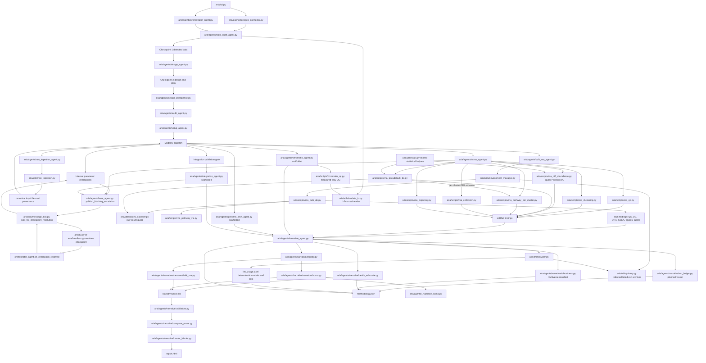

# Code Dependency Graph

This document is the working impact map for ARIA code changes. It is not a
complete Python import graph. It tracks the runtime data flow, ownership
boundaries, and production-impact edges that matter when adding features or
polishing existing behavior.

Use it before changing shared agents, script result schemas, report rendering,
or checkpoint/design logic.

## RNA And Reporting Flow

## High-Impact Edges

| If you change | Check these dependents | Why it is risky |
|---|---|---|
| `geo_connector.py` inferred design schema | `data_audit_agent.py`, `design_agent.py`, `bulk_rna_agent.py`, TUI GEO flow | GEO groups, organism, aliases, and sample IDs seed the entire design path. |
| `data_audit_agent.py` h5ad or GEO design inference | `design_agent.py`, `scrna_agent.py`, `design_intelligence.py`, CP1 text | A wrong condition/replicate/groupby guess can run valid code on the wrong biological design. |
| `design_agent.py` design dict | `bulk_rna_agent.py`, `scrna_agent.py`, `design_intelligence.py`, methods/provenance | `groups`, `main_factor`, covariates, aliases, and pseudobulk settings are consumed downstream. |
| `bulk_rna_agent.py` | `rna_bulk_de.py`, narrative bulk narrator, methods, release validation | It maps confirmed design onto count matrix columns and owns bulk result shape. |
| `rna_bulk_de.py` result schema | `BulkRnaNarrator`, `NarrativeAgent`, bulk workflow docs, tests | Report claims, figures, tables, ORA, GSEA, and methodology depend on specific keys. |
| bulk/scRNA DE contrast plumbing (`plan_contrasts`, `contrasts`, `comparisons`, `_suggest_contrasts`, `_normalise_explicit_contrasts`, `_normalise_pseudobulk_comparisons`) | `BulkRNAAgent`, `rna_bulk_de.py`, `scRNAAgent._run_pseudobulk`, `rna_diff_abundance.py`, `rna_pseudobulk_de.py`, report contrast claims | P0-5: DE must never choose a denominator/reference from sorted group names. Bulk script calls without explicit numerator+denominator return `ExplicitContrastRequired` and display-only suggestions. BulkRNAAgent runs only confirmed plan/design contrasts; otherwise it publishes `bulk.contrast` and returns insufficient. scRNA pseudobulk requires `pb_cfg["comparisons"]`; missing comparisons publish `scrna.pseudobulk.contrast` and skip DA/DE. Do not restore `_auto_contrasts`/alphabetical pairs as executable defaults. |
| `rna_bulk_de.py` covariate/design plumbing (`_build_design_formula`, `_resolve_covariates`, `_run_deseq2(covariates=...)`, `fitted_design_formula`/`covariates_adjusted`/`covariates_dropped`) | `BulkRNAAgent._design_covariates` → `params["covariates"]`, `validate_design_matrix`, `BulkRnaNarrator.methods()` | P0-4: bulk DESeq2 fits the confirmed `~ batch + condition`, not a hardcoded `~ condition`. Covariates flow agent → params → script; only metadata-present, varying, non-factor covariates are used and the validator receives them; a confirmed-but-unusable covariate is DISCLOSED (warning + `covariates_dropped`), never silently dropped. The narrator Methods must state `fitted_design_formula`. Do not revert to `~ {factor}` or pass `covariates=[]` to the validator. |
| `rna_pathway_viz.py` | `rna_bulk_de.py`, bulk narrative, report artifacts | It creates GSEA/ORA figures and tables that reports reference. |
| `scrna_agent.py` result schema | `_narrative_scrna.py`, `ScrnaNarrator`, scRNA workflow docs | scRNA reports assume stable keys for QC, composition, pseudobulk, pathways, LIANA, and trajectory. |
| `rna_pseudobulk_de.py` or `rna_diff_abundance.py` | `scrna_agent.py`, `ScrnaNarrator`, FDR-strategy and power report text | These scripts drive publication-facing inferential claims. DA uses quasi-Poisson (overdispersion-corrected, ADR-018); do not revert to plain Poisson — it anti-conservatively gates the composition covariate. |
| `rna_pseudobulk_de.py` per-group `background_genes` / `scrna_agent` `background_genes_by_cluster` / `rna_pathway_per_cluster.py` universe | per-cluster ORA significance, `ScrnaNarrator` Methods + per-block background size | The ORA universe is per cell type (genes tested in that cluster's pseudobulk, ADR-018). A single global background inflates per-cluster enrichment; legacy results without per-group background fall back to the global universe. |
| `rna_pseudobulk_de.py` composition covariate / `composition_skipped_reason` | `ScrnaNarrator` composition caveats, `scrna_agent` composition gating | The self-proportion composition covariate is dropped when collinear with the contrast (`_abs_corr` >= `COMPOSITION_COLLINEARITY_MAX`, C3/ADR-021); do not re-enable it unconditionally — it inflates variance exactly when abundance shifts with condition. |
| `rna_pseudobulk_de.py` apeGLM shrinkage (`lfc_shrink`, `log2fc_raw`, `lfc_shrinkage`) | `ScrnaNarrator` Methods (`_lfc_shrinkage_clause`), `pseudobulk_de.csv`, effect-size gate, synthetic-DE benchmark | Reported `log2fc` is the apeGLM-shrunken estimate and the `|log2fc|>lfc_min` gate uses it (C4/ADR-023); p-values are unchanged. The dds reference must be fixed to the contrast ref level for the coefficient to be test-vs-ref. Keep `log2fc_raw` (MLE) for audit; do not gate significance on the shrunken value. |
| `rna_pseudobulk_de.py` `robustness_multiverse` | `aria/agents/narrative/robustness.py`, `methodology.json["robustness_multiverse"]` | The P-MULTIVERSE closeout records FDR-family stability from local/global BH calls already computed in the run. It must not imply a hidden composition on/off rerun; the manifest reports the realized composition-covariate state per block. |
| `bus/message_bus.py` indices / persistence / `get_pending_checkpoints(experiment_id=...)` | TUI/headless polls, `OrchestratorAgent.run` (`enable_persistence`), checkpoint resolution, crash recovery | Findings/escalations are served from eviction-consistent indices and optionally persisted per-run (R6/ADR-021). Keep `_index`/`_deindex` in sync with the FIFO deque, keep persistence per-`experiment_id`, and scope reads by experiment so concurrent runs sharing the global bus don't cross-read. |
| `stats.py` BH correction helper | `rna_pseudobulk_de.py`, `rna_diff_abundance.py`, FDR tests | Shared multiple-testing code must stay numerically stable; duplicating local BH implementations risks divergent significance calls. |
| `count_classifier.py` raw-count detection | `rna_bulk_de.py` (`_load_counts` hard-refuse), `rna_pseudobulk_de.py` (integer-likeness + log-norm recovery probes), `count_source` provenance | The single detector deciding raw vs normalized input for DESeq2. Loosening `is_raw_counts` lets normalized matrices become pseudo-counts; the sampler is seeded — keep it deterministic for reproducible mode. |
| `script_contracts.py` IPC field names / `ContractField.aliases` | every dispatching agent (`run_in_stack` validates params before subprocess), `rna_cellcomm.py` `groupby`, `scrna_agent._run_cell_communication` | The agent must dispatch the contract's canonical key. P0-1: cellcomm's grouping key is `groupby` (script `_resolve_groupby` reads it first, then the `cell_type_col` alias, then `cell_type`); the contract declares `aliases=("cell_type_col",)` so legacy callers still validate. When renaming any IPC param, update the agent, the script reader, and the contract together, or add an `aliases=` entry — a mismatch fails at the contract gate and the script silently never runs. |
| `message_bus.py`, `BaseAgent.publish_blocking_escalation`, or checkpoint handling in `tui.py` / `headless.py` | `scrna_agent.py` Leiden resolution, `integration_agent.py` WNN/MOFA, `orchestrator_agent.py` CP3 handling | Internal parameter checkpoints must block script execution until user/headless resolution; otherwise custom/skip choices are decorative. |
| `orchestrator_agent.py` CP3 resolution | CP3 threshold tuning, internal agent parameter checkpoints, dispatch thread lifecycle | Internal CP3 messages carry `agent_parameter_checkpoint=True` and must not trigger threshold-tuning redispatch. |
| `orchestrator_agent.py` integration validation gate | `IntegrationAgent`, multimodal report sections, registry integrity | Scaffolded WNN/MOFA+/peak-to-gene code must not dispatch until validation is closed; otherwise beta scripts can emit publication-looking integration output. |
| `orchestrator_agent.py` `MODALITY_VALIDATION` / `_blocked_modalities` / `_experimental_modalities` | modality dispatch, blocked/experimental findings, `genome_arch_agent`, registry integrity, ADR-012 | All scaffold modalities (incl. Hi-C since P0-3/ADR-025) are `dispatch_enabled=False`. A modality with an `experimental_env_flag` (Hi-C → `ARIA_ALLOW_EXPERIMENTAL_HIC`) is unblocked ONLY when that env var is truthy, and then it is stamped with an INSUFFICIENT "EXPERIMENTAL / not publication-grade" finding and recorded in `exp_context["experimental_modalities"]`. Do not re-enable a scaffold by default or drop the experimental stamp; do not let the flag unblock unrelated modalities. |
| `parameter_advisor.py` metric evaluators | scRNA clustering CP3, WNN k CP3, memory decisions | Candidate metrics shown to users must be measured or explicitly marked as not computed; fabricated WNN weights and zero-filled modularity are invalid. |
| `scrna_agent.py` focus or annotation fallback logic | DesignIntelligence, focused h5ad materialization, report labels | Runtime logic must match explicit obs values or external annotation output; do not reintroduce tissue/cell-type alias maps or hardcoded marker panels under ADR-011. |
| `NarrativeBlock` schema | every modality narrator, validators, renderer, `methodology.json` | This is the report evidence contract. |
| `narrative/run_ledger.py` plan/finding keyword maps | report Run Ledger table, `methodology.json["run_ledger"]`, dispatch-integrity | The planned-vs-run reconciliation (P-LEDGER/ADR-022). If a new analysis is added, give it a `plan_kw`/`finding_keys` entry or it will read as a divergence. Technical vocabulary only (ADR-011). |
| `narrative/devils_advocate.py` confounder catalog | block `info` caveats, `methodology.json["devils_advocate"]`, claim tiers | The deterministic adversarial pass on the validated path (R2/P-DEVIL/ADR-022). Must run AFTER `annotate_claim_tiers`; it is idempotent (safe to call before render and during methodology). Confounders are a fixed technical checklist, not biology. |
| `claim_compiler.py` quantitative stats gate | every block-backed report claim, `methodology.json["claims"]`, devil's advocate scope | P-CLAIM2 downgrades DE claims when numeric support is weak (`n_significant`, effective-alpha power, low-power warning, log-norm recovery). Keep the gate based on structured metrics/caveats, not prose. |
| `validators.py` | all report generation | Validators are the last integrity gate before claims reach HTML. The causal guard scans ARIA's authored claim, not external named entities (DB term names, gene symbols) carried in evidence; `collect_named_entities` is also reused by the render-level prose scan. |
| `compose_prose.py` or `render_blocks.py` | HTML findings for all block-backed modalities | Rendering changes can turn valid results into cryptic or misleading reports. |
| `llm/provider.py` or `utils/provenance.py` LLM usage schema | `NarrativeAgent` report provenance, `methodology.json`, prompt cache behavior | Narrative confidence/prose must remain reproducible: deterministic controls, model tier, token counts, and cache semantics are part of audit provenance. Every call is time-bounded (`timeout`, R3) and tier fallbacks are recorded as degradation (`is_fallback`/`fallback_*` → `collect_llm_usage` `degraded`/`fallback_calls`, R4/ADR-020). C6/X10 adds `ARIA_AIR_GAPPED` local-only routing and cache TTL/version salt; do not bypass those controls for cloud calls or prompt-cache reuse. Tier resolution is lazy (P0-2): `complete()` uses `self.models.get(tier) or self.models.get(MEDIUM)` and raises an explicit `RuntimeError` if neither is configured — never index `self.models[MEDIUM]` as an eager default (it KeyErrors on partial configs even for a present tier). |
| `environment_manager.py` | all script-running agents | It controls conda stack execution and JSON IPC boundaries. Scripts run under `Popen(start_new_session=True)`; a timeout reaps the whole process group via `_terminate_process_tree`/`os.killpg` (R5/ADR-020). `_resolve_env` is preferred-env-if-installed → FALLBACK_ENV with NO aliasing (B12). Failed-run input archives are redacted by default (`input.redacted.json` + params hash); only `ARIA_PRESERVE_FAILED_INPUTS=1` keeps raw input JSON for local debugging. |
| `chromatin_qc.py` metric helpers / `mudata_io.py` `.h5mu` reader | `chromatin_agent.py`, v4.6 scATAC QC, DataAudit `.h5mu` detection | Chromatin QC must emit only measured metrics (ADR-019/ADR-002): TSS/FRiP/barcodes are real or `None`+`metrics_not_computed`, never placeholders. `.h5mu` is the detected scATAC entry; the MuData reader returns structured blockers when tooling/ATAC modality is absent — do not fabricate. |
| `data_audit_agent.py` SIGNATURES / `_scan_directory` extensions | modality classification, CP1, `.h5mu`/chromatin routing | `.h5mu` (paired RNA+ATAC) is scanned and classified as `scATAC` (C8); changing the signature order or extension set can make the v4.6 entry input undetectable again. |
| module-global accessors `bus` / `env_manager` | all agents and tests importing global coordination helpers | These are lazy accessors, not eagerly constructed singletons; avoid import-time workspace creation or broker state just by importing enums/classes. |
| `memory.py` decisions schema | checkpoints, provenance, reports, resume | DB shape changes can break old sessions and audit trails. Operational `memory/` files are private local context and must stay ignored/out of GitHub. |

## Ownership Boundaries

Agents own orchestration and user-visible decisions. Scripts own deterministic
analysis. Narrators own translation from structured results to
`NarrativeBlock`. Renderers own presentation.

Do not cross these boundaries casually:

- Scripts should not publish bus messages or write report prose.
- Agents should not parse generated HTML to recover results.
- Agents that publish in-dispatch parameter checkpoints must use
  `publish_blocking_escalation`; fire-and-forget checkpoints are invalid for
  user-controllable parameters.
- Narrators should not invent analyses that are absent from structured output.
- scRNA focus/annotation code must use explicit obs values, external annotation
  output, or unresolved labels; no built-in tissue marker panels or dataset
  aliases.
- Renderers should not create scientific claims that are not present in a
  block.
- Validators should downgrade or block unsafe claims, not silently rewrite
  biological meaning.

## Impact Checklist

Before changing a production path, answer these questions:

1. What result keys does this module produce or consume?
2. Which checkpoint text or confirmed design fields will change?
3. If it publishes a checkpoint from the dispatch thread, what blocks execution
   until `on_checkpoint_resolved` records a user/headless decision?
4. Which report sections, figures, tables, or `methodology.json` fields depend
   on it?
5. Does the change affect replay/resume or old workspaces?
6. Does it touch publication claims: DE, global/local FDR, power, ORA/GSEA,
   LIANA, PAGA/DPT, provenance, or dependency locks?
7. Which focused tests prove the contract, and which smoke test covers the
   integration path?

## Current Narrative Rule

For modalities backed by `NarrativeBlock`, prose is the primary report
presentation. Structured evidence tables, figures, and file links are audit
support. A report that only exposes claim rows and evidence tables is not
considered sufficiently narrative.

## Test Anchors

Use these tests as impact anchors when editing the graph's major nodes:

- Narrative kernel: `tests/test_narrative_types.py`,
  `tests/test_narrative_validators.py`, `tests/test_narrative_render_blocks.py`
- Bulk narrator and GSEA surfacing: `tests/test_narrator_bulk.py`,
  `tests/test_pathway_viz.py`
- scRNA narrator: `tests/test_narrator_scrna.py`
- GEO/design mapping: `tests/test_geo_design.py`
- Raw-count guard (DESeq2 input integrity): `tests/test_count_classifier.py`,
  `tests/test_bulk_raw_count_guard.py`
- LIANA agent↔contract param alignment (`groupby` canonical + `cell_type_col`
  alias, P0-1): `tests/test_cellcomm_contract.py`
- Chromatin v4.6 readiness (no fabricated QC, `.h5mu` detection/reader, no env
  alias path): `tests/test_chromatin_readiness.py` (mudata-gated cases skip
  without the chromatin stack)
- LLM/subprocess reliability (call timeout, model-degradation provenance,
  current model IDs, process-group kill on timeout):
  `tests/test_llm_reliability.py`
- LLM partial-config robustness (lazy tier resolution, explicit RuntimeError,
  P0-2): `tests/test_llm_partial_config.py`
- Bus durability + per-run isolation + indexed reads:
  `tests/test_bus_durability.py`
- Composition-covariate collinearity guard:
  `tests/test_composition_collinearity.py` (end-to-end case is pydeseq2-gated)
- Planned-vs-run ledger + deterministic devil's advocate:
  `tests/test_run_ledger_and_devils.py`
- Stage 4 closeout privacy / stats-gate / multiverse:
  `tests/test_stage4_closeout.py`
- apeGLM LFC shrinkage (pseudobulk effect sizes):
  `tests/test_lfc_shrinkage.py` (end-to-end cases are pydeseq2-gated)
- B7/B11 housekeeping and ADR-011 guards:
  `tests/test_pytest_smoke.py::test_global_bus_and_env_manager_are_lazy_accessors`,
  `tests/test_pytest_smoke.py::test_marker_fallback_annotation_is_explicit_and_conservative`,
  `tests/test_pytest_smoke.py::test_scrna_infers_and_materializes_cell_focus`,
  `tests/test_pytest_smoke.py::test_scrna_cell_focus_does_not_expand_without_explicit_focus`,
  `tests/test_pytest_smoke.py::test_design_intelligence_scrna_focused_group_feasibility`
- Checkpoint blocking and dispatch safety:
  `tests/test_pytest_smoke.py::test_internal_parameter_checkpoint_blocks_until_user_resolution`,
  `tests/test_pytest_smoke.py::test_wnn_checkpoint_skip_prevents_script_execution`,
  `tests/test_pytest_smoke.py::test_orchestrator_does_not_dispatch_on_internal_cp3_resolution`
- Integration scaffold gate and parameter honesty:
  `tests/test_pytest_smoke.py::test_orchestrator_skips_scaffolded_integration_agent`,
  `tests/test_pytest_smoke.py::test_wnn_advice_does_not_fabricate_pre_run_metrics`,
  `tests/test_pytest_smoke.py::test_wnn_checkpoint_marks_pre_run_metrics_as_not_computed`,
  `tests/test_pytest_smoke.py::test_leiden_subprocess_modularity_is_not_replaced_with_zero`,
  `tests/test_registry_integrity.py::test_scaffold_integration_agent_is_not_dispatched`
- Hi-C dispatch gate (scaffold off by default, experimental opt-in stamp, P0-3):
  `tests/test_hic_dispatch_gate.py`
- Bulk DE covariate/batch adjustment (fitted formula, dropped-covariate
  disclosure, P0-4): `tests/test_bulk_covariates.py` (e2e case is pydeseq2-gated)
- Explicit DE contrast/reference gate (no alphabetical reference, P0-5):
  `tests/test_explicit_contrast_gate.py`
- GEO multi-organism (spike-in) inference: organism-from-gene-symbol style
  (`geo_connector._organism_from_gene_symbols`, a technical species detection /
  ADR-011 exception like `human_markers`) and column-name group recovery
  (`BulkRNAAgent._infer_col_groups`): `tests/test_geo_spikein_inference.py`
- LLM deterministic provenance:
  `tests/test_pytest_smoke.py::test_llm_provider_forces_deterministic_generation`,
  `tests/test_pytest_smoke.py::test_llm_cache_key_includes_deterministic_controls`,
  `tests/test_pytest_smoke.py::test_collect_llm_usage_summarizes_deterministic_provenance`,
  `tests/test_pytest_smoke.py::test_provenance_section_renders_llm_usage`
- Main integration smoke: `tests/test_pytest_smoke.py`
