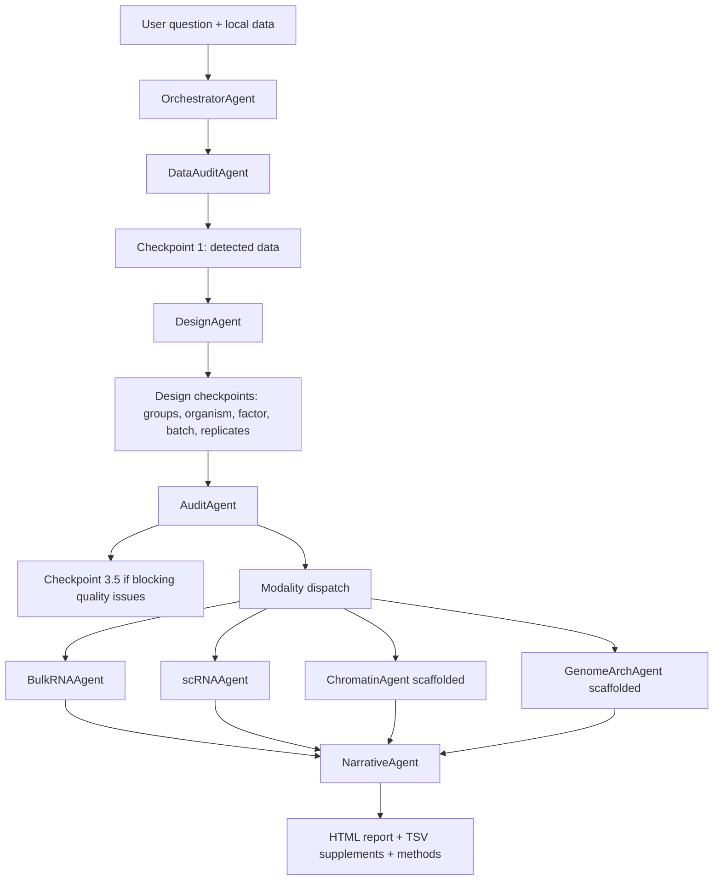

# Architecture Overview

ARIA is not just a collection of pipelines. The central product is a supervised
semantic layer around omics analysis:

1. understand the biological question;
2. inspect the input data;
3. confirm experimental design;
4. run deterministic modality-specific code;
5. record decisions and warnings;
6. generate a report grounded in real output files.

## Main Agent Flow

The same diagram is stored as [aria_overview.mmd](../diagrams/aria_overview.mmd).

## Components

| Component | Responsibility |
|---|---|
| OrchestratorAgent | Owns checkpoint flow and dispatch |
| DataAuditAgent | Detects modalities and data structure |
| DesignAgent | Confirms experimental design before compute |
| AuditAgent | Runs pre-dispatch quality checks |
| BulkRNAAgent | Orchestrates bulk RNA count/FASTQ workflows |
| scRNAAgent | Orchestrates QC, integration, clustering, annotation, DE, pseudobulk, beta trajectory and LIANA |
| NarrativeAgent | Writes reports from structured outputs and warnings |
| EnvironmentManager | Runs modality scripts in isolated Conda stacks using JSON IPC |
| ParameterAdvisor | Scores parameter candidates and records decisions |
| ARIAMemory | Stores decisions/findings in SQLite |
| MessageBus | Moves internal agent messages and checkpoint events |

## Script Boundary

Analytical scripts in `aria/scripts/` are subprocess entry points. They should:

- accept a JSON-serializable parameter dict;
- return a JSON-serializable result dict;
- avoid direct access to the message bus;
- validate inputs and return structured errors;
- use explicit mock gates only for development/test modes;
- write output files and summaries that can be validated on resume.

## Dependency Isolation

ARIA separates analytical stacks because bioinformatics libraries often have
conflicting compiled dependencies.

| Stack | Typical tools |
|---|---|
| RNA | Scanpy, AnnData, pyDESeq2, gseapy, LIANA, CellTypist |
| Chromatin | MACS3, pysam, pybedtools, muon / episcanpy |
| Hi-C | cooler, cooltools, hic-straw, pairtools |
| Integration | MOFA+, muon, scGLUE / related integration tools |
