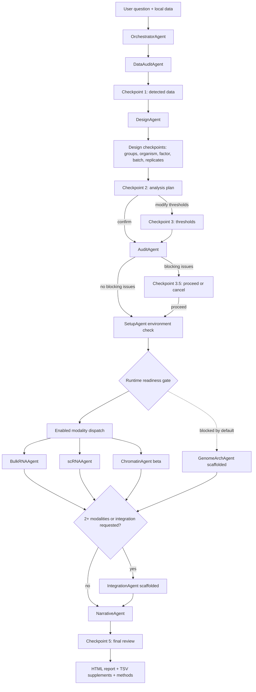

# Architecture Overview

ARIA is not just a collection of pipelines. The central product is a supervised
semantic layer around omics analysis:

1. understand the biological question;
2. inspect the input data;
3. confirm experimental design;
4. run deterministic modality-specific code;
5. record decisions and warnings;
6. generate a report grounded in real output files.

## Main Agent Flow

The same diagram is stored as [aria_overview.mmd](../diagrams/aria_overview.mmd).
For implementation-impact checks, use the deeper
[Code Dependency Graph](code_graph.md), which maps runtime dependencies,
ownership boundaries, and test anchors. For repository-wide navigation, use the
generated [Graphify map](graphify/README.md): it includes a queryable
`graph.json` and an interactive file-oriented `GRAPH_TREE.html`. The larger
force-directed `graph.html` is omitted when Graphify's visualization limit is
exceeded, so the repository never retains a stale map from an older snapshot.
The frozen v4.5 RNA/evidence-governance benchmarking protocol lives in
[benchmarking_v45.md](benchmarking_v45.md); it closes v4.5 as a benchmarking
specification and leaves full benchmark execution as the RNA preprint lane.

## Components

| Component | Responsibility |
|---|---|
| OrchestratorAgent | Owns checkpoint flow and dispatch |
| DataAuditAgent | Detects modalities and data structure |
| DesignAgent | Confirms experimental design before compute |
| AuditAgent | Runs pre-dispatch quality checks |
| SetupAgent | Checks computational environment before modality agents run |
| BulkRNAAgent | Orchestrates bulk RNA count/FASTQ workflows |
| scRNAAgent | Orchestrates QC, integration, clustering, annotation, DE, pseudobulk, beta trajectory and LIANA |
| ChromatinAgent | Orchestrates acknowledgement-gated beta scATAC and the implemented V47 bulk ATAC workflow; ChIP/CUT&RUN/CUT&TAG remain scaffolded |
| IntegrationAgent | Runs only for multimodal analyses or when explicitly requested; still scaffolded |
| NarrativeAgent | Writes reports from structured outputs and warnings |
| EnvironmentManager | Runs modality scripts in isolated Conda stacks using JSON IPC |
| ParameterAdvisor | Scores parameter candidates and records decisions |
| ARIAMemory | Stores decisions/findings in SQLite |
| MessageBus | Moves internal agent messages and checkpoint events |
| Experiment read-model | Derives UI-independent progress, checkpoints, ledger, readiness, and artifacts |
| Control Center | Optional Textual presentation over the shared read-model and checkpoint resolver |

## Execution Surfaces

`aria` selects the Textual Control Center only on an interactive TTY with the
`tui` extra installed. `--classic-tui`, `--reproducible`, `ARIA_NO_TUI`, a
missing Textual dependency, or a non-TTY process uses the classic Rich path.
`aria.headless.run_headless` provides the programmatic non-interactive surface.
All three use the same orchestrator and checkpoint contract; UI state is not a
scientific source of truth.

## Script Boundary

Analytical scripts in `aria/scripts/` are subprocess entry points. They should:

- accept a JSON-serializable parameter dict;
- return a JSON-serializable result dict;
- avoid direct access to the message bus;
- validate inputs and return structured errors;
- use explicit mock gates only for development/test modes;
- write output files and summaries that can be validated on resume.

## Dependency Isolation

ARIA separates analytical stacks because bioinformatics libraries often have
conflicting compiled dependencies.

| Stack | Typical tools |
|---|---|
| RNA | Scanpy, AnnData, pyDESeq2, gseapy, LIANA, CellTypist |
| scRNA ingestion | kb-python, kallisto, bustools |
| Raw bulk RNA | fastp, STAR, featureCounts, samtools, MultiQC, FastQC |
| Raw ATAC | bwa-mem2, chromap, samtools |
| Chromatin | MACS3, pysam, pybedtools, muon / episcanpy |
| Footprinting | TOBIAS, samtools |
| Benchmark | R/Bioconductor reference comparators |
| Hi-C | cooler, cooltools, hic-straw, pairtools |
| Integration | MOFA+, muon, scGLUE / related integration tools |

`aria.utils.environment_specs` is the single routing/setup/lock registry. Active
scientific and benchmark environments have exact Linux locks and can be checked
with `python -m aria.utils.environment_audit`. A missing registered environment
fails before scientific subprocess launch; it is never replaced by the
orchestrator environment. Hi-C and integration remain explicit scaffolds and are
not release lock targets.
