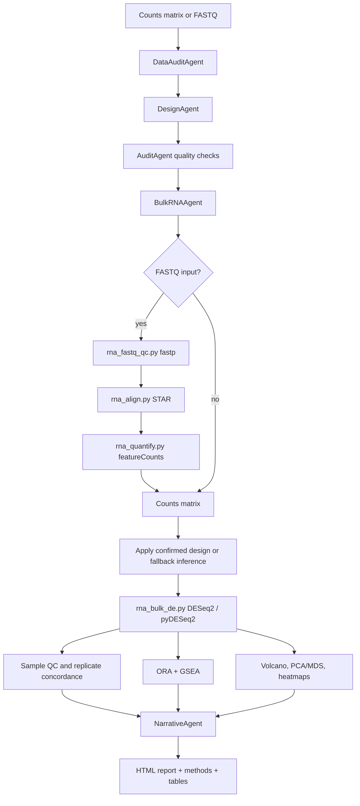

# Bulk RNA-seq Workflow

Validation level: validated on controlled + small real datasets for count
matrices; beta for FASTQ preprocessing. Publication still requires expert
review of the design, the fitted model, and the conclusions.

## Goal

Run differential expression and pathway analysis for bulk RNA-seq experiments
after confirming the biological design.

## Inputs

Preferred stable input:

- count matrix with genes as rows and samples as columns;
- sample metadata or names that can be mapped to biological groups.

Beta input:

- FASTQ files with enough metadata to infer samples and groups.

## Design Questions

ARIA must confirm:

- organism;
- main factor, such as condition, genotype, treatment, or timepoint;
- group labels;
- biological replicate structure;
- batch covariates, if present;
- reference/control interpretation.

## Flow

The same diagram is stored as [bulk_rna_flow.mmd](../diagrams/bulk_rna_flow.mmd).

## Outputs

- all pairwise contrasts;
- FASTQ QC, alignment, and quantification summaries when preprocessing runs;
- DE tables per contrast;
- pathway enrichment per contrast;
- volcano plots;
- PCA/MDS and heatmaps;
- report methods with design formula and thresholds;
- warnings for missing dependencies or skipped optional analyses.

## Failure Rules

- Missing pyDESeq2 must not silently produce fake DE.
- Missing fastp, STAR, or featureCounts must fail explicitly unless mock mode is
  explicitly enabled for development.
- Missing pathway tools must produce explicit warnings.
- Outlier pruning must preserve minimum replicate structure.
- One-replicate groups should be handled explicitly and conservatively.

## Current Evidence

- synthetic regression suite: `python tests/test_bulk_rna.py`;
- H9 three-condition workflow with BMAL1 KO, REV-ERBalpha KO, and WT;
- pyDESeq2 API compatibility path for old and new interfaces.
