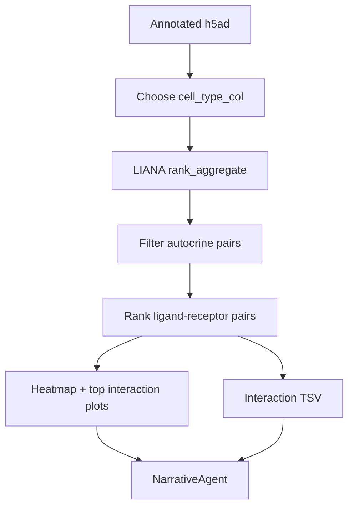

# Cell-cell Communication: LIANA

Validation level: beta.

## Goal

Estimate ligand-receptor communication between annotated cell groups in a
single-cell RNA-seq object.

## Inputs

- annotated `.h5ad`;
- cell-type or cluster label column;
- organism;
- optional LIANA settings such as number of permutations.

## Flow

## Rules

- Autocrine source == target pairs are excluded before interpretation.
- If LIANA emits all-NaN magnitude ranks, ARIA falls back to specificity rank.
- If cell labels are marker-fallback labels, the report must warn that sender
  and receiver labels need manual curation.

## Outputs

- sender x receiver interaction-count heatmap;
- top ligand-receptor bar chart;
- sortable / supplementary TSV table;
- method and caveat text in the report.

## Current Evidence

Validated on GSE278576 multi-sample annotated h5ad. LIANA recovered expected
glia-neuron and glia-microglia axes such as APOE -> TREM2, C3 -> NRP1,
VCAN -> TLR2, and NRG1 -> MS4A4A.
