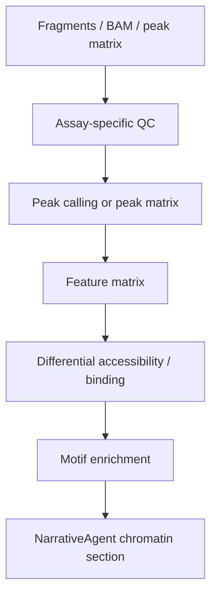

# Chromatin Workflows

Validation level: scATAC matrix workflow is alpha + requires explicit
acknowledgement. Bulk ATAC, ChIP-seq, CUT&RUN, and CUT&TAG remain scaffolded.

This module should not yet be described as production-ready.

## Target Assays

- scATAC-seq;
- bulk ATAC-seq;
- ChIP-seq;
- CUT&RUN;
- CUT&TAG.

## Existing Pieces

- `ChromatinAgent`;
- `chromatin_qc.py`;
- `chromatin_lsi_clustering.py`;
- `chromatin_diffacc.py`;
- `chromatin_motifs.py`;
- `chromatin_peaks.py`;
- MACS3 parameter profiles for assay types;
- chromatin narrative blocks.

## Current v4.6 scATAC Alpha Path

The same-cell RNA+ATAC `.h5mu` entry path is implemented for scATAC matrix
analysis behind CP3.5 acknowledgement. On the local HC11 validation file, ARIA
reads ATAC modality `atac` and reports real dimensions of 3,143 cells x 60,990
peaks. The alpha lane supports measured QC, TF-IDF/LSI clustering, per-cluster
accessibility markers, replicate-gated pseudobulk DA, local motif enrichment
when motif/genome resources exist, and chromatin report blocks.

The lane remains alpha. Missing resources or underpowered designs are reported
as skipped/limited analyses, not inferred around. chromVAR-style per-cell motif
activity remains out of scope.

## Required Before Stable

For scATAC:

- broader real-data fixture coverage beyond the current HC11/synthetic/
  multi-sample validation set;
- expert review of biological conclusions and thresholds;
- chromVAR per-cell motif activity if that becomes a product goal;
- peak-to-gene handoff contract;
- stable promotion criteria and release review.

For bulk ATAC / ChIP / CUT&RUN / CUT&TAG:

- robust BAM/fragment validation;
- assay-specific QC;
- peak calling and consensus peak strategy;
- count matrix generation;
- differential accessibility or binding;
- motif/pathway summary;
- report methods.

## Proposed Flow

## Release Recommendation

Do not promote multimodal integration before standalone chromatin conclusions
have stable validation and expert review. The current scATAC path is available
for reviewed alpha runs; scaffolded chromatin assays remain blocked from
publication-looking dispatch.
