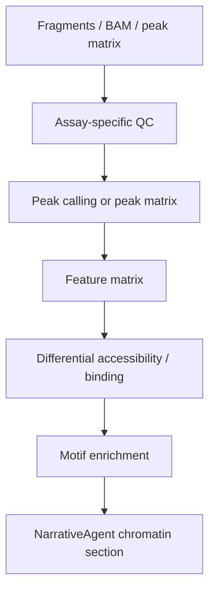

# Chromatin Workflow Roadmap

Validation level: scaffolded.

This module should not yet be described as production-ready.

## Target Assays

- scATAC-seq;
- bulk ATAC-seq;
- ChIP-seq;
- CUT&RUN;
- CUT&TAG.

## Existing Pieces

- `ChromatinAgent`;
- `chromatin_qc.py`;
- `chromatin_peaks.py`;
- MACS3 parameter profiles for assay types;
- basic report hooks.

## Required Before Stable

For scATAC:

- fragments / peak matrix input detection;
- TSS enrichment and FRiP QC;
- TF-IDF + LSI;
- clustering;
- differential accessibility;
- motif enrichment;
- peak-to-gene handoff contract;
- small deterministic fixtures;
- NarrativeAgent chromatin section.

For bulk ATAC / ChIP / CUT&RUN / CUT&TAG:

- robust BAM/fragment validation;
- assay-specific QC;
- peak calling and consensus peak strategy;
- count matrix generation;
- differential accessibility or binding;
- motif/pathway summary;
- report methods.

## Proposed Flow

## Release Recommendation

Do not start integration work before standalone chromatin workflows have
validated fixtures and report sections.
