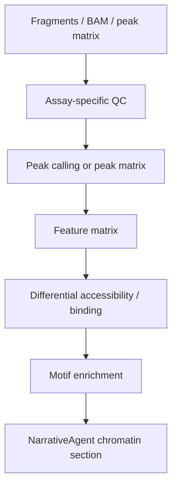

# Chromatin Workflows

Validation level: scATAC and bulk ATAC are both **beta + require explicit
acknowledgement** (CP3.5). Both expose the full workflow end-to-end (real-validated),
but stay beta + `requires_ack` pending the readiness ADR and CI coverage — they are
NOT autonomous production, and one step is explicitly not publication-grade yet:
differential TF footprinting (TOBIAS) is a DESCRIPTIVE candidate ranking, not
FDR-controlled significance, because it contrasts a single pseudobulk per condition
(preprint audit B7; per-replicate inference + multiplicity is the deferred fix).
ChIP-seq, CUT&RUN, and CUT&TAG remain
scaffolded. The authoritative per-modality tier lives in the orchestrator's
`MODALITY_VALIDATION` (single source) and is mirrored in `docs/validation_status.md`.

This module should not yet be described as production-ready.

## Target Assays

- scATAC-seq;
- bulk ATAC-seq;
- ChIP-seq;
- CUT&RUN;
- CUT&TAG.

## Existing Pieces

- `ChromatinAgent`;
- raw-read ingestion: `atac_align.py` (bulk ATAC FASTQ→BAM, bwa-mem2),
  `chromatin_scatac_align.py` (scATAC FASTQ→fragments, chromap),
  `chromatin_fragments_to_matrix.py` (fragments→cell×peak matrix, snapatac2);
- `chromatin_qc.py`;
- `chromatin_lsi_clustering.py`;
- `chromatin_diffacc.py`;
- `chromatin_motifs.py`;
- `chromatin_peaks.py`;
- `chromatin_peak_counts.py`;
- `chromatin_bulk_diffacc.py`;
- `chromatin_peak_annotation.py` (genomic peak annotation);
- `chromatin_peak_ora.py` (functional ORA over peak-linked genes);
- `chromatin_footprint_tobias.py` (TOBIAS Tn5-bias-corrected footprinting,
  scATAC + bulk condition-level);
- MACS3 parameter profiles for assay types;
- chromatin narrative blocks + publication figures (dual PNG+SVG);
- GEO/SRA connector recognizes and routes all four ARIA modalities
  (scRNA/bulk_RNA/scATAC/bulk_ATAC) — classification/routing of supplementary files,
  not general reproducible retrieval (raw FASTQ from SRA stays `fastq_pending`;
  preprint audit E6).

## Current scATAC Beta Path

scATAC reaches the full matrix pipeline from three entry points (all behind CP3.5
acknowledgement): a same-cell RNA+ATAC `.h5mu` (pre-called peaks); a raw fragments
file (the `chromatin_fragments_to_matrix.py` snapatac2 bridge builds the cell×peak
matrix — real-validated on the 10x PBMC Multiome); and raw FASTQ
(`chromatin_scatac_align.py` chromap → fragments → bridge). The beta lane supports
measured QC (incl. TSSe/FRiP gating figures), TF-IDF/LSI clustering, per-cluster
accessibility markers, replicate-gated pseudobulk condition-DA, local motif
enrichment, peak-to-gene link recovery (beta, ADR-050), TOBIAS footprinting + RNA
cross-evidence, gene-activity scoring (caveated scaffold), and chromatin report
blocks + publication figures.

Missing resources or underpowered designs are reported as skipped/limited analyses,
not inferred around. chromVAR-style per-cell motif activity remains out of scope.

## Current Bulk ATAC Beta Path

Bulk ATAC exposes the full ATAC workflow behind CP3.5 acknowledgement (publication-
grade except footprinting, which is descriptive-only pending the B7 fix above),
real-validated end-to-end on ENCODE replicates (K562 vs GM12878): raw FASTQ→BAM
(`atac_align.py`, bwa-mem2 + ATAC filtering) or aligned BAM/CRAM input → measured QC
→ MACS3 peak calling with overlap-reproducibility consensus → peak-by-sample count
matrix (`bedtools coverage -sorted -counts`) → replicate-gated DESeq2 differential
accessibility (`chromatin_bulk_diffacc.py`) → genomic peak annotation → functional
ORA → TF motif enrichment → condition-level TOBIAS footprinting → figures. DA
requires explicit condition, biological replicate, and comparison metadata;
under-specified designs return structured skips. FRiP is computed only when the real
post-peak-counting tools succeed; ARIA does not substitute a default FRiP. n=2
isogenic designs run with a low-power warning (directional, not FDR-calibration).

## Required Before Stable

For scATAC:

- broader real-data fixture coverage beyond the current HC11/synthetic/
  multi-sample validation set;
- expert review of biological conclusions and thresholds;
- chromVAR per-cell motif activity if that becomes a product goal;
- peak-to-gene handoff contract;
- stable promotion criteria and release review.

For bulk ATAC (QC→peaks→DA→annotation→ORA→motifs→footprinting→figures and raw
FASTQ→BAM are implemented and real-validated on ENCODE replicates):

- broader real-data validation across more replicated cohorts and tissues;
- chromatin CI lane (env solve + chr20 smoke) for external reproducibility;
- the readiness ADR + release review before any production promotion.

For ChIP / CUT&RUN / CUT&TAG:

- robust BAM/fragment validation;
- assay-specific QC;
- peak calling and consensus peak strategy;
- differential binding;
- motif/pathway summary;
- report methods.

## Proposed Flow

## Release Recommendation

Do not promote multimodal integration before standalone chromatin conclusions
have stable validation and expert review. The scATAC and bulk ATAC paths are
available as acknowledgement-gated **beta** runs (not autonomous production);
scaffolded chromatin assays (ChIP/CUT&RUN/CUT&TAG) remain blocked from
publication-looking dispatch.
