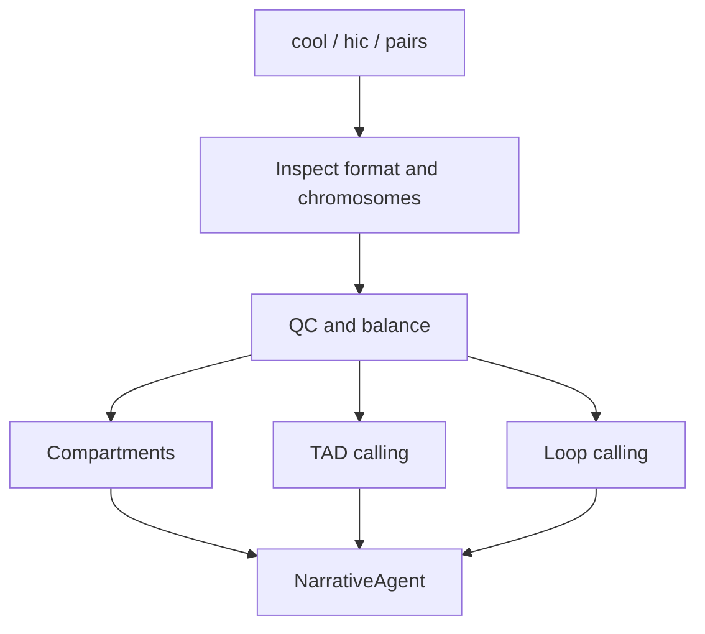

# Genome Architecture Roadmap: Hi-C / Micro-C

Validation level: scaffolded.

This module contains useful components, but it is not yet a stable end-to-end
workflow.

## Existing Pieces

- `GenomeArchAgent`;
- `hic_inspect.py`;
- `hic_qc_and_balance.py`;
- `hic_topology.py`;
- cooler / hic-straw aware code paths;
- out-of-core topology ideas.

## Target Analyses

- contact-map inspection;
- matrix balancing;
- compartments A/B;
- TADs;
- loops;
- QC summaries;
- report integration.

## Required Before Stable

- small public fixture with known expected outputs;
- memory-safe execution profile;
- explicit resolution selection;
- chromosome naming normalization;
- expected-column validation for topology outputs;
- structured warnings for missing cooler / hic-straw / cooltools;
- NarrativeAgent genome architecture section tested end-to-end.

## Proposed Flow

## Interpretation Caveat

Hi-C and Micro-C results are resolution-sensitive. ARIA should report the
resolution, genome assembly, balancing method, missing chromosomes, and skipped
topology analyses explicitly.
