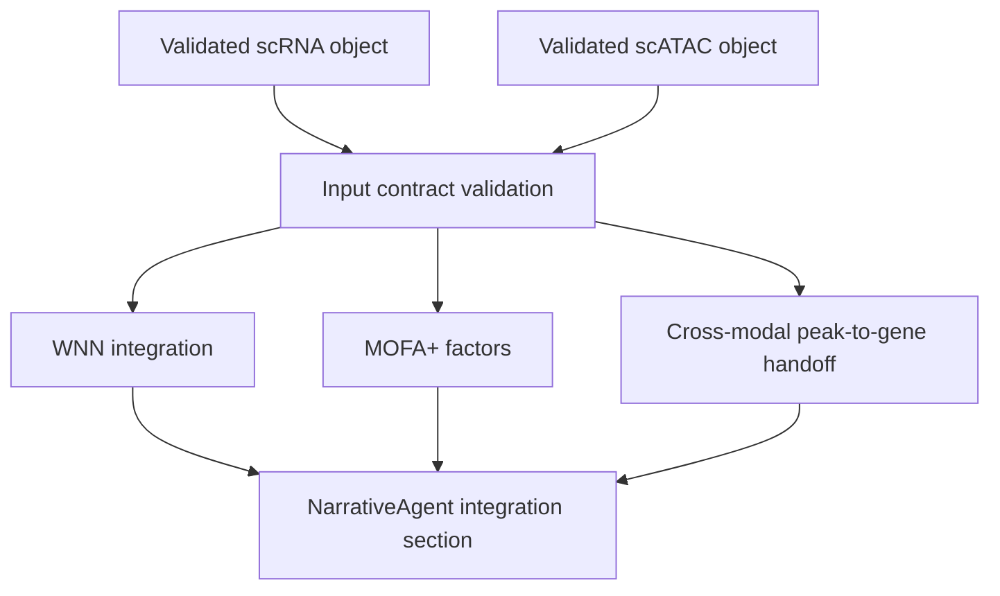

# Multimodal Integration Roadmap

Validation level: scaffolded.

Integration requires independently valid standalone modalities. RNA is
production-tier and scATAC is acknowledgement-gated beta, but that prerequisite
does not validate the current WNN/MOFA+ scaffold.

## Existing Pieces

- `IntegrationAgent`;
- `integration_wnn.py`;
- `integration_mofa.py`;
- `integration_peak2gene.py` scaffold (distinct from the beta standalone
  scATAC implementation in `chromatin_regulatory.py`);
- preliminary DebateCouncil hooks.

## Target Analyses

- WNN for paired scRNA + scATAC;
- MOFA+ for latent factors across modalities;
- cross-modal peak-to-gene handoff and synthesis;
- cross-modal concordance and discordance summaries.

## Required Before Stable

- a promotion decision for the standalone scATAC beta workflow;
- explicit, validated RNA + ATAC object and feature-identity contracts;
- paired multiome fixtures that exercise the integration scripts, not only the
  standalone chromatin lane;
- explicit missing-modality errors;
- no implicit mock factors or links in production;
- report section that distinguishes association from causality.

## Proposed Flow

## DebateCouncil Rule

DebateCouncil should not debate from vibes. The critic must cite structured
evidence or request a concrete data lookup, for example:

- a marker value;
- a CellTypist confidence;
- a peak-to-gene correlation;
- a factor loading;
- a missing covariate.

Standalone peak-to-gene link recovery is already beta in the scATAC workflow
(ADR-050). That result is associative and does not make `integration_peak2gene`
or the WNN/MOFA+ dispatch path validated.
