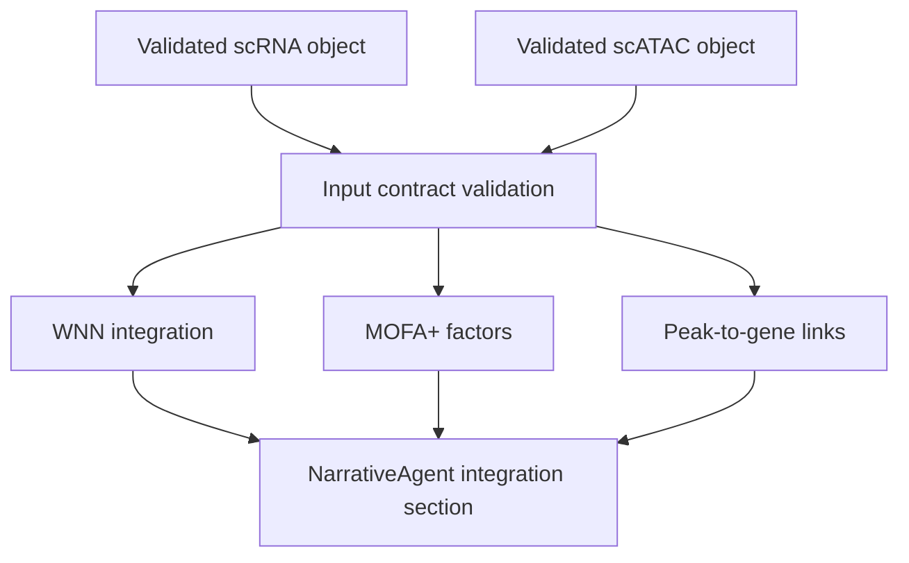

# Multimodal Integration Roadmap

Validation level: scaffolded.

Integration should wait until the standalone modalities are reliable. WNN,
MOFA+, and peak-to-gene are only meaningful when the input RNA and chromatin
objects are themselves valid.

## Existing Pieces

- `IntegrationAgent`;
- `integration_wnn.py`;
- `integration_mofa.py`;
- `integration_peak2gene.py`;
- preliminary DebateCouncil hooks.

## Target Analyses

- WNN for paired scRNA + scATAC;
- MOFA+ for latent factors across modalities;
- peak-to-gene links;
- cross-modal concordance and discordance summaries.

## Required Before Stable

- stable scATAC workflow;
- stable RNA + ATAC object contracts;
- small paired multiome fixture;
- explicit missing-modality errors;
- no implicit mock factors or links in production;
- report section that distinguishes association from causality.

## Proposed Flow

## DebateCouncil Rule

DebateCouncil should not debate from vibes. The critic must cite structured
evidence or request a concrete data lookup, for example:

- a marker value;
- a CellTypist confidence;
- a peak-to-gene correlation;
- a factor loading;
- a missing covariate.
