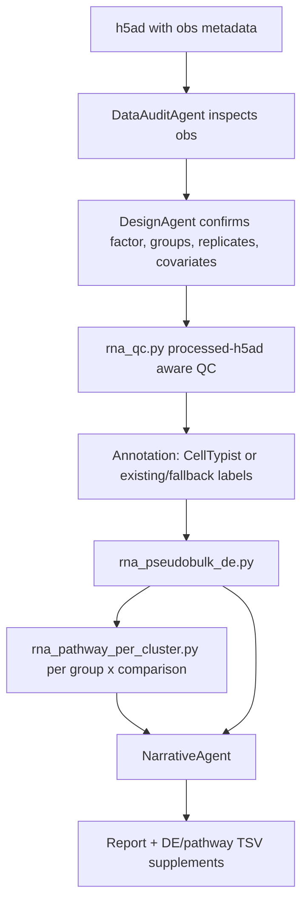

# Pseudobulk scRNA-seq From h5ad obs Metadata

Validation level: production-like validated analytically; final v4.3.12 report
review pending.

## Goal

Run between-condition differential expression at the biological-replicate level
inside each cell type or cluster.

This is the preferred path for condition contrasts in scRNA-seq because it
avoids treating individual cells as independent biological replicates.

## Required Metadata

The `.h5ad.obs` table should contain:

- condition column, such as `age_group`, `condition`, `treatment`, or genotype;
- biological replicate column, such as `donor_id`, `sample_id`, or `orig.ident`;
- group/cell-type column, such as `subclass`, `cell_type`, or CellTypist labels;
- optional covariates, such as sex, batch, donor attributes, or chemistry.

## Flow

The same diagram is stored as
[pseudobulk_scrna_flow.mmd](../diagrams/pseudobulk_scrna_flow.mmd).

## Design Rules

- Conditions must map to biological replicates.
- Each condition should have enough biological replicates for DE.
- Covariates must be recorded in the design formula.
- If ARIA cannot identify a condition or replicate column, it should ask or
  skip pseudobulk rather than guessing silently.
- If condition metadata already exists in `obs`, ARIA should use it directly
  instead of injecting filename-derived labels.

## Outputs

- pseudobulk DE summaries per group and comparison;
- significant genes with log2FC and adjusted p values;
- ORA pathway hits per group and comparison;
- summary bar plots;
- supplementary TSV tables;
- methods section with groupby, condition, replicate, covariate, and threshold
  details.

## Current Evidence

The GSE278576 consolidated hippocampus `.h5ad` path completed analytically on a
large processed object:

- processed-h5ad QC retained cells using existing obs metrics;
- pseudobulk DE ran across 18 subclasses;
- pathway ORA, LIANA, and PAGA/DPT outputs were present;
- narrative/report fixes were added after detecting a contradiction between
  executive summary and body sections.

Final release tagging should wait for the rerun report review.
