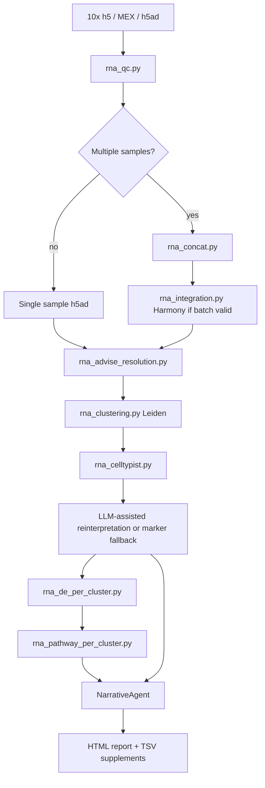

# Single-cell RNA-seq Workflow

Validation level: production-like validated for single-sample and multi-sample
RNA workflows.

## Goal

Run supervised scRNA-seq analysis with explicit QC, integration, clustering,
annotation, differential expression, and report generation.

## Inputs

Supported stable inputs:

- 10x `.h5`;
- 10x MEX directory;
- `.h5ad` objects.

Processed `.h5ad` objects are supported when ARIA can use existing `obs` QC
metrics such as `nFeature_RNA`, `nCount_RNA`, and `percent.mt`.

## Flow

The same diagram is stored as [scrna_flow.mmd](../diagrams/scrna_flow.mmd).

## Core Steps

### QC

`rna_qc.py` performs:

- empty-droplet filtering for raw matrices;
- adaptive mitochondrial and gene-count thresholds;
- Scrublet doublet detection when valid;
- processed-h5ad QC using existing `obs` metrics when available;
- structured `NoCellsAfterQC` errors if filtering removes all cells.

### Multi-sample Concatenation

`rna_concat.py`:

- inner-joins genes by default;
- stamps `sample_id` and `batch`;
- preserves metadata columns for downstream design;
- signs the sample manifest so stale concatenations do not resume.

### Integration

`rna_integration.py`:

- runs Harmony when a valid batch column has at least two batches;
- skips explicitly when only one batch exists or the dataset is above the
  configured cell limit;
- records skip reasons and output signatures.

### Clustering

`rna_advise_resolution.py` scores candidate Leiden resolutions. For large
datasets, it can use a deterministic sketch and flags that choice in the
parameter decision.

`rna_clustering.py` runs Leiden and marker discovery. Resume is valid only when
the current clustering parameters match the cached summary.

### Annotation

`rna_celltypist.py` performs database-backed annotation when CellTypist and the
selected model are available. If CellTypist cannot complete, ARIA can write
explicit marker-panel fallback labels through `rna_apply_cluster_labels.py`.
Fallback labels are marked as curation targets, not definitive identities.

## Outputs

- QC summaries;
- integrated or non-integrated `.h5ad`;
- UMAP figures;
- Leiden cluster summaries;
- CellTypist or marker-fallback annotations;
- per-cluster DE and pathway outputs;
- HTML report and supplementary TSVs.

## Current Evidence

- PBMC 3k single-sample workflow;
- GSE278576 hippocampus single-sample workflow;
- GSE278576 three-donor multi-sample workflow;
- pytest smoke regressions for processed h5ad QC, h5ad obs design inference,
  cache signatures, and marker fallback.
