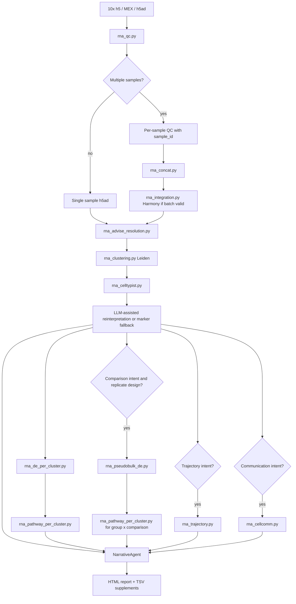

# Single-cell RNA-seq Workflow

Validation level: validated on controlled + small real datasets for
single-sample and multi-sample RNA workflows. Publication still requires expert
review of the design, the fitted model, and the conclusions.

## Goal

Run supervised scRNA-seq analysis with explicit QC, integration, clustering,
annotation, differential expression, and report generation.

## Inputs

Supported stable inputs:

- 10x `.h5`;
- 10x MEX directory. A directory containing `matrix.mtx` plus
  `barcodes.tsv` and `features.tsv` or `genes.tsv` is treated as one sample,
  not as three separate inputs;
- `.h5ad` objects.

Processed `.h5ad` objects are supported when ARIA can use existing `obs` QC
metrics such as `nFeature_RNA`, `nCount_RNA`, and `percent.mt`.

## Flow

The same diagram is stored as [scrna_flow.mmd](../diagrams/scrna_flow.mmd).

## Core Steps

### QC

`rna_qc.py` performs:

- empty-droplet filtering for raw matrices;
- adaptive mitochondrial and gene-count thresholds. Count/gene MAD bounds are
  computed in log space; mitochondrial percentage remains linear;
- Scrublet doublet detection when valid;
- processed-h5ad QC using existing `obs` metrics when available;
- structured `NoCellsAfterQC` errors if filtering removes all cells.
QC thresholds are data-intrinsic and do not change based on user prose.

### Multi-sample Concatenation

`rna_concat.py`:

- inner-joins genes by default;
- stamps `sample_id` and `batch`;
- preserves metadata columns for downstream design;
- signs the sample manifest so stale concatenations do not resume.

### Integration

`rna_integration.py`:

- runs Harmony when a valid batch column has at least two batches;
- skips explicitly when only one batch exists or the dataset is above the
  configured cell limit;
- records skip reasons and output signatures;
- surfaces destructive overcorrection signatures as blocking integration-QC
  issues when strong mixing collapses biological cluster structure.

### Clustering

`rna_advise_resolution.py` scores candidate Leiden resolutions. For large
datasets, it can use a deterministic sketch and flags that choice in the
parameter decision.

`rna_clustering.py` runs Leiden and marker discovery. Resume is valid only when
the current clustering parameters match the cached summary.

### Annotation

`rna_celltypist.py` performs database-backed annotation when CellTypist and the
selected model are available. If CellTypist cannot complete, ARIA can write
explicit marker-panel fallback labels through `rna_apply_cluster_labels.py`.
Fallback labels are marked as curation targets, not definitive identities.
When no explicit CellTypist model or tissue hint is available, ARIA discloses
the immune-default fallback model in data-quality and Methods text. Per-cluster
annotation confidence is computed from raw per-cell CellTypist labels and
probabilities, not from majority-voted labels that are structurally constant
within a Leiden cluster.

### Differential Expression

Donor-level pseudobulk carries condition inference. Production pseudobulk keeps
labels and design metadata from the annotated object, but uses the QC-filtered
raw-count object through `counts_data_path` so pyDESeq2 receives integer-like
counts. Per-cluster marker discovery is still useful for description and
annotation support, but it is reported as exploratory/descriptive because the
same cells define the clusters and the marker ranking.

## Outputs

- QC summaries;
- integrated or non-integrated `.h5ad`;
- UMAP figures;
- Leiden cluster summaries;
- CellTypist or marker-fallback annotations;
- per-cluster marker rankings and pathway outputs;
- optional pseudobulk DE/pathway outputs when comparison design is present;
- optional trajectory and LIANA outputs when the biological intent requests them;
- HTML report and supplementary TSVs.

## Current Evidence

- PBMC 3k single-sample workflow;
- GSE278576 hippocampus single-sample workflow;
- GSE278576 three-donor multi-sample workflow;
- raw 10X pbmc3k production E2E with MEX-directory grouping, QC failure
  visibility, CellTypist confidence/fallback disclosure, and governed scRNA
  report blocks;
- six-donor raw-count pseudobulk E2E verifying `count_source=raw_counts` when
  the QC-filtered count handoff is present;
- pytest smoke regressions for processed h5ad QC, h5ad obs design inference,
  cache signatures, and marker fallback.
