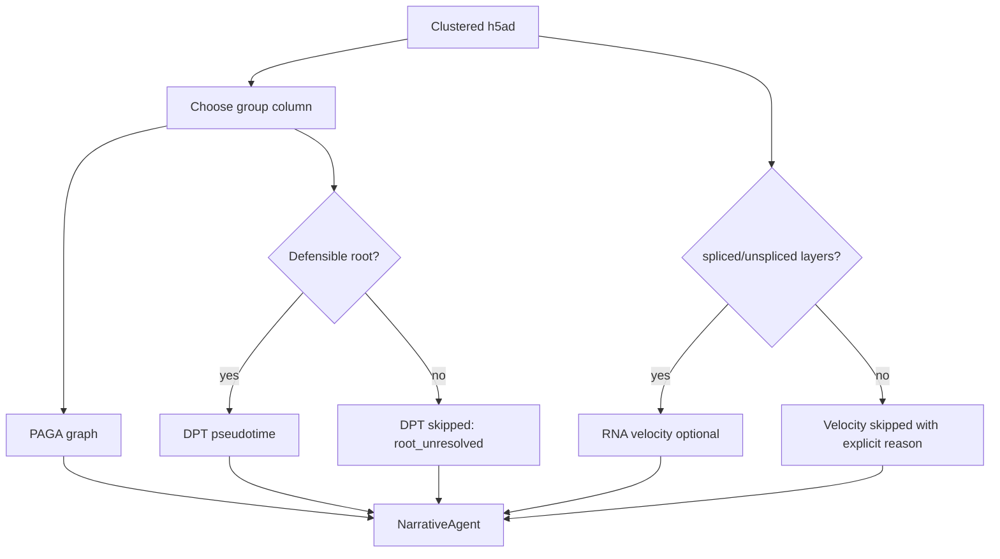

# Trajectory Analysis: PAGA + Root-Gated DPT

Validation level: beta.

## Goal

Summarize manifold connectivity in a processed scRNA object, and compute
pseudotime ordering only when a defensible trajectory root is available.

Trajectory analysis in ARIA is exploratory. It should not be presented as proof
of active differentiation without supporting time-course, perturbation, lineage,
or velocity evidence.

## Inputs

- clustered `.h5ad`;
- group column, preferably a cell-type label or carefully curated cluster label;
- optional root cell type or root group.

## Root Policy

PAGA graph connectivity can run without a biological start point. DPT
pseudotime direction cannot: ARIA computes DPT only when one of these roots is
available:

- a precomputed `adata.uns["iroot"]` in the input h5ad;
- a user-provided `root_cell_type` / `--trajectory-root` that matches the
  grouping column;
- a generic progenitor-like label in the grouping column, using only broad terms
  such as `stem`, `progenitor`, or `precursor`.

If no root is available, ARIA reports `pseudotime.computed = false` with
`reason = "root_unresolved"` and still returns the PAGA graph and velocity
status. It does not use low complexity, fewest detected genes, or other quality
proxies as a pseudotime root.

## Flow

## Outputs

- PAGA connectivity graph;
- log-scaled graph view for weak adult-tissue edges;
- DPT pseudotime summaries by group when a defensible root is available;
- explicit `root_unresolved` skip reason when no DPT root is available;
- explicit velocity skip reason when layers are absent;
- report caveats about exploratory interpretation.

## Current Evidence

Validated on a 50k-cell OPC / oligodendrocyte / astrocyte hippocampus subset.
With OPC selected as root, the output ordered OPC to oligodendrocyte to
astrocyte in DPT, while PAGA showed weak adult-tissue connectivity. ARIA reports
this as manifold structure, not as causal developmental evidence.
