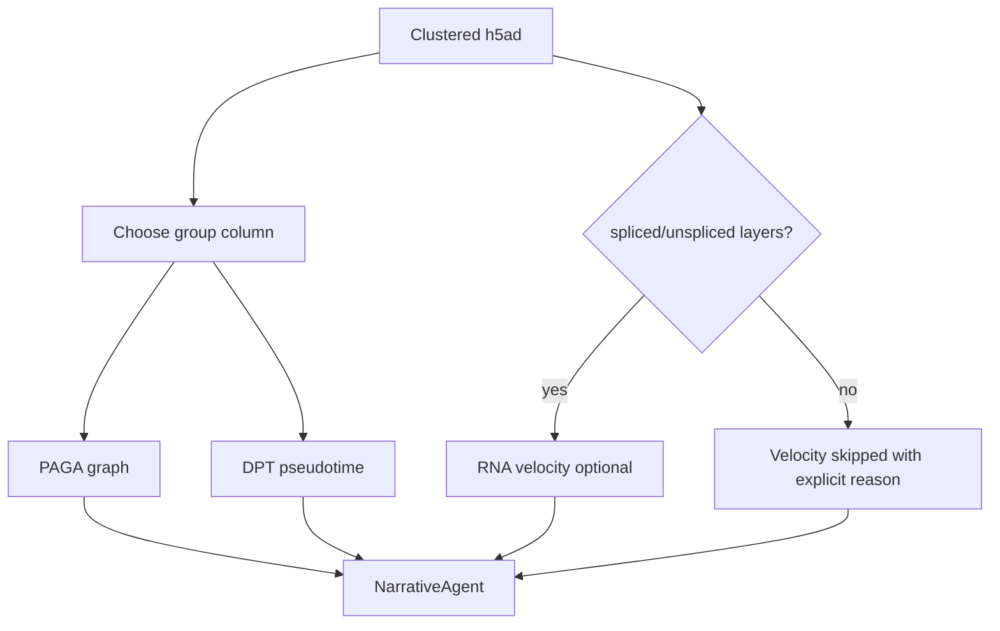

# Trajectory Analysis: PAGA + DPT

Validation level: beta.

## Goal

Summarize manifold connectivity and pseudotime ordering in a processed scRNA
object.

Trajectory analysis in ARIA is exploratory. It should not be presented as proof
of active differentiation without supporting time-course, perturbation, lineage,
or velocity evidence.

## Inputs

- clustered `.h5ad`;
- group column, preferably a cell-type label or carefully curated cluster label;
- optional root cell type or root group.

## Flow

## Outputs

- PAGA connectivity graph;
- log-scaled graph view for weak adult-tissue edges;
- DPT pseudotime summaries by group;
- explicit velocity skip reason when layers are absent;
- report caveats about exploratory interpretation.

## Current Evidence

Validated on a 50k-cell OPC / oligodendrocyte / astrocyte hippocampus subset.
The output ordered OPC to oligodendrocyte to astrocyte in DPT, while PAGA showed
weak adult-tissue connectivity. ARIA reports this as manifold structure, not as
causal developmental evidence.
